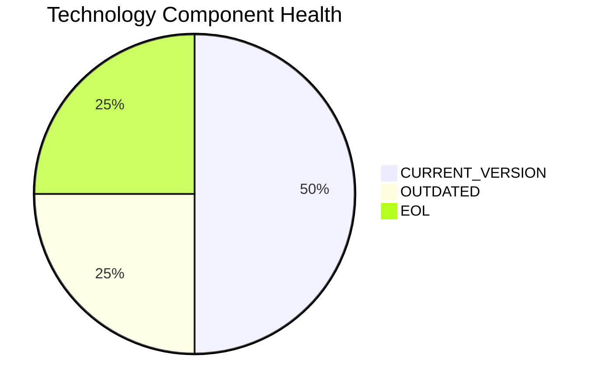

# RouteOptApp-011 — Application Modernization Report

> **Application ID:** app011  
> **Business Unit:** R&D  
> **Criticality:** Medium

## Application Overview

| Attribute | Value |
|-----------|-------|
| Application ID | app011 |
| Name | RouteOptApp-011 |
| Business Unit | R&D |
| Criticality | Medium |
| Status | Production |
| Deployment Type | AWS |
| Architecture | 3-Tier |
| Containerized | Yes |
| CI/CD | Yes |
| Users | 125 |
| Environments | 1 |
| External Interfaces | 5 |
| Servers | s, v, 1, 4 |
| DB Storage (GB) | 180 |
| DB License Required | No |

## Technology Stack Assessment

| Component | Name | Status |
|-----------|------|--------|
| Operating System | CentOS 7 | 🔴 EOL |
| Database | PostgreSQL 14 | 🟢 CURRENT_VERSION |
| Programming Language | Python 3.11 | 🟢 CURRENT_VERSION |
| Application Server | Glassfish 4.0 | 🟡 OUTDATED |

### Technology Health Distribution

## Complexity Assessment

**Overall Complexity:** 🟡 **MEDIUM** (Score: 5/10)

| Factor | Score | Weight |
|--------|-------|--------|
| Technology Age | 7 | 25% |
| Integration Complexity | 5 | 20% |
| Infrastructure | 5 | 15% |
| Business Criticality | 5 | 15% |
| Architecture | 3 | 15% |
| Data Complexity | 2 | 10% |

## Modernization Scenarios

### Applicable Scenarios

| Scenario | Reasoning |
|----------|-----------|
| OS Security Patch | OS CentOS 7 is EOL and requires security patching or upgrade. |
| Switch to Standard Linux | CentOS 7 is EOL. Upgrading to a current Linux distribution is recommended. |
| Switch to ARM CPU | Cloud deployment can leverage ARM-based instances (e.g., AWS Graviton) for cost savings. |
| App Server Replacement | Application server Glassfish 4.0 is outdated and should be upgraded. |
| Update Outdated Components | Outdated/EOL components detected: CentOS 7, Glassfish 4.0. Updates required. |
| Switch to Managed DB | Database could be migrated to a fully managed cloud database service for reduced operational overhead. |
| Managed ARM DB | Database can be evaluated for ARM-based managed service deployment. |
| Serverless DB Migration | Database can be migrated to a serverless database solution to reduce operational overhead. |

### All Scenario Statuses

| Scenario | Status |
|----------|--------|
| OS Security Patch | ✅ APPLICABLE |
| Switch to Standard Linux | ✅ APPLICABLE |
| Switch to ARM CPU | ✅ APPLICABLE |
| App Server Replacement | ✅ APPLICABLE |
| Cloud Deployment | 🔵 FULFILLED |
| Containerization | 🔵 FULFILLED |
| Refactor & Decouple | 🔵 FULFILLED |
| Upgrade Legacy DB | 🔵 FULFILLED |
| Switch to OSS DB | 🔵 FULFILLED |
| Update Outdated Components | ✅ APPLICABLE |
| Switch to Managed DB | ✅ APPLICABLE |
| Managed ARM DB | ✅ APPLICABLE |
| Serverless DB Migration | ✅ APPLICABLE |
| Switch to PostgreSQL | 🔵 FULFILLED |

## Financial Summary

| Metric | Value |
|--------|-------|
| Total Estimated Implementation Cost | $31,477.73 |
| Total Estimated Annual Savings | $42,700.00 |
| Estimated ROI Payback Period | 0.7 years |

### Cost/Savings Breakdown by Scenario

| Scenario | Est. Cost | Est. Annual Savings | ROI (years) |
|----------|-----------|---------------------|-------------|
| OS Security Patch | $1,005.68 | $500.00 | 2.01 |
| Switch to Standard Linux | $301.70 | $400.00 | 0.75 |
| Switch to ARM CPU | $5,028.39 | $1,000.00 | 5.03 |
| App Server Replacement | $10,056.79 | $10,800.00 | 0.93 |
| Update Outdated Components | N/A | N/A | N/A |
| Switch to Managed DB | $5,028.39 | $10,000.00 | 0.5 |
| Managed ARM DB | $5,028.39 | $5,000.00 | 1.01 |
| Serverless DB Migration | $5,028.39 | $15,000.00 | 0.34 |
