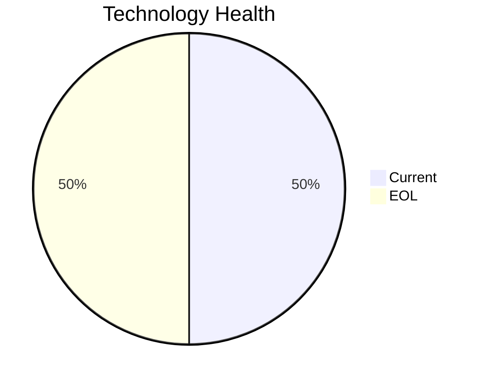

<!-- generated by AI in Github cloud -->
# RouteOptApp-011 (app011)

## Application Overview

| Attribute | Value |
|-----------|-------|
| **App ID** | app011 |
| **Name** | RouteOptApp-011 |
| **Status** | Production |
| **Criticality** | Medium |
| **Solution Type** | Custom made |
| **Deployment** | AWS |
| **Containerized** | Yes |
| **Architecture** | 3-Tier |
| **Business Unit** | R&D |
| **External Interfaces** | 5 |
| **Servers** | 1 |
| **Environments** | 1 |

## Technology Stack

| Component | Type | Version | Status | EOL Date |
|-----------|------|---------|--------|----------|
| CentOS | os | 7 | 🔴 EOL | 2024-06-30 |
| Python 3.11 | programming_language | 3.11 | 🟢 CURRENT | 2027-10-31 |
| Glassfish 4.0 | application_server | 4.0 | 🔴 EOL | 2018-12-31 |
| PostgreSQL 14 | database | 14 | 🟢 CURRENT | 2026-11-12 |

## Complexity Assessment

**Score: 5/10 (MEDIUM)**

Technology age score 8 (2 EOL, 0 outdated components). Integration score 5 (5 external interfaces). Infrastructure score 2 (1 servers, 1 environments). Criticality score 5 (Medium). Architecture score 3. Data score 4. Weighted final: 4.9 → 5 (MEDIUM).

| Factor | Value |
|--------|-------|
| Number Of Servers | 1 |
| Number Of Databases | 1 |
| Number Of Environments | 1 |
| Number Of Interfaces | 5 |
| Business Criticality | Medium |
| Number Of Outdated Technologies | 0 |
| Number Of Eol Technologies | 2 |
| Number Of Dependencies | 0 |
| Ci Cd Present | Yes |
| Containerized | Yes |

## Applicable Modernization Scenarios

### Os Update Security Patch
- **Status**: APPLICABLE
- **Reason**: OS 'CentOS 7' is EOL and requires security patching or upgrade.
- **Confidence**: 8/10

### Application Server Replacement
- **Status**: APPLICABLE
- **Reason**: Application server 'Glassfish 4.0' is EOL and must be replaced.
- **Confidence**: 8/10

### App Refactor Decoupling
- **Status**: APPLICABLE
- **Reason**: Custom application with 3-Tier architecture; refactoring to reduce coupling is applicable.
- **Confidence**: 8/10

### Update Outdated Components
- **Status**: APPLICABLE
- **Reason**: Outdated/EOL components found: CentOS, Glassfish 4.0. Updates required.
- **Confidence**: 8/10

## Other Scenarios

| Scenario | Status | Reason |
|----------|--------|--------|
| switch_to_standard_linux_os | FULFILLED | OS 'CentOS 7' is already a standard Linux distribution. |
| switch_to_arm_cpu | LACK_OF_DATA | No explicit CPU architecture data (x86 vs ARM) is available in the application m... |
| app_deployment_to_cloud | FULFILLED | Application is already deployed to cloud (AWS). |
| app_containerization | FULFILLED | Application is already containerized. |
| upgrade_legacy_databases | FULFILLED | Database 'PostgreSQL 14' is current. |
| switch_db_engine_open_source | FULFILLED | Database 'PostgreSQL 14' is already open-source or managed open-source. |

## Financial Summary

| Scenario | Cost (USD) | Annual Savings (USD) | ROI 3yr % | Payback (yrs) |
|----------|-----------|---------------------|-----------|---------------|
| os_update_security_patch | $1,006 | $500 | 49.2% | 2.0 |
| application_server_replacement | $10,057 | $10,800 | 222.2% | 0.9 |
| app_refactor_decoupling | $251,420 | $135,000 | 61.1% | 1.9 |
| **TOTAL** | **$262,482** | **$146,300** | | |
