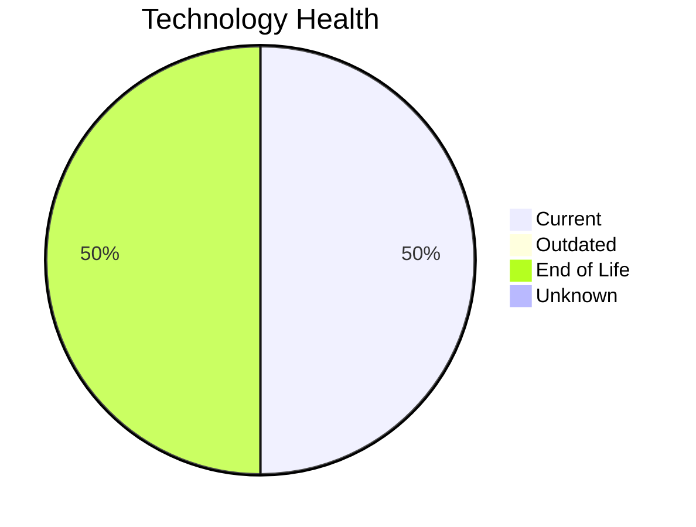

# Application Report: RouteOptApp-011

**ID:** app011
**Generated:** 2026-05-11

## Overview

| Attribute | Value |
|-----------|-------|
| Business Unit | R&D |
| Solution Type | Custom made |
| Deployment | AWS |
| Business Criticality | Medium |
| Users | 125 |
| Servers | 1 (sv14) |
| Containerized | Yes |
| CI/CD | Yes |
| Architecture | 3-Tier |

## Technology Stack

| Component | Technology | Version | Status |
|-----------|-----------|---------|--------|
| Os | CentOS 7 | CentOS 7 | 🔴 EOL |
| Language | Python 3.11 | Python 3.11 | 🟢 CURRENT_VERSION |
| Database | PostgreSQL 14 | PostgreSQL 14 | 🟢 CURRENT_VERSION |
| Application Server | Glassfish 4.0 | Glassfish 4.0 | 🔴 EOL |

## Complexity Assessment

**Score:** 5/10 — **MEDIUM**
**Confidence:** 8/10

| Factor | Value |
|--------|-------|
| Technology Age (EOL/Outdated) | 2 EOL / 0 outdated |
| Integration (External Interfaces) | 5 |
| Infrastructure (Servers) | 1 |
| Business Criticality | Medium |
| Containerized | Yes |
| CI/CD Present | Yes |

> Complexity MEDIUM (5/10). Technology age: 9/10 (2 EOL, 0 outdated components). Integration: 4/10 (5 external interfaces). Infrastructure: 2/10 (1 servers). Business criticality Medium: 4/10. Architecture 3-tier: 2/10. Data complexity: 3/10.

## Modernization Scenarios

### Applicable Scenarios

#### ✅ Operating System Update

- **Reason:** OS CentOS 7 has status EOL. Security patches and OS update recommended.
- **Confidence:** 8/10
- **Cost:** €1,006 (one-time)
- **Savings:** €500/year

#### ✅ Switch to ARM-based CPU

- **Reason:** Custom/open-source application on Linux can be considered for ARM-based infrastructure.
- **Confidence:** 8/10
- **Cost:** €5,028 (one-time)
- **Savings:** €1,000/year

#### ✅ Applications Server replacement

- **Reason:** Application server Glassfish 4.0 has status EOL. Replacement recommended.
- **Confidence:** 8/10
- **Cost:** €10,057 (one-time)
- **Savings:** €10,800/year

#### ✅ Application Refactoring and De-coupling

- **Reason:** Custom application with 3-tier architecture. Refactoring and de-coupling recommended.
- **Confidence:** 8/10
- **Cost:** €251,420 (one-time)
- **Savings:** €135,000/year

#### ✅ Update outdated components

- **Reason:** Application has EOL components that should be updated.
- **Confidence:** 8/10

### Other Scenarios

| Scenario | Status | Reason |
|----------|--------|--------|
| Switch to standard Linux Operating System | ✔️ FULFILLED | Application already runs on standard Linux (CentOS 7). |
| Application Migration to Cloud Infrastructure (Lift & Shift) | ✔️ FULFILLED | Application is already deployed on AWS cloud infrastructure. |
| Application Containerization | ✔️ FULFILLED | Application is already containerized. |
| Upgrade Legacy Databases | ✔️ FULFILLED | Database PostgreSQL 14 is current version, no upgrade needed. |
| Switch DB Engine to open-source database solution | ✔️ FULFILLED | Database PostgreSQL 14 is already open-source. |

## Financial Summary

| Metric | Value |
|--------|-------|
| Total One-Time Investment | €267,511 |
| Total Annual Savings | €147,300 |
| Break-Even | 1.8 years |

