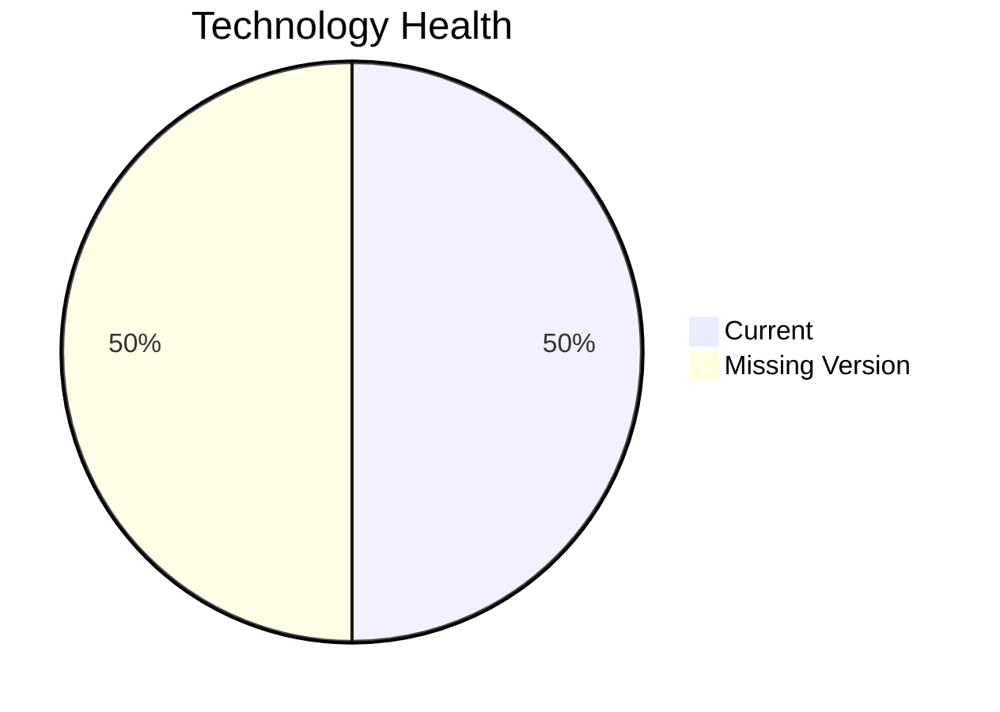

# Application Report: RouteOptApp-011

**ID:** app011  
**Generated:** 2026-05-11

## Overview

| Attribute | Value |
|-----------|-------|
| Business Unit | R&D |
| Solution Type | Custom made |
| Deployment Type | AWS |
| Business Criticality | Medium |
| Users | 125 |
| Servers | 1 |
| Architecture | 3-Tier |
| Containerized | Yes |
| CI/CD | Yes |
| Data Classification | Internal |

## Technology Stack

| Component | Technology | Status |
|-----------|-----------|--------|
| Os | CentOS 7 | ⚪ NO_KNOWLEDGE |
| Database | PostgreSQL 14 | 🟢 CURRENT_VERSION |
| Language | Python 3.11 | 🟢 CURRENT_VERSION |
| Application Server | Glassfish 4.0 | ⚪ NO_KNOWLEDGE |

## Complexity Assessment

**Score:** 3/10 — **LOW**  
**Confidence:** 7

> Score 3/10 (LOW): 0 EOL component(s), 0 outdated, 5 external interfaces, 1 server(s), criticality=Medium, architecture=3-Tier.

| Factor | Value |
|--------|-------|
| Servers | 1 |
| Interfaces | 5 |
| Environments | 1 |
| EOL Technologies | 0 |
| Outdated Technologies | 0 |
| CI/CD Present | Yes |
| Containerized | Yes |

## Modernization Scenarios

### Applicable Scenarios

#### ✅ Switch to ARM-based CPU

- **Priority:** Medium
- **Effort:** Medium
- **Effects:** cost, sustainability
- **Cost:** €3,802 (one-time)
- **Annual Savings:** €1,000/year
- **Reasoning:** Application runs on cloud and could benefit from ARM-based instances (e.g., AWS Graviton).

### Other Scenarios

| Scenario | Status | Reason |
|----------|--------|--------|
| Operating System Update | ❓ LACK_OF_DATA | OS lifecycle status could not be determined. |
| Switch to standard Linux Operating System | ✔️ FULFILLED | Application already runs on standard Linux (CentOS 7). |
| Applications Server replacement | ✔️ FULFILLED | Application server appears to be on a supported version. |
| Application Migration to Cloud Infrastructure (Lift & Shift) | ✔️ FULFILLED | Application is already deployed on cloud (AWS). |
| Application Containerization | ✔️ FULFILLED | Application is already containerized. |
| Application Refactoring and De-coupling | 🔶 PARTIALLY_FULFILLED | 3-Tier architecture provides some decoupling; further microservice decomposition may be beneficial. |
| Upgrade Legacy Databases | ✔️ FULFILLED | Database (PostgreSQL 14) is on a current, supported version. |
| Switch DB Engine to open-source database solution | ✔️ FULFILLED | Database (PostgreSQL 14) is already an open-source solution. |
| Update outdated components | ❓ LACK_OF_DATA | Component lifecycle status insufficient to evaluate. |

## Financial Summary

| Metric | Value |
|--------|-------|
| Total One-Time Cost | €3,802 |
| Total Yearly Savings | €1,000 |
| Break-Even | 3.8 years |
