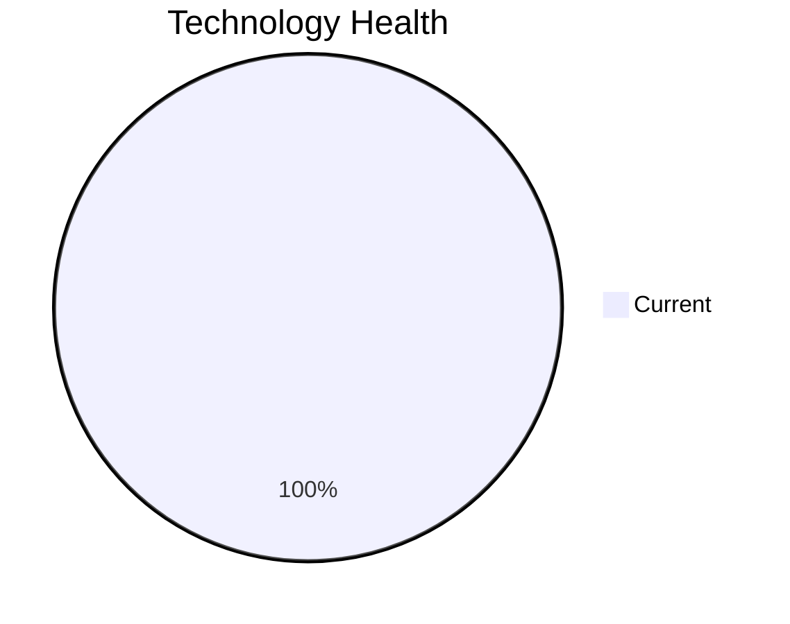

# Application Report: IoTSensorApp-012

**ID:** app012  
**Generated:** 2026-05-11

## Overview

| Attribute | Value |
|-----------|-------|
| Business Unit | R&D |
| Solution Type | Custom made |
| Deployment Type | AWS |
| Business Criticality | High |
| Users | 85 |
| Servers | 2 |
| Architecture | 2-Tier |
| Containerized | Yes |
| CI/CD | Yes |
| Data Classification | Confidential |

## Technology Stack

| Component | Technology | Status |
|-----------|-----------|--------|
| Os | Windows Server 2022 | 🟢 CURRENT_VERSION |
| Database | PostgreSQL 14 | 🟢 CURRENT_VERSION |
| Language | Rust 1.70 | 🟢 CURRENT_VERSION |
| Application Server | Microsoft IIS 10.0 | 🟢 CURRENT_VERSION |

## Complexity Assessment

**Score:** 5/10 — **MEDIUM**  
**Confidence:** 7

> Score 5/10 (MEDIUM): 0 EOL component(s), 0 outdated, 8 external interfaces, 2 server(s), criticality=High, architecture=2-Tier.

| Factor | Value |
|--------|-------|
| Servers | 2 |
| Interfaces | 8 |
| Environments | 2 |
| EOL Technologies | 0 |
| Outdated Technologies | 0 |
| CI/CD Present | Yes |
| Containerized | Yes |

## Modernization Scenarios

### Applicable Scenarios

#### ✅ Switch to ARM-based CPU

- **Priority:** Medium
- **Effort:** Medium
- **Effects:** cost, sustainability
- **Cost:** €5,028 (one-time)
- **Annual Savings:** €1,000/year
- **Reasoning:** Application runs on cloud and could benefit from ARM-based instances (e.g., AWS Graviton).

#### ✅ Application Refactoring and De-coupling

- **Priority:** High
- **Effort:** High
- **Effects:** agility, cost, sustainability
- **Cost:** €251,420 (one-time)
- **Annual Savings:** €135,000/year
- **Reasoning:** Application has 2-Tier architecture - refactoring to microservices would improve scalability.

### Other Scenarios

| Scenario | Status | Reason |
|----------|--------|--------|
| Operating System Update | ✔️ FULFILLED | Operating system is on a current, supported version. |
| Switch to standard Linux Operating System | ❌ NOT_APPLICABLE | Application runs on Windows or is SaaS; switching to standard Linux OS is not applicable. |
| Applications Server replacement | ✔️ FULFILLED | Application server appears to be on a supported version. |
| Application Migration to Cloud Infrastructure (Lift & Shift) | ✔️ FULFILLED | Application is already deployed on cloud (AWS). |
| Application Containerization | ✔️ FULFILLED | Application is already containerized. |
| Upgrade Legacy Databases | ✔️ FULFILLED | Database (PostgreSQL 14) is on a current, supported version. |
| Switch DB Engine to open-source database solution | ✔️ FULFILLED | Database (PostgreSQL 14) is already an open-source solution. |
| Update outdated components | ✔️ FULFILLED | All components are on current, supported versions. |

## Financial Summary

| Metric | Value |
|--------|-------|
| Total One-Time Cost | €256,448 |
| Total Yearly Savings | €136,000 |
| Break-Even | 1.9 years |
