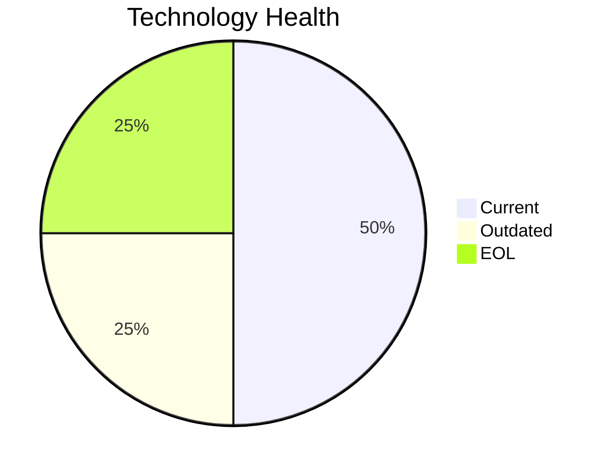

<!-- generated by AI in Github cloud -->
# SecurityApp-013 (app013)

## Application Overview

| Attribute | Value |
|-----------|-------|
| **App ID** | app013 |
| **Name** | SecurityApp-013 |
| **Status** | Production |
| **Criticality** | Critical |
| **Solution Type** | Custom made |
| **Deployment** | On-Premise |
| **Containerized** | No |
| **Architecture** | 3-Tier |
| **Business Unit** | Security |
| **External Interfaces** | 15 |
| **Servers** | 2 |
| **Environments** | 3 |

## Technology Stack

| Component | Type | Version | Status | EOL Date |
|-----------|------|---------|--------|----------|
| Debian | os | 7 | 🔴 EOL | 2018-05-31 |
| Java 17 | programming_language | 17 | 🟢 CURRENT | 2029-09-30 |
| Websphere 8.0 | application_server | 8.0 | 🟡 OUTDATED | 2025-04-30 |
| SQL Server 2022 | database | 2022 | 🟢 CURRENT | 2028-01-11 |

## Complexity Assessment

**Score: 7/10 (HIGH)**

Technology age score 7 (1 EOL, 1 outdated components). Integration score 8 (15 external interfaces). Infrastructure score 6 (2 servers, 3 environments). Criticality score 9 (Critical). Architecture score 5. Data score 5. Weighted final: 6.8 → 7 (HIGH).

| Factor | Value |
|--------|-------|
| Number Of Servers | 2 |
| Number Of Databases | 1 |
| Number Of Environments | 3 |
| Number Of Interfaces | 15 |
| Business Criticality | Critical |
| Number Of Outdated Technologies | 1 |
| Number Of Eol Technologies | 1 |
| Number Of Dependencies | 0 |
| Ci Cd Present | Yes |
| Containerized | No |

## Applicable Modernization Scenarios

### Os Update Security Patch
- **Status**: APPLICABLE
- **Reason**: OS 'Debian 7' is EOL and requires security patching or upgrade.
- **Confidence**: 8/10

### Application Server Replacement
- **Status**: APPLICABLE
- **Reason**: Application server 'Websphere 8.0' is outdated and should be upgraded.
- **Confidence**: 8/10

### App Deployment To Cloud
- **Status**: APPLICABLE
- **Reason**: Application is on-premise (On-Premise); cloud migration (lift & shift) is applicable.
- **Confidence**: 8/10

### App Containerization
- **Status**: APPLICABLE
- **Reason**: Custom/open-source application not yet containerized; containerization is applicable.
- **Confidence**: 8/10

### App Refactor Decoupling
- **Status**: APPLICABLE
- **Reason**: Custom application with 3-Tier architecture; refactoring to reduce coupling is applicable.
- **Confidence**: 8/10

### Switch Db Engine Open Source
- **Status**: APPLICABLE
- **Reason**: Proprietary database 'SQL Server 2022' with custom app; switching to open-source DB is applicable.
- **Confidence**: 8/10

### Update Outdated Components
- **Status**: APPLICABLE
- **Reason**: Outdated/EOL components found: Debian, Websphere 8.0. Updates required.
- **Confidence**: 8/10

## Other Scenarios

| Scenario | Status | Reason |
|----------|--------|--------|
| switch_to_standard_linux_os | FULFILLED | OS 'Debian 7' is already a standard Linux distribution. |
| switch_to_arm_cpu | LACK_OF_DATA | No explicit CPU architecture data (x86 vs ARM) is available in the application m... |
| upgrade_legacy_databases | FULFILLED | Database 'SQL Server 2022' is current. |

## Financial Summary

| Scenario | Cost (USD) | Annual Savings (USD) | ROI 3yr % | Payback (yrs) |
|----------|-----------|---------------------|-----------|---------------|
| os_update_security_patch | $1,330 | $500 | 12.8% | 2.7 |
| application_server_replacement | $13,300 | $9,600 | 116.5% | 1.4 |
| app_deployment_to_cloud | $6,650 | $2,400 | 8.3% | 2.8 |
| app_containerization | $133,001 | $80,000 | 80.4% | 1.7 |
| app_refactor_decoupling | $332,502 | $120,000 | 8.3% | 2.8 |
| switch_db_engine_open_source | $33,250 | $15,000 | 35.3% | 2.2 |
| **TOTAL** | **$520,034** | **$227,500** | | |
