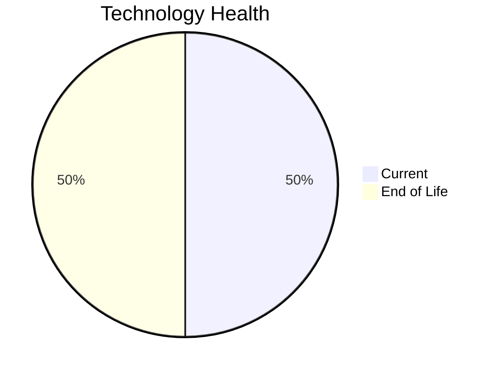

# Application Report: SecurityApp-013

**ID:** app013  
**Generated:** 2026-05-13

## Overview

| Attribute | Value |
|-----------|-------|
| Business Unit | Security |
| Solution Type | Custom made |
| Deployment Type | On-Premise |
| Business Criticality | Critical |
| Users | 520 |
| Servers | sv17, sv18 |
| Environments | 3 |
| External Interfaces | 15 |
| Containerized | No |
| CI/CD Present | Yes |
| Architecture | 3-Tier |
| Data Classification | Confidential |

## Technology Stack

| Component | Technology | Version | Status |
|-----------|-----------|---------|--------|
| Operating System | Debian 7 | Debian 7 | 🔴 EOL |
| Database | SQL Server 2022 | SQL Server 2022 | 🟢 Current |
| Programming Language | Java 17 | Java 17 | 🟢 Current |
| Application Server | WebSphere 8.0 | WebSphere 8.0 | 🔴 EOL |

## Complexity Assessment

**Score:** 7/10 — **HIGH**  
**Confidence:** 8/10

> Technology age score 9/10: Multiple EOL components detected. Integration score 8/10: 15 external interfaces. Infrastructure score 4/10: 2 server(s), 3 environment(s). Business criticality score 9/10: Critical criticality application. Architecture score 4/10: 3-Tier architecture, not containerized, CI/CD present. Data score 4/10: Database in good standing.

| Factor | Value |
|--------|-------|
| Servers | 2 |
| Environments | 3 |
| External Interfaces | 15 |
| EOL Technologies | 2 |
| Outdated Technologies | 0 |
| Business Criticality | Critical |
| CI/CD Present | Yes |
| Containerized | No |

## Modernization Scenarios

### ✅ Applicable Scenarios

#### Operating System Update

- **Priority:** High
- **Effort:** Low
- **Effects:** security
- **One-Time Cost:** €1,330
- **Annual Savings:** €500/year
- **Reasoning:** OS (Debian 7) is EOL and requires urgent update/replacement.

#### Switch to ARM-based CPU

- **Priority:** Medium
- **Effort:** Medium
- **Effects:** cost, sustainability
- **One-Time Cost:** €6,650
- **Annual Savings:** €800/year
- **Reasoning:** Custom application on standard Linux is a candidate for ARM CPU migration with cost and sustainability benefits.

#### Application Server Replacement

- **Priority:** Medium
- **Effort:** Medium
- **Effects:** agility, cost
- **One-Time Cost:** €13,300
- **Annual Savings:** €9,600/year
- **Reasoning:** Application server (Websphere 8.0) is EOL and requires replacement.

#### Application Migration to Cloud (Lift & Shift)

- **Priority:** High
- **Effort:** Low
- **Effects:** security, agility
- **One-Time Cost:** €6,650
- **Annual Savings:** €2,400/year
- **Reasoning:** Application is deployed on-premise (On-Premise). Cloud migration would improve scalability and reduce infrastructure costs.

#### Application Containerization

- **Priority:** High
- **Effort:** High
- **Effects:** agility, cost, sustainability
- **One-Time Cost:** €133,001
- **Annual Savings:** €80,000/year
- **Reasoning:** Application runs on Linux or modern .NET stack and is not yet containerized. Containerization would improve portability and resource efficiency.

#### Switch DB Engine to Open-Source

- **Priority:** High
- **Effort:** Medium
- **Effects:** cost
- **One-Time Cost:** €33,250
- **Annual Savings:** €15,000/year
- **Reasoning:** Commercial database (SQL Server 2022) detected. Migrating to PostgreSQL or MySQL would eliminate licensing costs.

#### Update Outdated Components

- **Priority:** High
- **Effort:** High
- **Effects:** security, agility, cost
- **Cost:** No financial data available
- **Reasoning:** Outdated or EOL components detected: Debian 7, WebSphere 8.0. Updates required to maintain security and supportability.

#### Switch to Managed Database Service

- **Priority:** Medium
- **Effort:** Low
- **Effects:** agility, cost
- **One-Time Cost:** €6,650
- **Annual Savings:** €10,000/year
- **Reasoning:** On-premise database (SQL Server 2022) could benefit from migration to a managed cloud database service.

#### Switch DB Engine to PostgreSQL

- **Priority:** High
- **Effort:** Medium
- **Effects:** cost
- **One-Time Cost:** €33,250
- **Annual Savings:** €15,000/year
- **Reasoning:** Commercial database (SQL Server 2022) is a candidate for migration to PostgreSQL to eliminate licensing costs.

### Other Scenarios

| Scenario | Status | Reason |
|----------|--------|--------|
| Switch to Standard Linux OS | ✔️ Fulfilled | Application already runs on standard Linux OS (Debian 7). |
| Application Refactoring and De-coupling | 🔶 Partial | Application architecture (3-Tier) suggests some coupling. Partial refactoring may benefit the applic... |
| Upgrade Legacy Databases | ✔️ Fulfilled | Database (SQL Server 2022) is on a current supported version. |
| Managed ARM Database | ❌ N/A | Database is not on a managed cloud service; ARM database migration not applicable. |
| Serverless Database Migration | ❌ N/A | On-premise deployment: serverless DB migration requires cloud infrastructure first. |

## Financial Summary

| Metric | Value |
|--------|-------|
| Total One-Time Investment | €234,081 |
| Total Annual Savings | €133,300 |
| Break-Even | 1.8 years |
