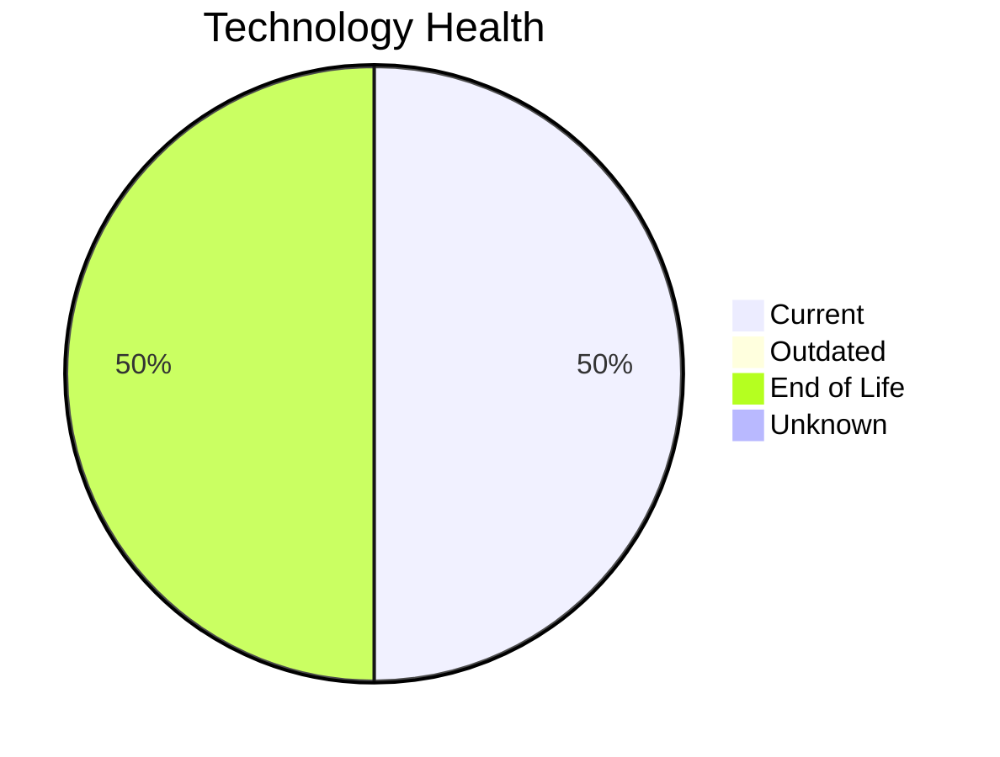

# Application Report: SecurityApp-013

**ID:** app013
**Generated:** 2026-05-11

## Overview

| Attribute | Value |
|-----------|-------|
| Business Unit | Security |
| Solution Type | Custom made |
| Deployment | On-Premise |
| Business Criticality | Critical |
| Users | 520 |
| Servers | 2 (sv17, sv18) |
| Containerized | No |
| CI/CD | Yes |
| Architecture | 3-Tier |

## Technology Stack

| Component | Technology | Version | Status |
|-----------|-----------|---------|--------|
| Os | Debian 7 | Debian 7 | 🔴 EOL |
| Language | Java 17 | Java 17 | 🟢 CURRENT_VERSION |
| Database | SQL Server 2022 | SQL Server 2022 | 🟢 CURRENT_VERSION |
| Application Server | Websphere 8.0 | Websphere 8.0 | 🔴 EOL |

## Complexity Assessment

**Score:** 7/10 — **HIGH**
**Confidence:** 8/10

| Factor | Value |
|--------|-------|
| Technology Age (EOL/Outdated) | 2 EOL / 0 outdated |
| Integration (External Interfaces) | 15 |
| Infrastructure (Servers) | 2 |
| Business Criticality | Critical |
| Containerized | No |
| CI/CD Present | Yes |

> Complexity HIGH (7/10). Technology age: 9/10 (2 EOL, 0 outdated components). Integration: 8/10 (15 external interfaces). Infrastructure: 4/10 (2 servers). Business criticality Critical: 9/10. Architecture 3-tier: 5/10. Data complexity: 3/10.

## Modernization Scenarios

### Applicable Scenarios

#### ✅ Operating System Update

- **Reason:** OS Debian 7 has status EOL. Security patches and OS update recommended.
- **Confidence:** 8/10
- **Cost:** €1,330 (one-time)
- **Savings:** €500/year

#### ✅ Switch to ARM-based CPU

- **Reason:** Custom/open-source application on Linux can be considered for ARM-based infrastructure.
- **Confidence:** 8/10
- **Cost:** €6,650 (one-time)
- **Savings:** €1,000/year

#### ✅ Applications Server replacement

- **Reason:** Application server Websphere 8.0 has status EOL. Replacement recommended.
- **Confidence:** 8/10
- **Cost:** €13,300 (one-time)
- **Savings:** €9,600/year

#### ✅ Application Migration to Cloud Infrastructure (Lift & Shift)

- **Reason:** Application is deployed on-premise. Migration to cloud infrastructure is applicable.
- **Confidence:** 8/10
- **Cost:** €6,650 (one-time)
- **Savings:** €2,400/year

#### ✅ Application Containerization

- **Reason:** Application is not containerized and can be containerized as a custom/open-source app.
- **Confidence:** 8/10
- **Cost:** €133,001 (one-time)
- **Savings:** €80,000/year

#### ✅ Application Refactoring and De-coupling

- **Reason:** Custom application with 3-tier architecture. Refactoring and de-coupling recommended.
- **Confidence:** 8/10
- **Cost:** €332,502 (one-time)
- **Savings:** €120,000/year

#### ✅ Switch DB Engine to open-source database solution

- **Reason:** Proprietary database SQL Server 2022 detected. Switch to open-source (e.g., PostgreSQL) is applicable.
- **Confidence:** 8/10
- **Cost:** €33,250 (one-time)
- **Savings:** €15,000/year

#### ✅ Update outdated components

- **Reason:** Application has EOL components that should be updated.
- **Confidence:** 8/10

### Other Scenarios

| Scenario | Status | Reason |
|----------|--------|--------|
| Switch to standard Linux Operating System | ✔️ FULFILLED | Application already runs on standard Linux (Debian 7). |
| Upgrade Legacy Databases | ✔️ FULFILLED | Database SQL Server 2022 is current version, no upgrade needed. |

## Financial Summary

| Metric | Value |
|--------|-------|
| Total One-Time Investment | €526,684 |
| Total Annual Savings | €228,500 |
| Break-Even | 2.3 years |

