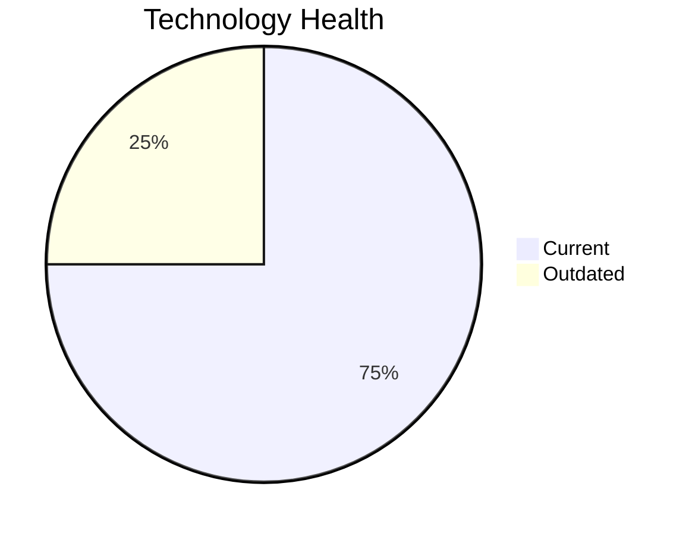

<!-- generated by AI in Github cloud -->
# DocumentApp-014 (app014)

## Application Overview

| Attribute | Value |
|-----------|-------|
| **App ID** | app014 |
| **Name** | DocumentApp-014 |
| **Status** | Production |
| **Criticality** | Medium |
| **Solution Type** | Open Source |
| **Deployment** | AWS |
| **Containerized** | No |
| **Architecture** | 2-Tier |
| **Business Unit** | Operations |
| **External Interfaces** | 9 |
| **Servers** | 2 |
| **Environments** | 2 |

## Technology Stack

| Component | Type | Version | Status | EOL Date |
|-----------|------|---------|--------|----------|
| Windows | os | Server 2019 | 🟢 CURRENT | 2029-01-09 |
| C# .NET 6 | programming_language | 6 | 🟡 OUTDATED | 2024-11-12 |
| Microsoft IIS 10.0 | application_server | 10.0 | 🟢 CURRENT | N/A |
| MySQL 8.0 | database | 8.0 | 🟢 CURRENT | 2026-04-30 |

## Complexity Assessment

**Score: 5/10 (MEDIUM)**

Technology age score 4 (0 EOL, 1 outdated components). Integration score 6 (9 external interfaces). Infrastructure score 6 (2 servers, 2 environments). Criticality score 5 (Medium). Architecture score 5. Data score 4. Weighted final: 5.0 → 5 (MEDIUM).

| Factor | Value |
|--------|-------|
| Number Of Servers | 2 |
| Number Of Databases | 1 |
| Number Of Environments | 2 |
| Number Of Interfaces | 9 |
| Business Criticality | Medium |
| Number Of Outdated Technologies | 1 |
| Number Of Eol Technologies | 0 |
| Number Of Dependencies | 0 |
| Ci Cd Present | Yes |
| Containerized | No |

## Applicable Modernization Scenarios

### App Containerization
- **Status**: APPLICABLE
- **Reason**: Custom/open-source application not yet containerized; containerization is applicable.
- **Confidence**: 8/10

### App Refactor Decoupling
- **Status**: APPLICABLE
- **Reason**: Application may benefit from refactoring and de-coupling.
- **Confidence**: 8/10

### Update Outdated Components
- **Status**: APPLICABLE
- **Reason**: Outdated/EOL components found: C# .NET 6. Updates required.
- **Confidence**: 8/10

## Other Scenarios

| Scenario | Status | Reason |
|----------|--------|--------|
| os_update_security_patch | FULFILLED | OS 'Windows Server 2019' is current and receiving security patches. |
| switch_to_standard_linux_os | NOT_APPLICABLE | OS 'Windows Server 2019' is Windows; switching to Linux is not applicable. |
| switch_to_arm_cpu | LACK_OF_DATA | No explicit CPU architecture data (x86 vs ARM) is available in the application m... |
| application_server_replacement | FULFILLED | Application server 'Microsoft IIS 10.0' is current. |
| app_deployment_to_cloud | FULFILLED | Application is already deployed to cloud (AWS). |
| upgrade_legacy_databases | FULFILLED | Database 'MySQL 8.0' is current. |
| switch_db_engine_open_source | FULFILLED | Database 'MySQL 8.0' is already open-source or managed open-source. |

## Financial Summary

| Scenario | Cost (USD) | Annual Savings (USD) | ROI 3yr % | Payback (yrs) |
|----------|-----------|---------------------|-----------|---------------|
| app_containerization | $100,568 | $90,000 | 168.5% | 1.1 |
| app_refactor_decoupling | $251,420 | $135,000 | 61.1% | 1.9 |
| **TOTAL** | **$351,988** | **$225,000** | | |
