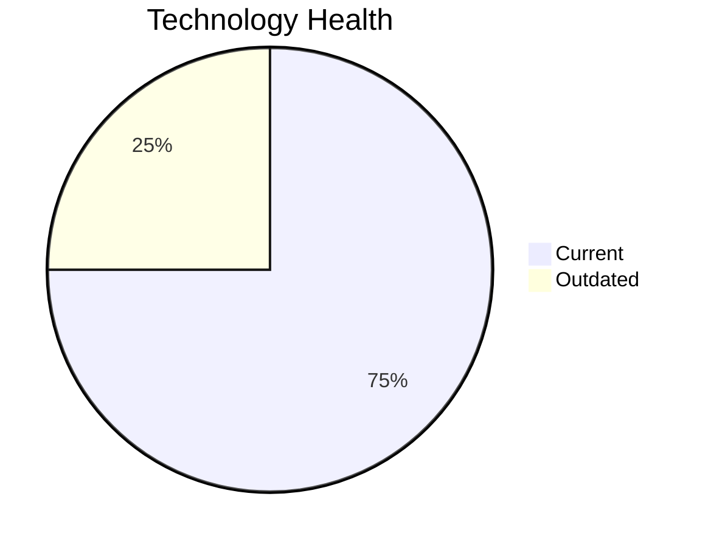

# Application Report: DocumentApp-014

**ID:** app014  
**Generated:** 2026-05-13

## Overview

| Attribute | Value |
|-----------|-------|
| Business Unit | Operations |
| Solution Type | Open Source |
| Deployment Type | AWS |
| Business Criticality | Medium |
| Users | 890 |
| Servers | sv19, sv20 |
| Environments | 2 |
| External Interfaces | 9 |
| Containerized | No |
| CI/CD Present | Yes |
| Architecture | 2-Tier |
| Data Classification | Internal |

## Technology Stack

| Component | Technology | Version | Status |
|-----------|-----------|---------|--------|
| Operating System | Windows Server 2019 | Windows Server 2019 | 🟢 Current |
| Database | MySQL 8.0 | MySQL 8.0 | 🟢 Current |
| Programming Language | C# .NET 6 | C# .NET 6 | 🟡 Outdated |
| Application Server | IIS 10.0 | IIS 10.0 | 🟢 Current |

## Complexity Assessment

**Score:** 5/10 — **MEDIUM**  
**Confidence:** 8/10

> Technology age score 5/10: Outdated components present. Integration score 6/10: 9 external interfaces. Infrastructure score 4/10: 2 server(s), 2 environment(s). Business criticality score 5/10: Medium criticality application. Architecture score 5/10: 2-Tier architecture, not containerized, CI/CD present. Data score 2/10: Database in good standing.

| Factor | Value |
|--------|-------|
| Servers | 2 |
| Environments | 2 |
| External Interfaces | 9 |
| EOL Technologies | 0 |
| Outdated Technologies | 1 |
| Business Criticality | Medium |
| CI/CD Present | Yes |
| Containerized | No |

## Modernization Scenarios

### ✅ Applicable Scenarios

#### Application Containerization

- **Priority:** High
- **Effort:** High
- **Effects:** agility, cost, sustainability
- **One-Time Cost:** €100,568
- **Annual Savings:** €90,000/year
- **Reasoning:** Application runs on Linux or modern .NET stack and is not yet containerized. Containerization would improve portability and resource efficiency.

#### Update Outdated Components

- **Priority:** High
- **Effort:** High
- **Effects:** security, agility, cost
- **Cost:** No financial data available
- **Reasoning:** Outdated or EOL components detected: C# .NET 6. Updates required to maintain security and supportability.

### Other Scenarios

| Scenario | Status | Reason |
|----------|--------|--------|
| Operating System Update | ✔️ Fulfilled | OS (Windows Server 2019) is on a current supported version. |
| Switch to Standard Linux OS | ❌ N/A | Application runs on Windows-based OS. Exclusion criterion applies. |
| Switch to ARM-based CPU | ❓ Unknown | Insufficient data to determine ARM compatibility (architecture type not documented). |
| Application Server Replacement | ✔️ Fulfilled | Application server (Microsoft IIS 10.0) is on a current supported version. |
| Application Migration to Cloud (Lift & Shift) | ✔️ Fulfilled | Application is already hosted on cloud infrastructure (AWS). |
| Application Refactoring and De-coupling | 🔶 Partial | Application architecture (2-Tier) suggests some coupling. Partial refactoring may benefit the applic... |
| Upgrade Legacy Databases | ✔️ Fulfilled | Database (MySQL 8.0) is on a current supported version. |
| Switch DB Engine to Open-Source | ✔️ Fulfilled | Database (MySQL 8.0) is already an open-source database engine. |
| Switch to Managed Database Service | ❌ N/A | Database is already cloud-hosted or scenario not applicable. |
| Managed ARM Database | ❌ N/A | Database is not on a managed cloud service; ARM database migration not applicable. |
| Serverless Database Migration | ❌ N/A | Application deployment pattern does not support serverless database migration at this time. |
| Switch DB Engine to PostgreSQL | ❌ N/A | Database (MySQL 8.0) is already open-source/managed; PostgreSQL migration not prioritized. |

## Financial Summary

| Metric | Value |
|--------|-------|
| Total One-Time Investment | €100,568 |
| Total Annual Savings | €90,000 |
| Break-Even | 1.1 years |
