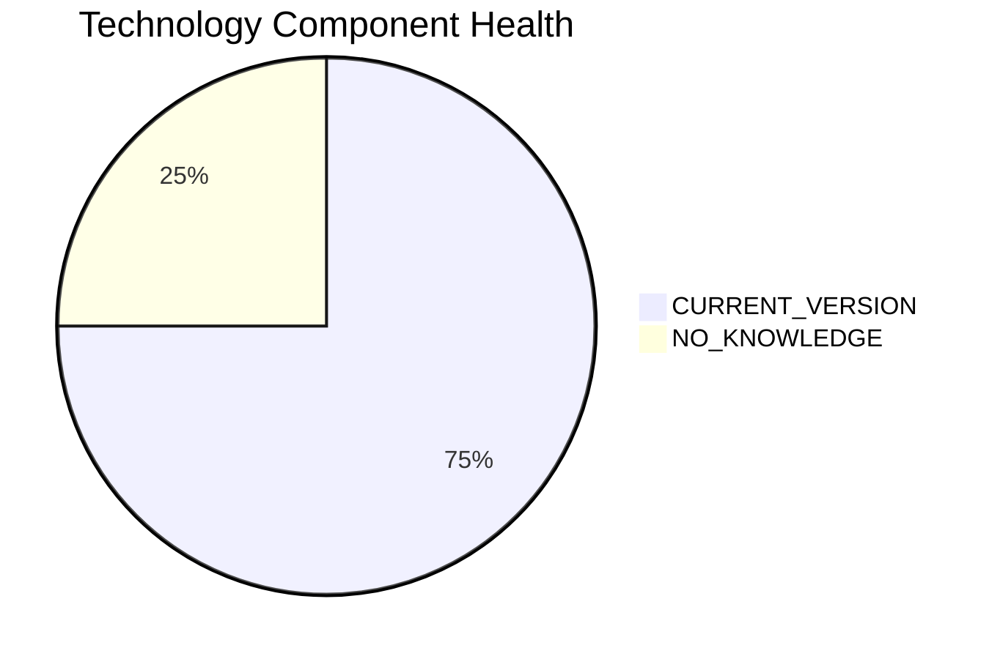

# ReportingApp-015 — Application Modernization Report

> **Application ID:** app015  
> **Business Unit:** Finance  
> **Criticality:** Low

## Application Overview

| Attribute | Value |
|-----------|-------|
| Application ID | app015 |
| Name | ReportingApp-015 |
| Business Unit | Finance |
| Criticality | Low |
| Status | Production |
| Deployment Type | AWS |
| Architecture | 2-Tier |
| Containerized | No |
| CI/CD | Yes |
| Users | 340 |
| Environments | 4 |
| External Interfaces | 4 |
| Servers | s, v, 2, 1 |
| DB Storage (GB) | 400 |
| DB License Required | No |

## Technology Stack Assessment

| Component | Name | Status |
|-----------|------|--------|
| Operating System | Windows Server 2019 | 🟢 CURRENT_VERSION |
| Database | MongoDB | ⚪ NO_KNOWLEDGE |
| Programming Language | PHP 8.1 | 🟢 CURRENT_VERSION |
| Application Server | Microsoft IIS 10.0 | 🟢 CURRENT_VERSION |

### Technology Health Distribution

## Complexity Assessment

**Overall Complexity:** 🟡 **MEDIUM** (Score: 4/10)

| Factor | Score | Weight |
|--------|-------|--------|
| Technology Age | 2 | 25% |
| Integration Complexity | 5 | 20% |
| Infrastructure | 7 | 15% |
| Business Criticality | 3 | 15% |
| Architecture | 4 | 15% |
| Data Complexity | 2 | 10% |

## Modernization Scenarios

### Applicable Scenarios

| Scenario | Reasoning |
|----------|-----------|
| Switch to ARM CPU | Cloud deployment can leverage ARM-based instances (e.g., AWS Graviton) for cost savings. |
| Containerization | Application is not containerized. Containerization would improve deployment consistency and portability. |
| Refactor & Decouple | Application with 2-Tier architecture could benefit from decoupling and modernization. |
| Switch to Managed DB | Database could be migrated to a fully managed cloud database service for reduced operational overhead. |
| Managed ARM DB | Database can be evaluated for ARM-based managed service deployment. |
| Serverless DB Migration | Database can be migrated to a serverless database solution to reduce operational overhead. |

### All Scenario Statuses

| Scenario | Status |
|----------|--------|
| OS Security Patch | 🔵 FULFILLED |
| Switch to Standard Linux | ⬜ NOT_APPLICABLE |
| Switch to ARM CPU | ✅ APPLICABLE |
| App Server Replacement | 🔵 FULFILLED |
| Cloud Deployment | 🔵 FULFILLED |
| Containerization | ✅ APPLICABLE |
| Refactor & Decouple | ✅ APPLICABLE |
| Upgrade Legacy DB | ❓ LACK_OF_DATA |
| Switch to OSS DB | 🔵 FULFILLED |
| Update Outdated Components | 🔵 FULFILLED |
| Switch to Managed DB | ✅ APPLICABLE |
| Managed ARM DB | ✅ APPLICABLE |
| Serverless DB Migration | ✅ APPLICABLE |
| Switch to PostgreSQL | ⬜ NOT_APPLICABLE |

## Financial Summary

| Metric | Value |
|--------|-------|
| Total Estimated Implementation Cost | $323,566.17 |
| Total Estimated Annual Savings | $256,000.00 |
| Estimated ROI Payback Period | 1.3 years |

### Cost/Savings Breakdown by Scenario

| Scenario | Est. Cost | Est. Annual Savings | ROI (years) |
|----------|-----------|---------------------|-------------|
| Switch to ARM CPU | $4,372.52 | $1,000.00 | 4.37 |
| Containerization | $87,450.31 | $90,000.00 | 0.97 |
| Refactor & Decouple | $218,625.78 | $135,000.00 | 1.62 |
| Switch to Managed DB | $4,372.52 | $10,000.00 | 0.44 |
| Managed ARM DB | $4,372.52 | $5,000.00 | 0.87 |
| Serverless DB Migration | $4,372.52 | $15,000.00 | 0.29 |
