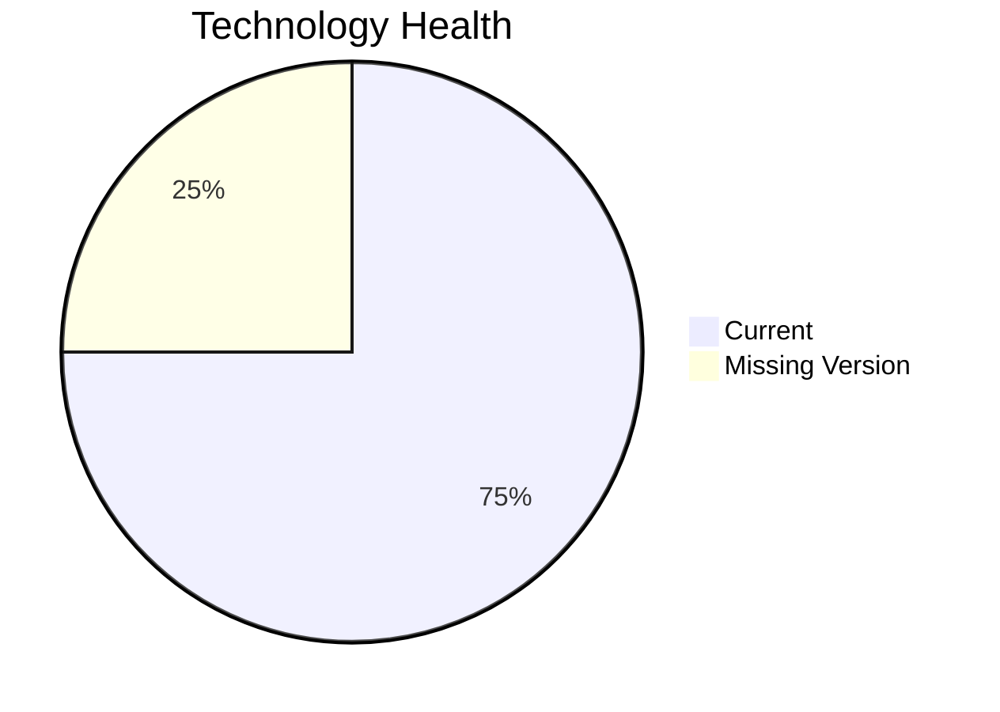

# Application Report: ReportingApp-015

**ID:** app015  
**Generated:** 2026-05-13

## Overview

| Attribute | Value |
|-----------|-------|
| Business Unit | Finance |
| Solution Type | Custom made |
| Deployment Type | AWS |
| Business Criticality | Low |
| Users | 340 |
| Servers | sv21 |
| Environments | 4 |
| External Interfaces | 4 |
| Containerized | No |
| CI/CD Present | Yes |
| Architecture | 2-Tier |
| Data Classification | Public |

## Technology Stack

| Component | Technology | Version | Status |
|-----------|-----------|---------|--------|
| Operating System | Windows Server 2019 | Windows Server 2019 | 🟢 Current |
| Database | MongoDB (unknown version) | MongoDB (unknown version) | ⚪ Unknown |
| Programming Language | PHP 8.1 | PHP 8.1 | 🟢 Current |
| Application Server | IIS 10.0 | IIS 10.0 | 🟢 Current |

## Complexity Assessment

**Score:** 3/10 — **LOW**  
**Confidence:** 8/10

> Technology age score 2/10: All components current. Integration score 4/10: 4 external interfaces. Infrastructure score 4/10: 1 server(s), 4 environment(s). Business criticality score 3/10: Low criticality application. Architecture score 5/10: 2-Tier architecture, not containerized, CI/CD present. Data score 2/10: Database in good standing.

| Factor | Value |
|--------|-------|
| Servers | 1 |
| Environments | 4 |
| External Interfaces | 4 |
| EOL Technologies | 0 |
| Outdated Technologies | 0 |
| Business Criticality | Low |
| CI/CD Present | Yes |
| Containerized | No |

## Modernization Scenarios

*No directly applicable scenarios identified.*

### Other Scenarios

| Scenario | Status | Reason |
|----------|--------|--------|
| Operating System Update | ✔️ Fulfilled | OS (Windows Server 2019) is on a current supported version. |
| Switch to Standard Linux OS | ❌ N/A | Application runs on Windows-based OS. Exclusion criterion applies. |
| Switch to ARM-based CPU | ❓ Unknown | Insufficient data to determine ARM compatibility (architecture type not documented). |
| Application Server Replacement | ✔️ Fulfilled | Application server (Microsoft IIS 10.0) is on a current supported version. |
| Application Migration to Cloud (Lift & Shift) | ✔️ Fulfilled | Application is already hosted on cloud infrastructure (AWS). |
| Application Containerization | 🚫 Blocked | Windows application not running .NET 6+. Containerization blocked due to pre-.NET 6 Windows runtime. |
| Application Refactoring and De-coupling | 🔶 Partial | Application architecture (2-Tier) suggests some coupling. Partial refactoring may benefit the applic... |
| Upgrade Legacy Databases | ✔️ Fulfilled | Database (MongoDB) is on a current supported version. |
| Switch DB Engine to Open-Source | ✔️ Fulfilled | Database (MongoDB) is already an open-source database engine. |
| Update Outdated Components | ✔️ Fulfilled | All application components are on current, supported versions per technology assessment. |
| Switch to Managed Database Service | ❌ N/A | Database is already cloud-hosted or scenario not applicable. |
| Managed ARM Database | ❌ N/A | Database is not on a managed cloud service; ARM database migration not applicable. |
| Serverless Database Migration | ❌ N/A | Application deployment pattern does not support serverless database migration at this time. |
| Switch DB Engine to PostgreSQL | ❌ N/A | No commercial or applicable database detected for PostgreSQL migration. |

## Financial Summary

| Metric | Value |
|--------|-------|
| Total One-Time Investment | €0 |
| Total Annual Savings | €0 |
| Break-Even | N/A |
