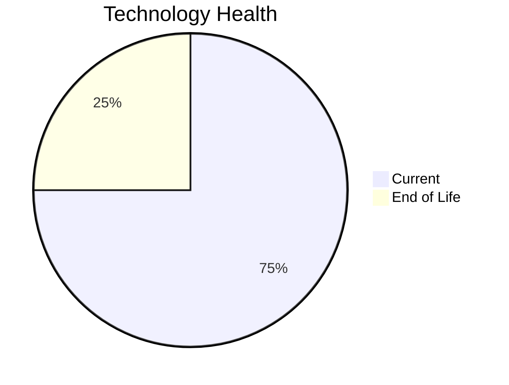

# Application Report: ReportingApp-015

**ID:** app015  
**Generated:** 2026-05-11

## Overview

| Attribute | Value |
|-----------|-------|
| Business Unit | Finance |
| Solution Type | Custom made |
| Deployment Type | AWS |
| Business Criticality | Low |
| Users | 340 |
| Servers | 1 |
| Architecture | 2-Tier |
| Containerized | No |
| CI/CD | Yes |
| Data Classification | Public |

## Technology Stack

| Component | Technology | Status |
|-----------|-----------|--------|
| Os | Windows Server 2019 | 🟢 CURRENT_VERSION |
| Database | MongoDB  | 🔴 EOL |
| Language | PHP 8.1 | 🟢 CURRENT_VERSION |
| Application Server | Microsoft IIS 10.0 | 🟢 CURRENT_VERSION |

## Complexity Assessment

**Score:** 6/10 — **MEDIUM**  
**Confidence:** 7

> Score 6/10 (MEDIUM): 1 EOL component(s), 0 outdated, 4 external interfaces, 1 server(s), criticality=Low, architecture=2-Tier.

| Factor | Value |
|--------|-------|
| Servers | 1 |
| Interfaces | 4 |
| Environments | 4 |
| EOL Technologies | 1 |
| Outdated Technologies | 0 |
| CI/CD Present | Yes |
| Containerized | No |

## Modernization Scenarios

### Applicable Scenarios

#### ✅ Switch to ARM-based CPU

- **Priority:** Medium
- **Effort:** Medium
- **Effects:** cost, sustainability
- **Cost:** €5,783 (one-time)
- **Annual Savings:** €1,000/year
- **Reasoning:** Application runs on cloud and could benefit from ARM-based instances (e.g., AWS Graviton).

#### ✅ Application Containerization

- **Priority:** High
- **Effort:** High
- **Effects:** agility, cost, sustainability
- **Cost:** €115,653 (one-time)
- **Annual Savings:** €90,000/year
- **Reasoning:** Application is not containerized; containerization is applicable for improved portability and scalability.

#### ✅ Application Refactoring and De-coupling

- **Priority:** High
- **Effort:** High
- **Effects:** agility, cost, sustainability
- **Cost:** €289,133 (one-time)
- **Annual Savings:** €135,000/year
- **Reasoning:** Application has 2-Tier architecture - refactoring to microservices would improve scalability.

#### ✅ Upgrade Legacy Databases

- **Priority:** High
- **Effort:** Medium
- **Effects:** security, agility
- **Cost:** €11,565 (one-time)
- **Annual Savings:** €10,000/year
- **Reasoning:** Database (MongoDB) is EOL and requires upgrade.

#### ✅ Update outdated components

- **Priority:** High
- **Effort:** High
- **Effects:** security, agility, cost
- **Reasoning:** EOL components found: MongoDB . Update required.

### Other Scenarios

| Scenario | Status | Reason |
|----------|--------|--------|
| Operating System Update | ✔️ FULFILLED | Operating system is on a current, supported version. |
| Switch to standard Linux Operating System | ❌ NOT_APPLICABLE | Application runs on Windows or is SaaS; switching to standard Linux OS is not applicable. |
| Applications Server replacement | ✔️ FULFILLED | Application server appears to be on a supported version. |
| Application Migration to Cloud Infrastructure (Lift & Shift) | ✔️ FULFILLED | Application is already deployed on cloud (AWS). |
| Switch DB Engine to open-source database solution | ✔️ FULFILLED | Database (MongoDB) is already an open-source solution. |

## Financial Summary

| Metric | Value |
|--------|-------|
| Total One-Time Cost | €422,134 |
| Total Yearly Savings | €236,000 |
| Break-Even | 1.8 years |
