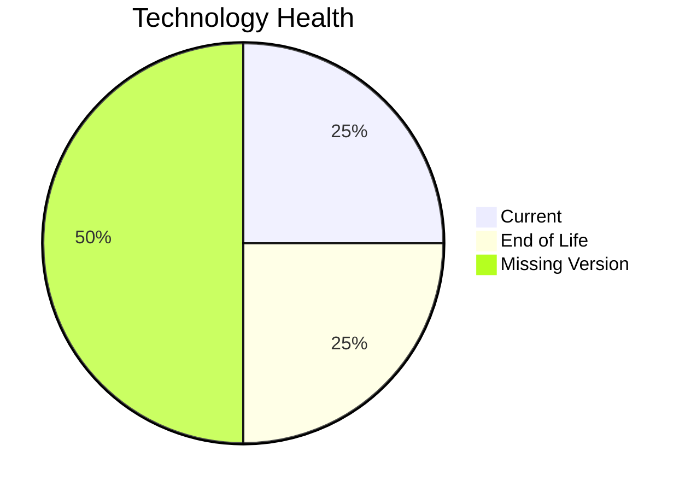

# Application Report: MobileApp-016

**ID:** app016  
**Generated:** 2026-05-11

## Overview

| Attribute | Value |
|-----------|-------|
| Business Unit | Operations |
| Solution Type | Custom made |
| Deployment Type | AWS |
| Business Criticality | Medium |
| Users | 1580 |
| Servers | 2 |
| Architecture | 3-Tier |
| Containerized | Yes |
| CI/CD | Yes |
| Data Classification | Internal |

## Technology Stack

| Component | Technology | Status |
|-----------|-----------|--------|
| Os | RHEL 7 | 🔴 EOL |
| Database | SQL Server 2019 | 🟢 CURRENT_VERSION |
| Language | React Native | ⚪ NO_KNOWLEDGE |
| Application Server | Payara 4.0 | ⚪ NO_KNOWLEDGE |

## Complexity Assessment

**Score:** 6/10 — **MEDIUM**  
**Confidence:** 7

> Score 6/10 (MEDIUM): 1 EOL component(s), 0 outdated, 10 external interfaces, 2 server(s), criticality=Medium, architecture=3-Tier.

| Factor | Value |
|--------|-------|
| Servers | 2 |
| Interfaces | 10 |
| Environments | 3 |
| EOL Technologies | 1 |
| Outdated Technologies | 0 |
| CI/CD Present | Yes |
| Containerized | Yes |

## Modernization Scenarios

### Applicable Scenarios

#### ✅ Operating System Update

- **Priority:** High
- **Effort:** Low
- **Effects:** security
- **Cost:** €1,157 (one-time)
- **Annual Savings:** €500/year
- **Reasoning:** OS (rhel 7) is EOL and requires update.

#### ✅ Switch to ARM-based CPU

- **Priority:** Medium
- **Effort:** Medium
- **Effects:** cost, sustainability
- **Cost:** €5,783 (one-time)
- **Annual Savings:** €1,000/year
- **Reasoning:** Application runs on cloud and could benefit from ARM-based instances (e.g., AWS Graviton).

#### ✅ Switch DB Engine to open-source database solution

- **Priority:** High
- **Effort:** Medium
- **Effects:** cost
- **Reasoning:** Application uses commercial database (SQL Server 2019) with license cost; migration to open-source is recommended.

#### ✅ Update outdated components

- **Priority:** High
- **Effort:** High
- **Effects:** security, agility, cost
- **Reasoning:** EOL components found: RHEL 7. Update required.

### Other Scenarios

| Scenario | Status | Reason |
|----------|--------|--------|
| Switch to standard Linux Operating System | ✔️ FULFILLED | Application already runs on standard Linux (RHEL 7). |
| Applications Server replacement | ✔️ FULFILLED | Application server appears to be on a supported version. |
| Application Migration to Cloud Infrastructure (Lift & Shift) | ✔️ FULFILLED | Application is already deployed on cloud (AWS). |
| Application Containerization | ✔️ FULFILLED | Application is already containerized. |
| Application Refactoring and De-coupling | 🔶 PARTIALLY_FULFILLED | 3-Tier architecture provides some decoupling; further microservice decomposition may be beneficial. |
| Upgrade Legacy Databases | ✔️ FULFILLED | Database (SQL Server 2019) is on a current, supported version. |

## Financial Summary

| Metric | Value |
|--------|-------|
| Total One-Time Cost | €6,940 |
| Total Yearly Savings | €1,500 |
| Break-Even | 4.6 years |
