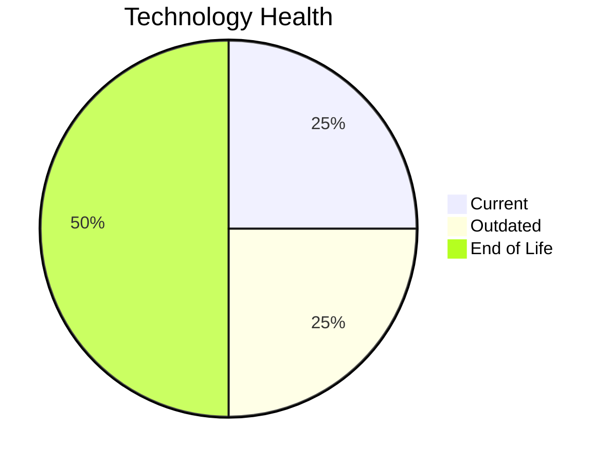

# Application Report: BackupApp-017

**ID:** app017  
**Generated:** 2026-05-13

## Overview

| Attribute | Value |
|-----------|-------|
| Business Unit | IT |
| Solution Type | 3rd party software |
| Deployment Type | On-Premise |
| Business Criticality | High |
| Users | 45 |
| Servers | sv24, sv25 |
| Environments | 5 |
| External Interfaces | 8 |
| Containerized | No |
| CI/CD Present | No |
| Architecture | unknown |
| Data Classification | Confidential |

## Technology Stack

| Component | Technology | Version | Status |
|-----------|-----------|---------|--------|
| Operating System | RHEL 7 | RHEL 7 | 🔴 EOL |
| Database | Oracle 12c | Oracle 12c | 🔴 EOL |
| Programming Language | PowerShell | PowerShell | 🟢 Current |
| Application Server | Payara 5.x | Payara 5.x | 🟡 Outdated |

## Complexity Assessment

**Score:** 7/10 — **HIGH**  
**Confidence:** 8/10

> Technology age score 9/10: Multiple EOL components detected. Integration score 6/10: 8 external interfaces. Infrastructure score 6/10: 2 server(s), 5 environment(s). Business criticality score 7/10: High criticality application. Architecture score 6/10: unknown architecture, not containerized, no CI/CD. Data score 7/10: EOL database components present.

| Factor | Value |
|--------|-------|
| Servers | 2 |
| Environments | 5 |
| External Interfaces | 8 |
| EOL Technologies | 2 |
| Outdated Technologies | 1 |
| Business Criticality | High |
| CI/CD Present | No |
| Containerized | No |

## Modernization Scenarios

### ✅ Applicable Scenarios

#### Operating System Update

- **Priority:** High
- **Effort:** Low
- **Effects:** security
- **One-Time Cost:** €1,330
- **Annual Savings:** €500/year
- **Reasoning:** OS (RHEL 7) is EOL and requires urgent update/replacement.

#### Application Server Replacement

- **Priority:** Medium
- **Effort:** Medium
- **Effects:** agility, cost
- **One-Time Cost:** €13,300
- **Annual Savings:** €9,600/year
- **Reasoning:** Application server (Payara 5.0) is OUTDATED and approaching EOL.

#### Application Migration to Cloud (Lift & Shift)

- **Priority:** High
- **Effort:** Low
- **Effects:** security, agility
- **One-Time Cost:** €6,650
- **Annual Savings:** €2,400/year
- **Reasoning:** Application is deployed on-premise (On-Premise). Cloud migration would improve scalability and reduce infrastructure costs.

#### Upgrade Legacy Databases

- **Priority:** High
- **Effort:** Medium
- **Effects:** security, agility
- **One-Time Cost:** €13,300
- **Annual Savings:** €10,000/year
- **Reasoning:** Database (Oracle 12c) is EOL and requires urgent upgrade.

#### Switch to Managed Database Service

- **Priority:** Medium
- **Effort:** Low
- **Effects:** agility, cost
- **One-Time Cost:** €6,650
- **Annual Savings:** €10,000/year
- **Reasoning:** On-premise database (Oracle 12c) could benefit from migration to a managed cloud database service.

### Other Scenarios

| Scenario | Status | Reason |
|----------|--------|--------|
| Switch to Standard Linux OS | ✔️ Fulfilled | Application already runs on standard Linux OS (RHEL 7). |
| Switch to ARM-based CPU | 🚫 Blocked | 3rd party application with potential x86-specific dependencies. |
| Application Containerization | 🚫 Blocked | 3rd party / SaaS application: runtime packaging cannot be modified by the customer. |
| Application Refactoring and De-coupling | 🚫 Blocked | 3rd party or SaaS application. Internal architecture cannot be refactored by the customer. |
| Switch DB Engine to Open-Source | 🚫 Blocked | 3rd party application. Database migration cannot be performed without vendor involvement. |
| Update Outdated Components | 🚫 Blocked | 3rd party or SaaS application. Component versions are vendor-managed and not upgradeable by the cust... |
| Managed ARM Database | ❌ N/A | Database is not on a managed cloud service; ARM database migration not applicable. |
| Serverless Database Migration | ❌ N/A | On-premise deployment: serverless DB migration requires cloud infrastructure first. |
| Switch DB Engine to PostgreSQL | 🚫 Blocked | 3rd party application. Database migration to PostgreSQL requires vendor involvement. |

## Financial Summary

| Metric | Value |
|--------|-------|
| Total One-Time Investment | €41,230 |
| Total Annual Savings | €32,500 |
| Break-Even | 1.3 years |
