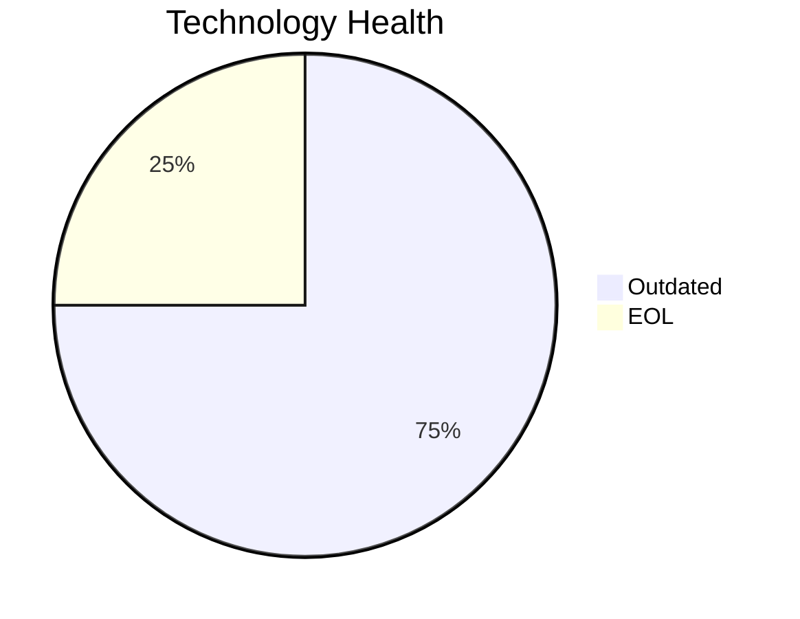

<!-- generated by AI in Github cloud -->
# BackupApp-017 (app017)

## Application Overview

| Attribute | Value |
|-----------|-------|
| **App ID** | app017 |
| **Name** | BackupApp-017 |
| **Status** | Production |
| **Criticality** | High |
| **Solution Type** | 3rd party software |
| **Deployment** | On-Premise |
| **Containerized** | No |
| **Architecture** | unknown |
| **Business Unit** | IT |
| **External Interfaces** | 8 |
| **Servers** | 2 |
| **Environments** | 5 |

## Technology Stack

| Component | Type | Version | Status | EOL Date |
|-----------|------|---------|--------|----------|
| RHEL | os | 7 | 🔴 EOL | 2024-06-30 |
| PowerShell | programming_language |  | 🟡 OUTDATED | N/A |
| Payara 5.0 | application_server | 5.0 | 🟡 OUTDATED | 2024-03-31 |
| Oracle 12c | database | 12c | 🟡 OUTDATED | 2022-07-31 |

## Complexity Assessment

**Score: 7/10 (HIGH)**

Technology age score 7 (1 EOL, 3 outdated components). Integration score 6 (8 external interfaces). Infrastructure score 8 (2 servers, 5 environments). Criticality score 7 (High). Architecture score 5. Data score 8. Weighted final: 6.8 → 7 (HIGH).

| Factor | Value |
|--------|-------|
| Number Of Servers | 2 |
| Number Of Databases | 1 |
| Number Of Environments | 5 |
| Number Of Interfaces | 8 |
| Business Criticality | High |
| Number Of Outdated Technologies | 3 |
| Number Of Eol Technologies | 1 |
| Number Of Dependencies | 0 |
| Ci Cd Present | No |
| Containerized | No |

## Applicable Modernization Scenarios

### Os Update Security Patch
- **Status**: APPLICABLE
- **Reason**: OS 'RHEL 7' is EOL and requires security patching or upgrade.
- **Confidence**: 8/10

### App Deployment To Cloud
- **Status**: APPLICABLE
- **Reason**: Application is on-premise (On-Premise); cloud migration (lift & shift) is applicable.
- **Confidence**: 8/10

### Upgrade Legacy Databases
- **Status**: APPLICABLE
- **Reason**: Database 'Oracle 12c' is OUTDATED; upgrade is required.
- **Confidence**: 8/10

### Update Outdated Components
- **Status**: APPLICABLE
- **Reason**: Outdated/EOL components found: RHEL, PowerShell, Payara 5.0, Oracle 12c. Updates required.
- **Confidence**: 8/10

## Other Scenarios

| Scenario | Status | Reason |
|----------|--------|--------|
| switch_to_standard_linux_os | FULFILLED | OS 'RHEL 7' is already a standard Linux distribution. |
| switch_to_arm_cpu | LACK_OF_DATA | No explicit CPU architecture data (x86 vs ARM) is available in the application m... |
| application_server_replacement | BLOCKED | Application is 3rd party software; app server replacement depends on vendor. |
| app_containerization | BLOCKED | 3rd party application; containerization depends on vendor support. |
| app_refactor_decoupling | NOT_APPLICABLE | 3rd party application; refactoring is not applicable. |
| switch_db_engine_open_source | NOT_APPLICABLE | 3rd party application; database engine change depends on vendor. |

## Financial Summary

| Scenario | Cost (USD) | Annual Savings (USD) | ROI 3yr % | Payback (yrs) |
|----------|-----------|---------------------|-----------|---------------|
| os_update_security_patch | $1,330 | $500 | 12.8% | 2.7 |
| app_deployment_to_cloud | $6,650 | $2,400 | 8.3% | 2.8 |
| upgrade_legacy_databases | $13,300 | $10,000 | 125.6% | 1.3 |
| **TOTAL** | **$21,280** | **$12,900** | | |
