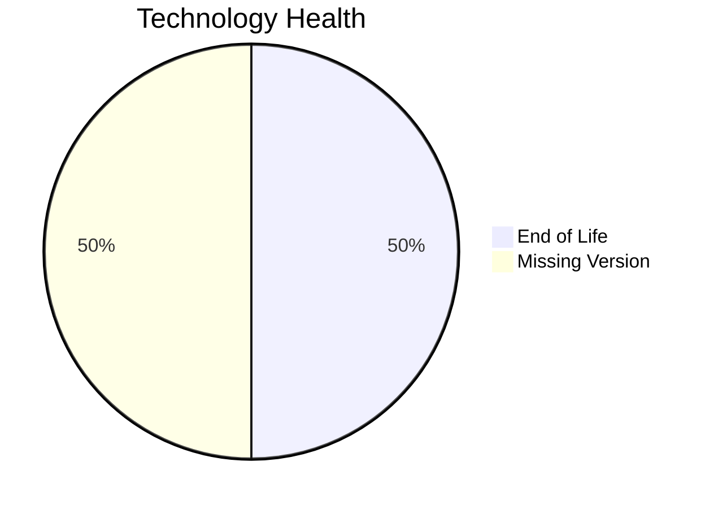

# Application Report: BackupApp-017

**ID:** app017  
**Generated:** 2026-05-11

## Overview

| Attribute | Value |
|-----------|-------|
| Business Unit | IT |
| Solution Type | 3rd party software |
| Deployment Type | On-Premise |
| Business Criticality | High |
| Users | 45 |
| Servers | 2 |
| Architecture | unknown |
| Containerized | No |
| CI/CD | No |
| Data Classification | Confidential |

## Technology Stack

| Component | Technology | Status |
|-----------|-----------|--------|
| Os | RHEL 7 | 🔴 EOL |
| Database | Oracle 12c | 🔴 EOL |
| Language | PowerShell | ⚪ NO_KNOWLEDGE |
| Application Server | Payara 5.0 | ⚪ NO_KNOWLEDGE |

## Complexity Assessment

**Score:** 8/10 — **HIGH**  
**Confidence:** 7

> Score 8/10 (HIGH): 2 EOL component(s), 0 outdated, 8 external interfaces, 2 server(s), criticality=High, architecture=unknown.

| Factor | Value |
|--------|-------|
| Servers | 2 |
| Interfaces | 8 |
| Environments | 5 |
| EOL Technologies | 2 |
| Outdated Technologies | 0 |
| CI/CD Present | No |
| Containerized | No |

## Modernization Scenarios

### Applicable Scenarios

#### ✅ Operating System Update

- **Priority:** High
- **Effort:** Low
- **Effects:** security
- **Cost:** €1,530 (one-time)
- **Annual Savings:** €500/year
- **Reasoning:** OS (rhel 7) is EOL and requires update.

#### ✅ Switch to ARM-based CPU

- **Priority:** Medium
- **Effort:** Medium
- **Effects:** cost, sustainability
- **Cost:** €7,648 (one-time)
- **Annual Savings:** €1,000/year
- **Reasoning:** Application on on-premise x86 infrastructure could benefit from ARM migration for cost savings.

#### ✅ Application Migration to Cloud Infrastructure (Lift & Shift)

- **Priority:** High
- **Effort:** Low
- **Effects:** security, agility
- **Cost:** €7,648 (one-time)
- **Annual Savings:** €2,400/year
- **Reasoning:** Application runs on-premise and is a candidate for cloud migration.

#### ✅ Upgrade Legacy Databases

- **Priority:** High
- **Effort:** Medium
- **Effects:** security, agility
- **Cost:** €15,295 (one-time)
- **Annual Savings:** €10,000/year
- **Reasoning:** Database (Oracle 12c) is EOL and requires upgrade.

#### ✅ Switch DB Engine to open-source database solution

- **Priority:** High
- **Effort:** Medium
- **Effects:** cost
- **Reasoning:** Application uses commercial database (Oracle 12c) with license cost; migration to open-source is recommended.

#### ✅ Update outdated components

- **Priority:** High
- **Effort:** High
- **Effects:** security, agility, cost
- **Reasoning:** EOL components found: RHEL 7, Oracle 12c. Update required.

### Other Scenarios

| Scenario | Status | Reason |
|----------|--------|--------|
| Switch to standard Linux Operating System | ✔️ FULFILLED | Application already runs on standard Linux (RHEL 7). |
| Applications Server replacement | ✔️ FULFILLED | Application server appears to be on a supported version. |
| Application Containerization | ❌ NOT_APPLICABLE | 3rd party/SaaS application - containerization managed by vendor. |
| Application Refactoring and De-coupling | ❌ NOT_APPLICABLE | 3rd party/SaaS application - refactoring not applicable. |

## Financial Summary

| Metric | Value |
|--------|-------|
| Total One-Time Cost | €32,121 |
| Total Yearly Savings | €13,900 |
| Break-Even | 2.3 years |
