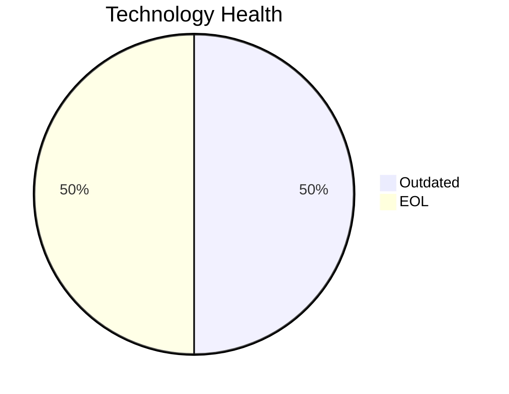

<!-- generated by AI in Github cloud -->
# VendorApp-018 (app018)

## Application Overview

| Attribute | Value |
|-----------|-------|
| **App ID** | app018 |
| **Name** | VendorApp-018 |
| **Status** | Production |
| **Criticality** | Medium |
| **Solution Type** | Custom made |
| **Deployment** | On-Premise |
| **Containerized** | No |
| **Architecture** | 3-Tier |
| **Business Unit** | Procurement |
| **External Interfaces** | 6 |
| **Servers** | 2 |
| **Environments** | 6 |

## Technology Stack

| Component | Type | Version | Status | EOL Date |
|-----------|------|---------|--------|----------|
| RHEL | os | 7 | 🔴 EOL | 2024-06-30 |
| Java 8 | programming_language | 8 | 🟡 OUTDATED | 2022-03-31 |
| Glassfish 4.5 | application_server | 4.5 | 🔴 EOL | 2019-12-31 |
| PostgreSQL 13 | database | 13 | 🟡 OUTDATED | 2025-11-13 |

## Complexity Assessment

**Score: 6/10 (MEDIUM)**

Technology age score 8 (2 EOL, 2 outdated components). Integration score 5 (6 external interfaces). Infrastructure score 8 (2 servers, 6 environments). Criticality score 5 (Medium). Architecture score 5. Data score 4. Weighted final: 6.1 → 6 (MEDIUM).

| Factor | Value |
|--------|-------|
| Number Of Servers | 2 |
| Number Of Databases | 1 |
| Number Of Environments | 6 |
| Number Of Interfaces | 6 |
| Business Criticality | Medium |
| Number Of Outdated Technologies | 2 |
| Number Of Eol Technologies | 2 |
| Number Of Dependencies | 0 |
| Ci Cd Present | No |
| Containerized | No |

## Applicable Modernization Scenarios

### Os Update Security Patch
- **Status**: APPLICABLE
- **Reason**: OS 'RHEL 7' is EOL and requires security patching or upgrade.
- **Confidence**: 8/10

### Application Server Replacement
- **Status**: APPLICABLE
- **Reason**: Application server 'Glassfish 4.5' is EOL and must be replaced.
- **Confidence**: 8/10

### App Deployment To Cloud
- **Status**: APPLICABLE
- **Reason**: Application is on-premise (On-Premise); cloud migration (lift & shift) is applicable.
- **Confidence**: 8/10

### App Containerization
- **Status**: APPLICABLE
- **Reason**: Custom/open-source application not yet containerized; containerization is applicable.
- **Confidence**: 8/10

### App Refactor Decoupling
- **Status**: APPLICABLE
- **Reason**: Custom application with 3-Tier architecture; refactoring to reduce coupling is applicable.
- **Confidence**: 8/10

### Upgrade Legacy Databases
- **Status**: APPLICABLE
- **Reason**: Database 'PostgreSQL 13' is OUTDATED; upgrade is required.
- **Confidence**: 8/10

### Update Outdated Components
- **Status**: APPLICABLE
- **Reason**: Outdated/EOL components found: RHEL, Java 8, Glassfish 4.5, PostgreSQL 13. Updates required.
- **Confidence**: 8/10

## Other Scenarios

| Scenario | Status | Reason |
|----------|--------|--------|
| switch_to_standard_linux_os | FULFILLED | OS 'RHEL 7' is already a standard Linux distribution. |
| switch_to_arm_cpu | LACK_OF_DATA | No explicit CPU architecture data (x86 vs ARM) is available in the application m... |
| switch_db_engine_open_source | FULFILLED | Database 'PostgreSQL 13' is already open-source or managed open-source. |

## Financial Summary

| Scenario | Cost (USD) | Annual Savings (USD) | ROI 3yr % | Payback (yrs) |
|----------|-----------|---------------------|-----------|---------------|
| os_update_security_patch | $1,157 | $500 | 29.7% | 2.3 |
| application_server_replacement | $11,565 | $10,800 | 180.1% | 1.1 |
| app_deployment_to_cloud | $5,783 | $2,700 | 40.1% | 2.1 |
| app_containerization | $115,653 | $90,000 | 133.5% | 1.3 |
| app_refactor_decoupling | $289,133 | $135,000 | 40.1% | 2.1 |
| upgrade_legacy_databases | $11,565 | $10,000 | 159.4% | 1.2 |
| **TOTAL** | **$434,855** | **$249,000** | | |
