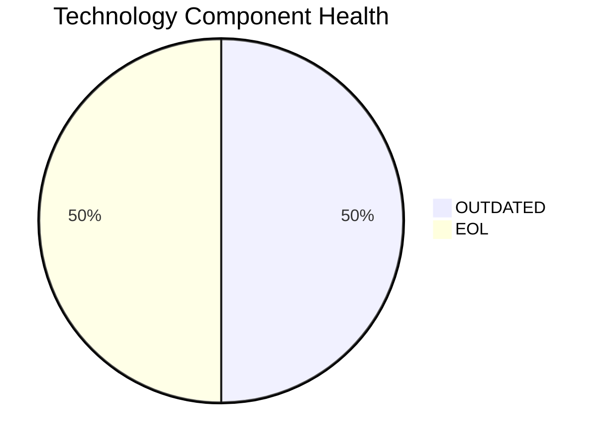

# VendorApp-018 — Application Modernization Report

> **Application ID:** app018  
> **Business Unit:** Procurement  
> **Criticality:** Medium

## Application Overview

| Attribute | Value |
|-----------|-------|
| Application ID | app018 |
| Name | VendorApp-018 |
| Business Unit | Procurement |
| Criticality | Medium |
| Status | Production |
| Deployment Type | On-Premise |
| Architecture | 3-Tier |
| Containerized | No |
| CI/CD | No |
| Users | 260 |
| Environments | 6 |
| External Interfaces | 6 |
| Servers | sv26, sv27 |
| DB Storage (GB) | 250 |
| DB License Required | No |

## Technology Stack Assessment

| Component | Name | Status |
|-----------|------|--------|
| Operating System | RHEL 7 | 🔴 EOL |
| Database | PostgreSQL 13 | 🟡 OUTDATED |
| Programming Language | Java 8 | 🔴 EOL |
| Application Server | Glassfish 4.5 | 🟡 OUTDATED |

### Technology Health Distribution

## Complexity Assessment

**Overall Complexity:** 🔴 **HIGH** (Score: 7/10)

| Factor | Score | Weight |
|--------|-------|--------|
| Technology Age | 8 | 25% |
| Integration Complexity | 7 | 20% |
| Infrastructure | 7 | 15% |
| Business Criticality | 5 | 15% |
| Architecture | 7 | 15% |
| Data Complexity | 6 | 10% |

## Modernization Scenarios

### Applicable Scenarios

| Scenario | Reasoning |
|----------|-----------|
| OS Security Patch | OS RHEL 7 is EOL and requires security patching or upgrade. |
| Switch to Standard Linux | RHEL 7 is EOL. Upgrading to a current Linux distribution is recommended. |
| Switch to ARM CPU | On-premise deployment can be evaluated for ARM-based hardware to reduce energy costs. |
| App Server Replacement | Application server Glassfish 4.5 is outdated and should be upgraded. |
| Cloud Deployment | Application is deployed on-premise. Cloud migration would improve scalability and reduce infrastructure costs. |
| Containerization | Application is not containerized. Containerization would improve deployment consistency and portability. |
| Refactor & Decouple | Application with 3-Tier architecture could benefit from decoupling and modernization. |
| Upgrade Legacy DB | Database PostgreSQL 13 is outdated and should be upgraded. |
| Update Outdated Components | Outdated/EOL components detected: RHEL 7, PostgreSQL 13, Java 8, Glassfish 4.5. Updates required. |
| Switch to Managed DB | On-premise database could be migrated to a managed cloud database service. |
| Managed ARM DB | Migrating database to ARM-based managed cloud service would reduce costs. |
| Serverless DB Migration | Database can be migrated to a serverless database solution to reduce operational overhead. |

### All Scenario Statuses

| Scenario | Status |
|----------|--------|
| OS Security Patch | ✅ APPLICABLE |
| Switch to Standard Linux | ✅ APPLICABLE |
| Switch to ARM CPU | ✅ APPLICABLE |
| App Server Replacement | ✅ APPLICABLE |
| Cloud Deployment | ✅ APPLICABLE |
| Containerization | ✅ APPLICABLE |
| Refactor & Decouple | ✅ APPLICABLE |
| Upgrade Legacy DB | ✅ APPLICABLE |
| Switch to OSS DB | 🔵 FULFILLED |
| Update Outdated Components | ✅ APPLICABLE |
| Switch to Managed DB | ✅ APPLICABLE |
| Managed ARM DB | ✅ APPLICABLE |
| Serverless DB Migration | ✅ APPLICABLE |
| Switch to PostgreSQL | 🔵 FULFILLED |

## Financial Summary

| Metric | Value |
|--------|-------|
| Total Estimated Implementation Cost | $527,082.94 |
| Total Estimated Annual Savings | $253,900.00 |
| Estimated ROI Payback Period | 2.1 years |

### Cost/Savings Breakdown by Scenario

| Scenario | Est. Cost | Est. Annual Savings | ROI (years) |
|----------|-----------|---------------------|-------------|
| OS Security Patch | $1,330.01 | $500.00 | 2.66 |
| Switch to Standard Linux | $399.00 | $400.00 | 1.0 |
| Switch to ARM CPU | $6,650.05 | $1,000.00 | 6.65 |
| App Server Replacement | $13,300.10 | $9,600.00 | 1.39 |
| Cloud Deployment | $6,650.05 | $2,400.00 | 2.77 |
| Containerization | $133,000.99 | $80,000.00 | 1.66 |
| Refactor & Decouple | $332,502.49 | $120,000.00 | 2.77 |
| Upgrade Legacy DB | $13,300.10 | $10,000.00 | 1.33 |
| Update Outdated Components | N/A | N/A | N/A |
| Switch to Managed DB | $6,650.05 | $10,000.00 | 0.67 |
| Managed ARM DB | $6,650.05 | $5,000.00 | 1.33 |
| Serverless DB Migration | $6,650.05 | $15,000.00 | 0.44 |
