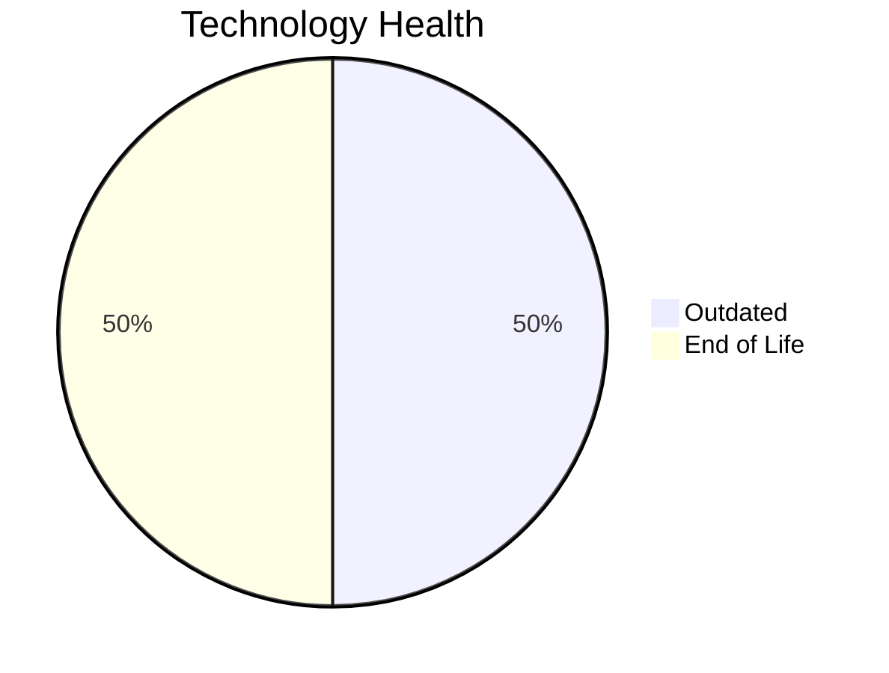

# Application Report: VendorApp-018

**ID:** app018  
**Generated:** 2026-05-13

## Overview

| Attribute | Value |
|-----------|-------|
| Business Unit | Procurement |
| Solution Type | Custom made |
| Deployment Type | On-Premise |
| Business Criticality | Medium |
| Users | 260 |
| Servers | sv26, sv27 |
| Environments | 6 |
| External Interfaces | 6 |
| Containerized | No |
| CI/CD Present | No |
| Architecture | 3-Tier |
| Data Classification | Internal |

## Technology Stack

| Component | Technology | Version | Status |
|-----------|-----------|---------|--------|
| Operating System | RHEL 7 | RHEL 7 | 🔴 EOL |
| Database | PostgreSQL 13 | PostgreSQL 13 | 🟡 Outdated |
| Programming Language | Java 8 | Java 8 | 🔴 EOL |
| Application Server | GlassFish 4.5 | GlassFish 4.5 | 🟡 Outdated |

## Complexity Assessment

**Score:** 6/10 — **MEDIUM**  
**Confidence:** 8/10

> Technology age score 9/10: Multiple EOL components detected. Integration score 6/10: 6 external interfaces. Infrastructure score 6/10: 2 server(s), 6 environment(s). Business criticality score 5/10: Medium criticality application. Architecture score 5/10: 3-Tier architecture, not containerized, no CI/CD. Data score 4/10: Outdated database components present.

| Factor | Value |
|--------|-------|
| Servers | 2 |
| Environments | 6 |
| External Interfaces | 6 |
| EOL Technologies | 2 |
| Outdated Technologies | 2 |
| Business Criticality | Medium |
| CI/CD Present | No |
| Containerized | No |

## Modernization Scenarios

### ✅ Applicable Scenarios

#### Operating System Update

- **Priority:** High
- **Effort:** Low
- **Effects:** security
- **One-Time Cost:** €1,157
- **Annual Savings:** €500/year
- **Reasoning:** OS (RHEL 7) is EOL and requires urgent update/replacement.

#### Switch to ARM-based CPU

- **Priority:** Medium
- **Effort:** Medium
- **Effects:** cost, sustainability
- **One-Time Cost:** €5,783
- **Annual Savings:** €900/year
- **Reasoning:** Custom application on standard Linux is a candidate for ARM CPU migration with cost and sustainability benefits.

#### Application Server Replacement

- **Priority:** Medium
- **Effort:** Medium
- **Effects:** agility, cost
- **One-Time Cost:** €11,565
- **Annual Savings:** €10,800/year
- **Reasoning:** Application server (Glassfish 4.5) is OUTDATED and approaching EOL.

#### Application Migration to Cloud (Lift & Shift)

- **Priority:** High
- **Effort:** Low
- **Effects:** security, agility
- **One-Time Cost:** €5,783
- **Annual Savings:** €2,700/year
- **Reasoning:** Application is deployed on-premise (On-Premise). Cloud migration would improve scalability and reduce infrastructure costs.

#### Application Containerization

- **Priority:** High
- **Effort:** High
- **Effects:** agility, cost, sustainability
- **One-Time Cost:** €115,653
- **Annual Savings:** €90,000/year
- **Reasoning:** Application runs on Linux or modern .NET stack and is not yet containerized. Containerization would improve portability and resource efficiency.

#### Upgrade Legacy Databases

- **Priority:** High
- **Effort:** Medium
- **Effects:** security, agility
- **One-Time Cost:** €11,565
- **Annual Savings:** €10,000/year
- **Reasoning:** Database (PostgreSQL 13) is OUTDATED and approaching EOL.

#### Update Outdated Components

- **Priority:** High
- **Effort:** High
- **Effects:** security, agility, cost
- **Cost:** No financial data available
- **Reasoning:** Outdated or EOL components detected: RHEL 7, Java 8, PostgreSQL 13, GlassFish 4.5. Updates required to maintain security and supportability.

#### Switch to Managed Database Service

- **Priority:** Medium
- **Effort:** Low
- **Effects:** agility, cost
- **One-Time Cost:** €5,783
- **Annual Savings:** €10,000/year
- **Reasoning:** On-premise database (PostgreSQL 13) could benefit from migration to a managed cloud database service.

### Other Scenarios

| Scenario | Status | Reason |
|----------|--------|--------|
| Switch to Standard Linux OS | ✔️ Fulfilled | Application already runs on standard Linux OS (RHEL 7). |
| Application Refactoring and De-coupling | 🔶 Partial | Application has 3-Tier architecture but lacks CI/CD. Some modernization needed for full decoupling b... |
| Switch DB Engine to Open-Source | ✔️ Fulfilled | Database (PostgreSQL 13) is already an open-source database engine. |
| Managed ARM Database | ❌ N/A | Database is not on a managed cloud service; ARM database migration not applicable. |
| Serverless Database Migration | ❌ N/A | On-premise deployment: serverless DB migration requires cloud infrastructure first. |
| Switch DB Engine to PostgreSQL | ✔️ Fulfilled | Database (PostgreSQL 13) is already PostgreSQL or PostgreSQL-compatible. |

## Financial Summary

| Metric | Value |
|--------|-------|
| Total One-Time Investment | €157,289 |
| Total Annual Savings | €124,900 |
| Break-Even | 1.3 years |
