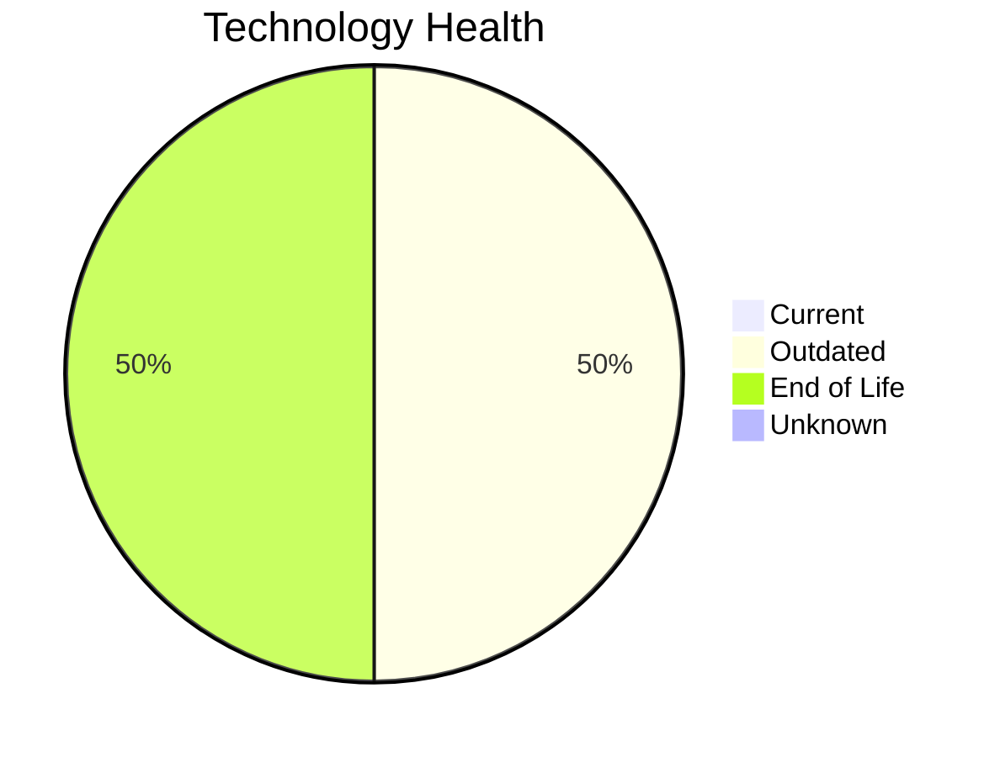

# Application Report: VendorApp-018

**ID:** app018
**Generated:** 2026-05-11

## Overview

| Attribute | Value |
|-----------|-------|
| Business Unit | Procurement |
| Solution Type | Custom made |
| Deployment | On-Premise |
| Business Criticality | Medium |
| Users | 260 |
| Servers | 2 (sv26, sv27) |
| Containerized | No |
| CI/CD | No |
| Architecture | 3-Tier |

## Technology Stack

| Component | Technology | Version | Status |
|-----------|-----------|---------|--------|
| Os | RHEL 7 | RHEL 7 | 🔴 EOL |
| Language | Java 8 | Java 8 | 🟡 OUTDATED |
| Database | PostgreSQL 13 | PostgreSQL 13 | 🟡 OUTDATED |
| Application Server | Glassfish 4.5 | Glassfish 4.5 | 🔴 EOL |

## Complexity Assessment

**Score:** 6/10 — **MEDIUM**
**Confidence:** 8/10

| Factor | Value |
|--------|-------|
| Technology Age (EOL/Outdated) | 2 EOL / 2 outdated |
| Integration (External Interfaces) | 6 |
| Infrastructure (Servers) | 2 |
| Business Criticality | Medium |
| Containerized | No |
| CI/CD Present | No |

> Complexity MEDIUM (6/10). Technology age: 9/10 (2 EOL, 2 outdated components). Integration: 6/10 (6 external interfaces). Infrastructure: 4/10 (2 servers). Business criticality Medium: 4/10. Architecture 3-tier: 5/10. Data complexity: 5/10.

## Modernization Scenarios

### Applicable Scenarios

#### ✅ Operating System Update

- **Reason:** OS RHEL 7 has status EOL. Security patches and OS update recommended.
- **Confidence:** 8/10
- **Cost:** €1,157 (one-time)
- **Savings:** €500/year

#### ✅ Switch to ARM-based CPU

- **Reason:** Custom/open-source application on Linux can be considered for ARM-based infrastructure.
- **Confidence:** 8/10
- **Cost:** €5,783 (one-time)
- **Savings:** €1,000/year

#### ✅ Applications Server replacement

- **Reason:** Application server Glassfish 4.5 has status EOL. Replacement recommended.
- **Confidence:** 8/10
- **Cost:** €11,565 (one-time)
- **Savings:** €10,800/year

#### ✅ Application Migration to Cloud Infrastructure (Lift & Shift)

- **Reason:** Application is deployed on-premise. Migration to cloud infrastructure is applicable.
- **Confidence:** 8/10
- **Cost:** €5,783 (one-time)
- **Savings:** €2,700/year

#### ✅ Application Containerization

- **Reason:** Application is not containerized and can be containerized as a custom/open-source app.
- **Confidence:** 8/10
- **Cost:** €115,653 (one-time)
- **Savings:** €90,000/year

#### ✅ Application Refactoring and De-coupling

- **Reason:** Custom application with 3-tier architecture. Refactoring and de-coupling recommended.
- **Confidence:** 8/10
- **Cost:** €289,133 (one-time)
- **Savings:** €135,000/year

#### ✅ Upgrade Legacy Databases

- **Reason:** Database PostgreSQL 13 has status OUTDATED. Upgrade recommended.
- **Confidence:** 8/10
- **Cost:** €11,565 (one-time)
- **Savings:** €10,000/year

#### ✅ Update outdated components

- **Reason:** Application has EOL components that should be updated.
- **Confidence:** 8/10

### Other Scenarios

| Scenario | Status | Reason |
|----------|--------|--------|
| Switch to standard Linux Operating System | ✔️ FULFILLED | Application already runs on standard Linux (RHEL 7). |
| Switch DB Engine to open-source database solution | ✔️ FULFILLED | Database PostgreSQL 13 is already open-source. |

## Financial Summary

| Metric | Value |
|--------|-------|
| Total One-Time Investment | €440,638 |
| Total Annual Savings | €250,000 |
| Break-Even | 1.8 years |

