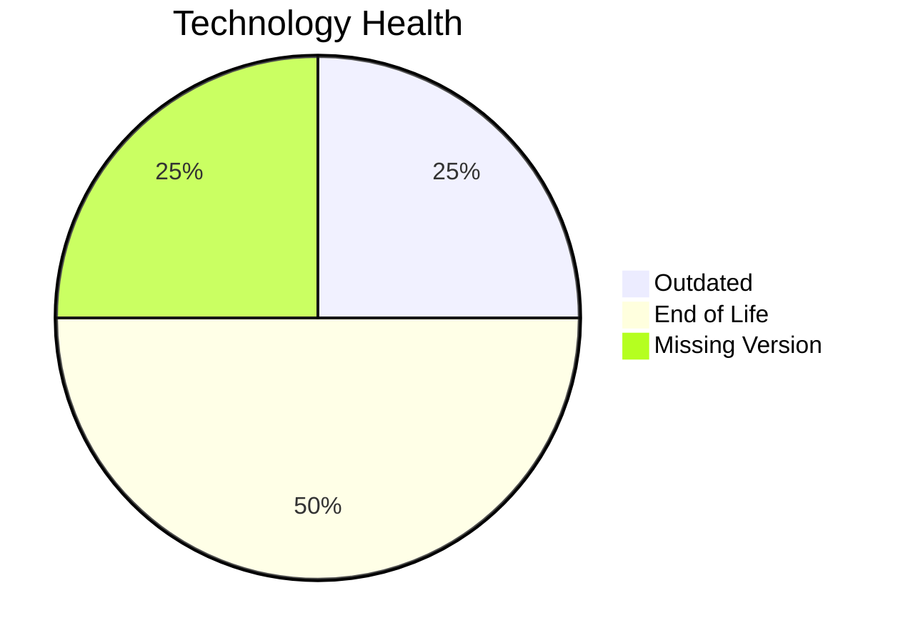

# Application Report: VendorApp-018

**ID:** app018  
**Generated:** 2026-05-11

## Overview

| Attribute | Value |
|-----------|-------|
| Business Unit | Procurement |
| Solution Type | Custom made |
| Deployment Type | On-Premise |
| Business Criticality | Medium |
| Users | 260 |
| Servers | 2 |
| Architecture | 3-Tier |
| Containerized | No |
| CI/CD | No |
| Data Classification | Internal |

## Technology Stack

| Component | Technology | Status |
|-----------|-----------|--------|
| Os | RHEL 7 | 🔴 EOL |
| Database | PostgreSQL 13 | 🟡 OUTDATED |
| Language | Java 8 | 🔴 EOL |
| Application Server | Glassfish 4.5 | ⚪ NO_KNOWLEDGE |

## Complexity Assessment

**Score:** 7/10 — **HIGH**  
**Confidence:** 7

> Score 7/10 (HIGH): 2 EOL component(s), 1 outdated, 6 external interfaces, 2 server(s), criticality=Medium, architecture=3-Tier.

| Factor | Value |
|--------|-------|
| Servers | 2 |
| Interfaces | 6 |
| Environments | 6 |
| EOL Technologies | 2 |
| Outdated Technologies | 1 |
| CI/CD Present | No |
| Containerized | No |

## Modernization Scenarios

### Applicable Scenarios

#### ✅ Operating System Update

- **Priority:** High
- **Effort:** Low
- **Effects:** security
- **Cost:** €1,330 (one-time)
- **Annual Savings:** €500/year
- **Reasoning:** OS (rhel 7) is EOL and requires update.

#### ✅ Switch to ARM-based CPU

- **Priority:** Medium
- **Effort:** Medium
- **Effects:** cost, sustainability
- **Cost:** €6,650 (one-time)
- **Annual Savings:** €1,000/year
- **Reasoning:** Application on on-premise x86 infrastructure could benefit from ARM migration for cost savings.

#### ✅ Application Migration to Cloud Infrastructure (Lift & Shift)

- **Priority:** High
- **Effort:** Low
- **Effects:** security, agility
- **Cost:** €6,650 (one-time)
- **Annual Savings:** €2,400/year
- **Reasoning:** Application runs on-premise and is a candidate for cloud migration.

#### ✅ Application Containerization

- **Priority:** High
- **Effort:** High
- **Effects:** agility, cost, sustainability
- **Cost:** €133,001 (one-time)
- **Annual Savings:** €80,000/year
- **Reasoning:** Application is not containerized; containerization is applicable for improved portability and scalability.

#### ✅ Upgrade Legacy Databases

- **Priority:** High
- **Effort:** Medium
- **Effects:** security, agility
- **Cost:** €13,300 (one-time)
- **Annual Savings:** €10,000/year
- **Reasoning:** Database (PostgreSQL 13) is outdated and should be upgraded.

#### ✅ Update outdated components

- **Priority:** High
- **Effort:** High
- **Effects:** security, agility, cost
- **Reasoning:** EOL components found: RHEL 7, Java 8. Update required.

### Other Scenarios

| Scenario | Status | Reason |
|----------|--------|--------|
| Switch to standard Linux Operating System | ✔️ FULFILLED | Application already runs on standard Linux (RHEL 7). |
| Applications Server replacement | ✔️ FULFILLED | Application server appears to be on a supported version. |
| Application Refactoring and De-coupling | 🔶 PARTIALLY_FULFILLED | 3-Tier architecture provides some decoupling; further microservice decomposition may be beneficial. |
| Switch DB Engine to open-source database solution | ✔️ FULFILLED | Database (PostgreSQL 13) is already an open-source solution. |

## Financial Summary

| Metric | Value |
|--------|-------|
| Total One-Time Cost | €160,931 |
| Total Yearly Savings | €93,900 |
| Break-Even | 1.7 years |
