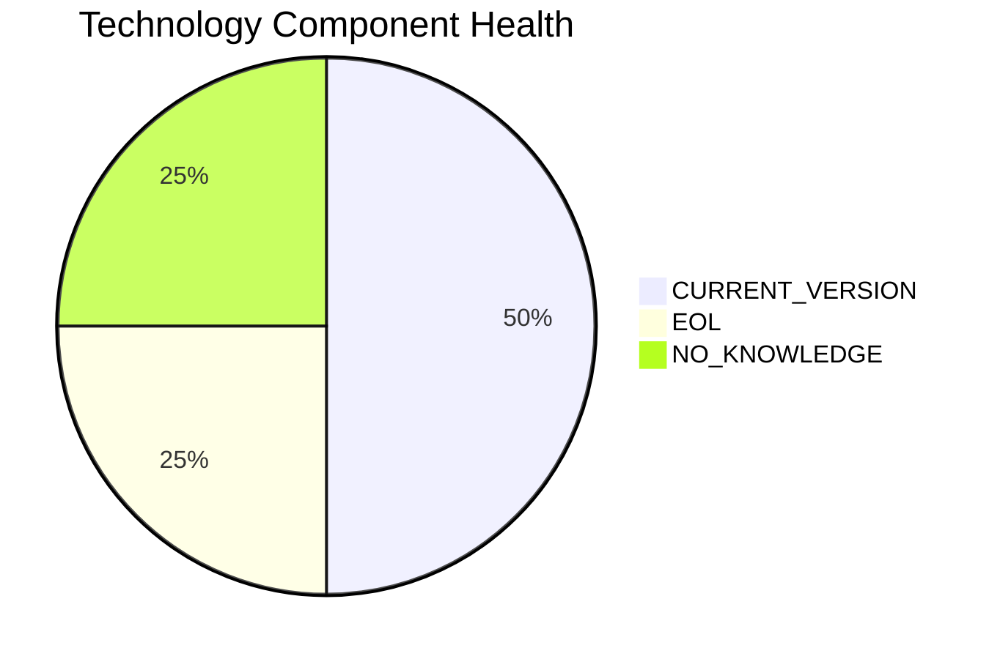

# QualityApp-019 — Application Modernization Report

> **Application ID:** app019  
> **Business Unit:** Quality  
> **Criticality:** High

## Application Overview

| Attribute | Value |
|-----------|-------|
| Application ID | app019 |
| Name | QualityApp-019 |
| Business Unit | Quality |
| Criticality | High |
| Status | Production |
| Deployment Type | AWS, On-premise |
| Architecture | 3-Tier |
| Containerized | No |
| CI/CD | Yes |
| Users | 180 |
| Environments | 1 |
| External Interfaces | 5 |
| Servers | s, v, 2, 8 |
| DB Storage (GB) | 180 |
| DB License Required | No |

## Technology Stack Assessment

| Component | Name | Status |
|-----------|------|--------|
| Operating System | RHEL 8 | 🟢 CURRENT_VERSION |
| Database | MySQL 8.0 | 🟢 CURRENT_VERSION |
| Programming Language | Python 3.8 | 🔴 EOL |
| Application Server | Apache Tomcat  8.0 | ⚪ NO_KNOWLEDGE |

### Technology Health Distribution

## Complexity Assessment

**Overall Complexity:** 🟡 **MEDIUM** (Score: 5/10)

| Factor | Score | Weight |
|--------|-------|--------|
| Technology Age | 7 | 25% |
| Integration Complexity | 5 | 20% |
| Infrastructure | 5 | 15% |
| Business Criticality | 7 | 15% |
| Architecture | 4 | 15% |
| Data Complexity | 2 | 10% |

## Modernization Scenarios

### Applicable Scenarios

| Scenario | Reasoning |
|----------|-----------|
| Switch to ARM CPU | Cloud deployment can leverage ARM-based instances (e.g., AWS Graviton) for cost savings. |
| Containerization | Application is not containerized. Containerization would improve deployment consistency and portability. |
| Refactor & Decouple | Application with 3-Tier architecture could benefit from decoupling and modernization. |
| Update Outdated Components | Outdated/EOL components detected: Python 3.8. Updates required. |
| Switch to Managed DB | Database could be migrated to a fully managed cloud database service for reduced operational overhead. |
| Managed ARM DB | Database can be evaluated for ARM-based managed service deployment. |
| Serverless DB Migration | Database can be migrated to a serverless database solution to reduce operational overhead. |
| Switch to PostgreSQL | Migrating from MySQL 8.0 to PostgreSQL would provide a more feature-rich open-source database. |

### All Scenario Statuses

| Scenario | Status |
|----------|--------|
| OS Security Patch | 🔵 FULFILLED |
| Switch to Standard Linux | 🔵 FULFILLED |
| Switch to ARM CPU | ✅ APPLICABLE |
| App Server Replacement | 🔵 FULFILLED |
| Cloud Deployment | 🔷 PARTIALLY_FULFILLED |
| Containerization | ✅ APPLICABLE |
| Refactor & Decouple | ✅ APPLICABLE |
| Upgrade Legacy DB | 🔵 FULFILLED |
| Switch to OSS DB | 🔵 FULFILLED |
| Update Outdated Components | ✅ APPLICABLE |
| Switch to Managed DB | ✅ APPLICABLE |
| Managed ARM DB | ✅ APPLICABLE |
| Serverless DB Migration | ✅ APPLICABLE |
| Switch to PostgreSQL | ✅ APPLICABLE |

## Financial Summary

| Metric | Value |
|--------|-------|
| Total Estimated Implementation Cost | $397,243.03 |
| Total Estimated Annual Savings | $271,000.00 |
| Estimated ROI Payback Period | 1.5 years |

### Cost/Savings Breakdown by Scenario

| Scenario | Est. Cost | Est. Annual Savings | ROI (years) |
|----------|-----------|---------------------|-------------|
| Switch to ARM CPU | $5,028.39 | $1,000.00 | 5.03 |
| Containerization | $100,567.86 | $90,000.00 | 1.12 |
| Refactor & Decouple | $251,419.65 | $135,000.00 | 1.86 |
| Update Outdated Components | N/A | N/A | N/A |
| Switch to Managed DB | $5,028.39 | $10,000.00 | 0.5 |
| Managed ARM DB | $5,028.39 | $5,000.00 | 1.01 |
| Serverless DB Migration | $5,028.39 | $15,000.00 | 0.34 |
| Switch to PostgreSQL | $25,141.96 | $15,000.00 | 1.68 |
