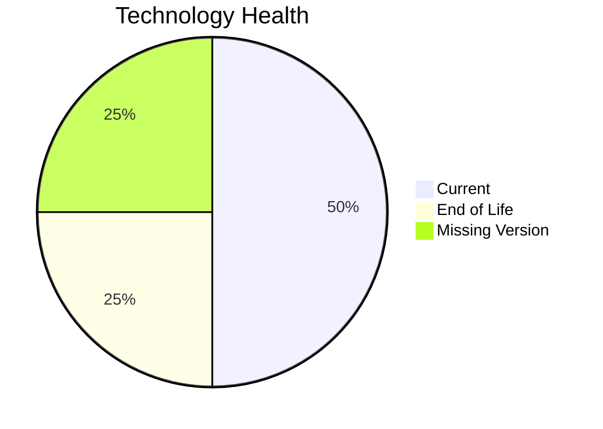

# Application Report: QualityApp-019

**ID:** app019  
**Generated:** 2026-05-13

## Overview

| Attribute | Value |
|-----------|-------|
| Business Unit | Quality |
| Solution Type | Custom made |
| Deployment Type | AWS, On-premise |
| Business Criticality | High |
| Users | 180 |
| Servers | sv28 |
| Environments | 1 |
| External Interfaces | 5 |
| Containerized | No |
| CI/CD Present | Yes |
| Architecture | 3-Tier |
| Data Classification | Confidential |

## Technology Stack

| Component | Technology | Version | Status |
|-----------|-----------|---------|--------|
| Operating System | RHEL 8 | RHEL 8 | 🟢 Current |
| Database | MySQL 8.0 | MySQL 8.0 | 🟢 Current |
| Programming Language | Python 3.8 | Python 3.8 | 🔴 EOL |
| Application Server | App Server (unknown) | App Server (unknown) | ⚪ Unknown |

## Complexity Assessment

**Score:** 5/10 — **MEDIUM**  
**Confidence:** 8/10

> Technology age score 8/10: Multiple EOL components detected. Integration score 4/10: 5 external interfaces. Infrastructure score 2/10: 1 server(s), 1 environment(s). Business criticality score 7/10: High criticality application. Architecture score 4/10: 3-Tier architecture, not containerized, CI/CD present. Data score 2/10: Database in good standing.

| Factor | Value |
|--------|-------|
| Servers | 1 |
| Environments | 1 |
| External Interfaces | 5 |
| EOL Technologies | 1 |
| Outdated Technologies | 0 |
| Business Criticality | High |
| CI/CD Present | Yes |
| Containerized | No |

## Modernization Scenarios

### ✅ Applicable Scenarios

#### Switch to ARM-based CPU

- **Priority:** Medium
- **Effort:** Medium
- **Effects:** cost, sustainability
- **One-Time Cost:** €5,028
- **Annual Savings:** €900/year
- **Reasoning:** Custom application on standard Linux is a candidate for ARM CPU migration with cost and sustainability benefits.

#### Application Migration to Cloud (Lift & Shift)

- **Priority:** High
- **Effort:** Low
- **Effects:** security, agility
- **One-Time Cost:** €5,028
- **Annual Savings:** €2,700/year
- **Reasoning:** Application is deployed on-premise (AWS, On-premise). Cloud migration would improve scalability and reduce infrastructure costs.

#### Application Containerization

- **Priority:** High
- **Effort:** High
- **Effects:** agility, cost, sustainability
- **One-Time Cost:** €100,568
- **Annual Savings:** €90,000/year
- **Reasoning:** Application runs on Linux or modern .NET stack and is not yet containerized. Containerization would improve portability and resource efficiency.

#### Update Outdated Components

- **Priority:** High
- **Effort:** High
- **Effects:** security, agility, cost
- **Cost:** No financial data available
- **Reasoning:** Outdated or EOL components detected: Python 3.8. Updates required to maintain security and supportability.

#### Switch to Managed Database Service

- **Priority:** Medium
- **Effort:** Low
- **Effects:** agility, cost
- **One-Time Cost:** €5,028
- **Annual Savings:** €10,000/year
- **Reasoning:** Hybrid deployment with on-premise database (MySQL 8.0) could migrate to managed service.

### Other Scenarios

| Scenario | Status | Reason |
|----------|--------|--------|
| Operating System Update | ✔️ Fulfilled | OS (RHEL 8) is on a current supported version. |
| Switch to Standard Linux OS | ✔️ Fulfilled | Application already runs on standard Linux OS (RHEL 8). |
| Application Server Replacement | ✔️ Fulfilled | Application server (Apache Tomcat  8.0) is on a current supported version. |
| Application Refactoring and De-coupling | 🔶 Partial | Application architecture (3-Tier) suggests some coupling. Partial refactoring may benefit the applic... |
| Upgrade Legacy Databases | ✔️ Fulfilled | Database (MySQL 8.0) is on a current supported version. |
| Switch DB Engine to Open-Source | ✔️ Fulfilled | Database (MySQL 8.0) is already an open-source database engine. |
| Managed ARM Database | ❌ N/A | Database is not on a managed cloud service; ARM database migration not applicable. |
| Serverless Database Migration | ❌ N/A | Application deployment pattern does not support serverless database migration at this time. |
| Switch DB Engine to PostgreSQL | ❌ N/A | Database (MySQL 8.0) is already open-source/managed; PostgreSQL migration not prioritized. |

## Financial Summary

| Metric | Value |
|--------|-------|
| Total One-Time Investment | €115,652 |
| Total Annual Savings | €103,600 |
| Break-Even | 1.1 years |
