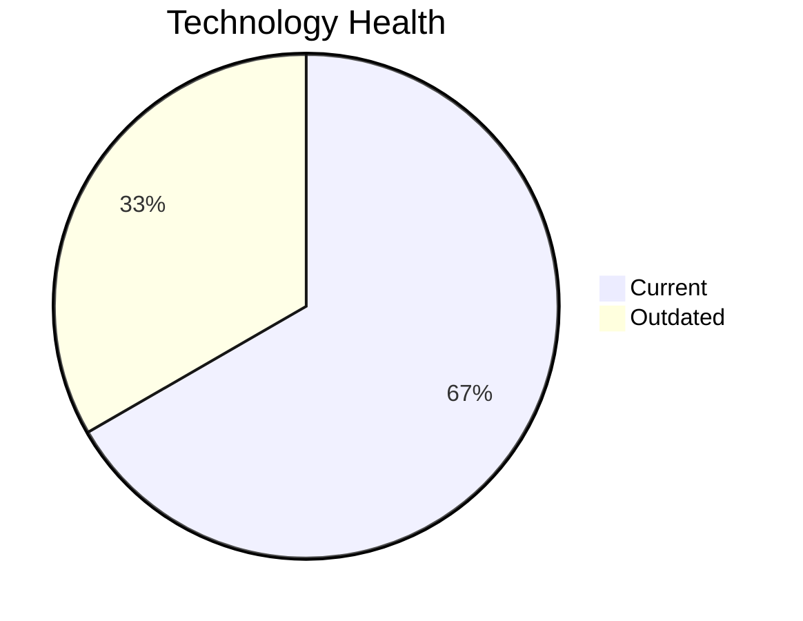

<!-- generated by AI in Github cloud -->
# QualityApp-019 (app019)

## Application Overview

| Attribute | Value |
|-----------|-------|
| **App ID** | app019 |
| **Name** | QualityApp-019 |
| **Status** | Production |
| **Criticality** | High |
| **Solution Type** | Custom made |
| **Deployment** | AWS, On-premise |
| **Containerized** | No |
| **Architecture** | 3-Tier |
| **Business Unit** | Quality |
| **External Interfaces** | 5 |
| **Servers** | 1 |
| **Environments** | 1 |

## Technology Stack

| Component | Type | Version | Status | EOL Date |
|-----------|------|---------|--------|----------|
| RHEL | os | 8 | 🟢 CURRENT | 2029-05-31 |
| Python 3.8 | programming_language | 3.8 | 🟡 OUTDATED | 2024-10-31 |
| MySQL 8.0 | database | 8.0 | 🟢 CURRENT | 2026-04-30 |

## Complexity Assessment

**Score: 4/10 (MEDIUM)**

Technology age score 4 (0 EOL, 1 outdated components). Integration score 5 (5 external interfaces). Infrastructure score 2 (1 servers, 1 environments). Criticality score 7 (High). Architecture score 5. Data score 4. Weighted final: 4.5 → 4 (MEDIUM).

| Factor | Value |
|--------|-------|
| Number Of Servers | 1 |
| Number Of Databases | 1 |
| Number Of Environments | 1 |
| Number Of Interfaces | 5 |
| Business Criticality | High |
| Number Of Outdated Technologies | 1 |
| Number Of Eol Technologies | 0 |
| Number Of Dependencies | 0 |
| Ci Cd Present | Yes |
| Containerized | No |

## Applicable Modernization Scenarios

### App Deployment To Cloud
- **Status**: APPLICABLE
- **Reason**: Application is on-premise (AWS, On-premise); cloud migration (lift & shift) is applicable.
- **Confidence**: 8/10

### App Containerization
- **Status**: APPLICABLE
- **Reason**: Custom/open-source application not yet containerized; containerization is applicable.
- **Confidence**: 8/10

### App Refactor Decoupling
- **Status**: APPLICABLE
- **Reason**: Custom application with 3-Tier architecture; refactoring to reduce coupling is applicable.
- **Confidence**: 8/10

### Update Outdated Components
- **Status**: APPLICABLE
- **Reason**: Outdated/EOL components found: Python 3.8. Updates required.
- **Confidence**: 8/10

## Other Scenarios

| Scenario | Status | Reason |
|----------|--------|--------|
| os_update_security_patch | FULFILLED | OS 'RHEL 8' is current and receiving security patches. |
| switch_to_standard_linux_os | FULFILLED | OS 'RHEL 8' is already a standard Linux distribution. |
| switch_to_arm_cpu | LACK_OF_DATA | No explicit CPU architecture data (x86 vs ARM) is available in the application m... |
| application_server_replacement | LACK_OF_DATA | Cannot assess application server 'Apache Tomcat  8.0' status. |
| upgrade_legacy_databases | FULFILLED | Database 'MySQL 8.0' is current. |
| switch_db_engine_open_source | FULFILLED | Database 'MySQL 8.0' is already open-source or managed open-source. |

## Financial Summary

| Scenario | Cost (USD) | Annual Savings (USD) | ROI 3yr % | Payback (yrs) |
|----------|-----------|---------------------|-----------|---------------|
| app_deployment_to_cloud | $4,373 | $2,700 | 85.2% | 1.6 |
| app_containerization | $87,450 | $90,000 | 208.7% | 1.0 |
| app_refactor_decoupling | $218,626 | $135,000 | 85.2% | 1.6 |
| **TOTAL** | **$310,449** | **$227,700** | | |
