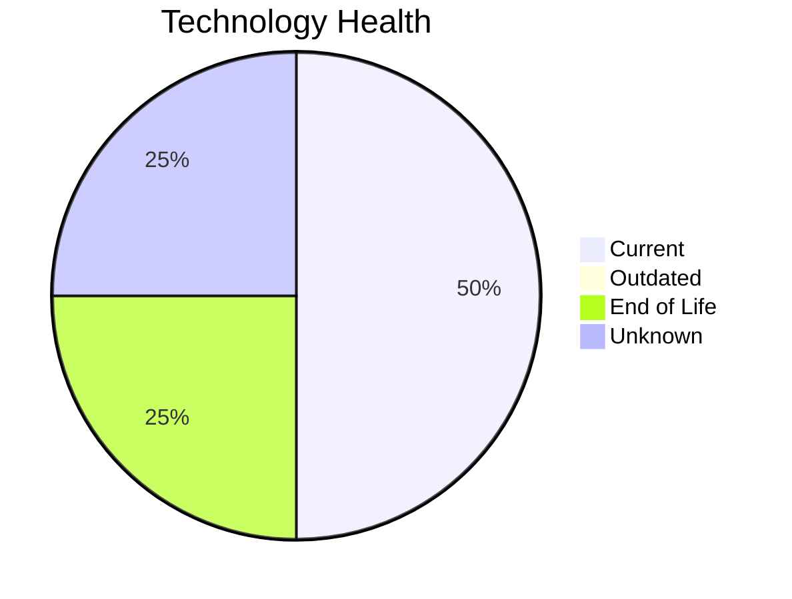

# Application Report: QualityApp-019

**ID:** app019
**Generated:** 2026-05-11

## Overview

| Attribute | Value |
|-----------|-------|
| Business Unit | Quality |
| Solution Type | Custom made |
| Deployment | AWS, On-premise |
| Business Criticality | High |
| Users | 180 |
| Servers | 1 (sv28) |
| Containerized | No |
| CI/CD | Yes |
| Architecture | 3-Tier |

## Technology Stack

| Component | Technology | Version | Status |
|-----------|-----------|---------|--------|
| Os | RHEL 8 | RHEL 8 | 🟢 CURRENT_VERSION |
| Language | Python 3.8 | Python 3.8 | 🔴 EOL |
| Database | MySQL 8.0 | MySQL 8.0 | 🟢 CURRENT_VERSION |
| Application Server | Apache Tomcat  8.0 | Apache Tomcat  8.0 | ⚪ NO_KNOWLEDGE |

## Complexity Assessment

**Score:** 5/10 — **MEDIUM**
**Confidence:** 8/10

| Factor | Value |
|--------|-------|
| Technology Age (EOL/Outdated) | 1 EOL / 0 outdated |
| Integration (External Interfaces) | 5 |
| Infrastructure (Servers) | 1 |
| Business Criticality | High |
| Containerized | No |
| CI/CD Present | Yes |

> Complexity MEDIUM (5/10). Technology age: 8/10 (1 EOL, 0 outdated components). Integration: 4/10 (5 external interfaces). Infrastructure: 2/10 (1 servers). Business criticality High: 7/10. Architecture 3-tier: 5/10. Data complexity: 3/10.

## Modernization Scenarios

### Applicable Scenarios

#### ✅ Switch to ARM-based CPU

- **Reason:** Custom/open-source application on Linux can be considered for ARM-based infrastructure.
- **Confidence:** 8/10
- **Cost:** €5,028 (one-time)
- **Savings:** €1,000/year

#### ✅ Application Migration to Cloud Infrastructure (Lift & Shift)

- **Reason:** Application has hybrid deployment. Full cloud migration can be considered.
- **Confidence:** 8/10
- **Cost:** €5,028 (one-time)
- **Savings:** €2,700/year

#### ✅ Application Containerization

- **Reason:** Application is not containerized and can be containerized as a custom/open-source app.
- **Confidence:** 8/10
- **Cost:** €100,568 (one-time)
- **Savings:** €90,000/year

#### ✅ Application Refactoring and De-coupling

- **Reason:** Custom application with 3-tier architecture. Refactoring and de-coupling recommended.
- **Confidence:** 8/10
- **Cost:** €251,420 (one-time)
- **Savings:** €135,000/year

#### ✅ Update outdated components

- **Reason:** Application has EOL components that should be updated.
- **Confidence:** 8/10

### Other Scenarios

| Scenario | Status | Reason |
|----------|--------|--------|
| Operating System Update | ✔️ FULFILLED | OS RHEL 8 is current version, no update needed. |
| Switch to standard Linux Operating System | ✔️ FULFILLED | Application already runs on standard Linux (RHEL 8). |
| Upgrade Legacy Databases | ✔️ FULFILLED | Database MySQL 8.0 is current version, no upgrade needed. |
| Switch DB Engine to open-source database solution | ✔️ FULFILLED | Database MySQL 8.0 is already open-source. |
| Applications Server replacement | ❌ NOT_APPLICABLE | No application server or N/A. |

## Financial Summary

| Metric | Value |
|--------|-------|
| Total One-Time Investment | €362,044 |
| Total Annual Savings | €228,700 |
| Break-Even | 1.6 years |

