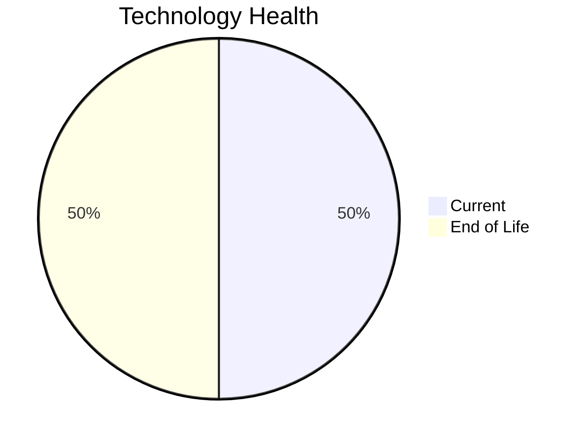

# Application Report: QualityApp-019

**ID:** app019  
**Generated:** 2026-05-11

## Overview

| Attribute | Value |
|-----------|-------|
| Business Unit | Quality |
| Solution Type | Custom made |
| Deployment Type | AWS, On-premise |
| Business Criticality | High |
| Users | 180 |
| Servers | 1 |
| Architecture | 3-Tier |
| Containerized | No |
| CI/CD | Yes |
| Data Classification | Confidential |

## Technology Stack

| Component | Technology | Status |
|-----------|-----------|--------|
| Os | RHEL 8 | 🟢 CURRENT_VERSION |
| Database | MySQL 8.0 | 🟢 CURRENT_VERSION |
| Language | Python 3.8 | 🔴 EOL |
| Application Server | Tomcat 8 | 🔴 EOL |

## Complexity Assessment

**Score:** 6/10 — **MEDIUM**  
**Confidence:** 7

> Score 6/10 (MEDIUM): 2 EOL component(s), 0 outdated, 5 external interfaces, 1 server(s), criticality=High, architecture=3-Tier.

| Factor | Value |
|--------|-------|
| Servers | 1 |
| Interfaces | 5 |
| Environments | 1 |
| EOL Technologies | 2 |
| Outdated Technologies | 0 |
| CI/CD Present | Yes |
| Containerized | No |

## Modernization Scenarios

### Applicable Scenarios

#### ✅ Switch to ARM-based CPU

- **Priority:** Medium
- **Effort:** Medium
- **Effects:** cost, sustainability
- **Cost:** €5,783 (one-time)
- **Annual Savings:** €1,000/year
- **Reasoning:** Application runs on cloud and could benefit from ARM-based instances (e.g., AWS Graviton).

#### ✅ Applications Server replacement

- **Priority:** Medium
- **Effort:** Medium
- **Effects:** agility, cost
- **Cost:** €11,565 (one-time)
- **Annual Savings:** €10,800/year
- **Reasoning:** Application server (Apache Tomcat  8.0) is EOL and requires replacement.

#### ✅ Application Containerization

- **Priority:** High
- **Effort:** High
- **Effects:** agility, cost, sustainability
- **Cost:** €115,653 (one-time)
- **Annual Savings:** €90,000/year
- **Reasoning:** Application is not containerized; containerization is applicable for improved portability and scalability.

#### ✅ Update outdated components

- **Priority:** High
- **Effort:** High
- **Effects:** security, agility, cost
- **Reasoning:** EOL components found: Python 3.8, Tomcat 8. Update required.

### Other Scenarios

| Scenario | Status | Reason |
|----------|--------|--------|
| Operating System Update | ✔️ FULFILLED | Operating system is on a current, supported version. |
| Switch to standard Linux Operating System | ✔️ FULFILLED | Application already runs on standard Linux (RHEL 8). |
| Application Migration to Cloud Infrastructure (Lift & Shift) | ✔️ FULFILLED | Application is already deployed on cloud (AWS, On-premise). |
| Application Refactoring and De-coupling | 🔶 PARTIALLY_FULFILLED | 3-Tier architecture provides some decoupling; further microservice decomposition may be beneficial. |
| Upgrade Legacy Databases | ✔️ FULFILLED | Database (MySQL 8.0) is on a current, supported version. |
| Switch DB Engine to open-source database solution | ✔️ FULFILLED | Database (MySQL 8.0) is already an open-source solution. |

## Financial Summary

| Metric | Value |
|--------|-------|
| Total One-Time Cost | €133,001 |
| Total Yearly Savings | €101,800 |
| Break-Even | 1.3 years |
