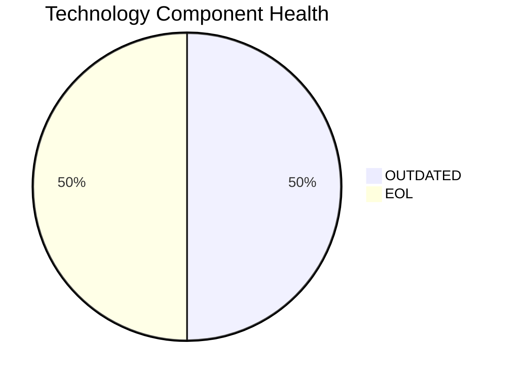

# TrainingApp-020 — Application Modernization Report

> **Application ID:** app020  
> **Business Unit:** HR  
> **Criticality:** Low

## Application Overview

| Attribute | Value |
|-----------|-------|
| Application ID | app020 |
| Name | TrainingApp-020 |
| Business Unit | HR |
| Criticality | Low |
| Status | Production |
| Deployment Type | AWS |
| Architecture | 2-Tier |
| Containerized | No |
| CI/CD | Yes |
| Users | 750 |
| Environments | 3 |
| External Interfaces | 7 |
| Servers | s, v, 2, 9 |
| DB Storage (GB) | 600 |
| DB License Required | Yes |

## Technology Stack Assessment

| Component | Name | Status |
|-----------|------|--------|
| Operating System | Windows Server 2012 | 🔴 EOL |
| Database | SQL Server 2016 | 🟡 OUTDATED |
| Programming Language | Angular 15 | 🟡 OUTDATED |
| Application Server | Microsoft IIS 8.5 | 🔴 EOL |

### Technology Health Distribution

## Complexity Assessment

**Overall Complexity:** 🟡 **MEDIUM** (Score: 6/10)

| Factor | Score | Weight |
|--------|-------|--------|
| Technology Age | 8 | 25% |
| Integration Complexity | 7 | 20% |
| Infrastructure | 7 | 15% |
| Business Criticality | 3 | 15% |
| Architecture | 4 | 15% |
| Data Complexity | 6 | 10% |

## Modernization Scenarios

### Applicable Scenarios

| Scenario | Reasoning |
|----------|-----------|
| OS Security Patch | OS Windows Server 2012 is EOL and requires security patching or upgrade. |
| Switch to ARM CPU | Cloud deployment can leverage ARM-based instances (e.g., AWS Graviton) for cost savings. |
| App Server Replacement | Application server Microsoft IIS 8.5 is EOL and must be replaced. |
| Containerization | Application is not containerized. Containerization would improve deployment consistency and portability. |
| Refactor & Decouple | Application with 2-Tier architecture could benefit from decoupling and modernization. |
| Upgrade Legacy DB | Database SQL Server 2016 is outdated and should be upgraded. |
| Switch to OSS DB | SQL Server 2016 is a commercial database. Switching to an open-source alternative would reduce licensing costs. |
| Update Outdated Components | Outdated/EOL components detected: Windows Server 2012, SQL Server 2016, Angular 15, Microsoft IIS 8.5. Updates required. |
| Switch to Managed DB | Database could be migrated to a fully managed cloud database service for reduced operational overhead. |
| Managed ARM DB | Database can be evaluated for ARM-based managed service deployment. |
| Serverless DB Migration | Database can be migrated to a serverless database solution to reduce operational overhead. |
| Switch to PostgreSQL | SQL Server 2016 is a commercial database. Migrating to PostgreSQL would eliminate licensing costs. |

### All Scenario Statuses

| Scenario | Status |
|----------|--------|
| OS Security Patch | ✅ APPLICABLE |
| Switch to Standard Linux | ⬜ NOT_APPLICABLE |
| Switch to ARM CPU | ✅ APPLICABLE |
| App Server Replacement | ✅ APPLICABLE |
| Cloud Deployment | 🔵 FULFILLED |
| Containerization | ✅ APPLICABLE |
| Refactor & Decouple | ✅ APPLICABLE |
| Upgrade Legacy DB | ✅ APPLICABLE |
| Switch to OSS DB | ✅ APPLICABLE |
| Update Outdated Components | ✅ APPLICABLE |
| Switch to Managed DB | ✅ APPLICABLE |
| Managed ARM DB | ✅ APPLICABLE |
| Serverless DB Migration | ✅ APPLICABLE |
| Switch to PostgreSQL | ✅ APPLICABLE |

## Financial Summary

| Metric | Value |
|--------|-------|
| Total Estimated Implementation Cost | $510,029.89 |
| Total Estimated Annual Savings | $307,300.00 |
| Estimated ROI Payback Period | 1.7 years |

### Cost/Savings Breakdown by Scenario

| Scenario | Est. Cost | Est. Annual Savings | ROI (years) |
|----------|-----------|---------------------|-------------|
| OS Security Patch | $1,156.53 | $500.00 | 2.31 |
| Switch to ARM CPU | $5,782.65 | $1,000.00 | 5.78 |
| App Server Replacement | $11,565.30 | $10,800.00 | 1.07 |
| Containerization | $115,653.04 | $90,000.00 | 1.29 |
| Refactor & Decouple | $289,132.60 | $135,000.00 | 2.14 |
| Upgrade Legacy DB | $11,565.30 | $10,000.00 | 1.16 |
| Switch to OSS DB | $28,913.26 | $15,000.00 | 1.93 |
| Update Outdated Components | N/A | N/A | N/A |
| Switch to Managed DB | $5,782.65 | $10,000.00 | 0.58 |
| Managed ARM DB | $5,782.65 | $5,000.00 | 1.16 |
| Serverless DB Migration | $5,782.65 | $15,000.00 | 0.39 |
| Switch to PostgreSQL | $28,913.26 | $15,000.00 | 1.93 |
