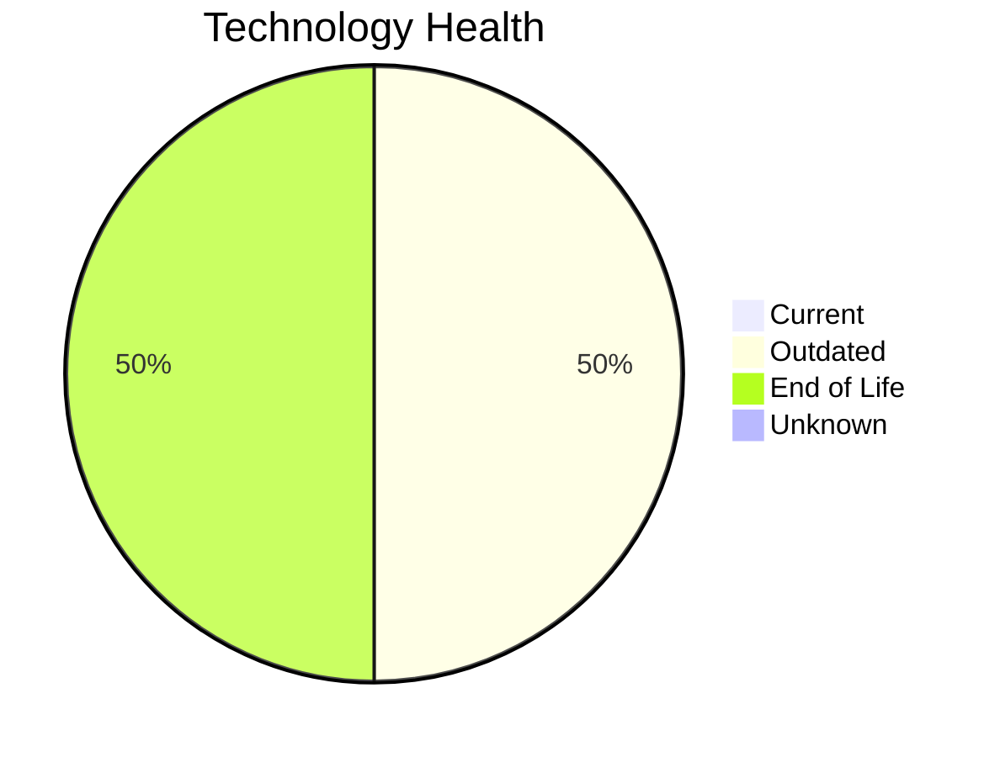

# Application Report: TrainingApp-020

**ID:** app020
**Generated:** 2026-05-11

## Overview

| Attribute | Value |
|-----------|-------|
| Business Unit | HR |
| Solution Type | 3rd party software |
| Deployment | AWS |
| Business Criticality | Low |
| Users | 750 |
| Servers | 1 (sv29) |
| Containerized | No |
| CI/CD | Yes |
| Architecture | 2-Tier |

## Technology Stack

| Component | Technology | Version | Status |
|-----------|-----------|---------|--------|
| Os | Windows Server 2012 | Windows Server 2012 | 🔴 EOL |
| Language | Angular 15 | Angular 15 | 🟡 OUTDATED |
| Database | SQL Server 2016 | SQL Server 2016 | 🟡 OUTDATED |
| Application Server | Microsoft IIS 8.5 | Microsoft IIS 8.5 | 🔴 EOL |

## Complexity Assessment

**Score:** 6/10 — **MEDIUM**
**Confidence:** 8/10

| Factor | Value |
|--------|-------|
| Technology Age (EOL/Outdated) | 2 EOL / 2 outdated |
| Integration (External Interfaces) | 7 |
| Infrastructure (Servers) | 1 |
| Business Criticality | Low |
| Containerized | No |
| CI/CD Present | Yes |

> Complexity MEDIUM (6/10). Technology age: 9/10 (2 EOL, 2 outdated components). Integration: 6/10 (7 external interfaces). Infrastructure: 2/10 (1 servers). Business criticality Low: 2/10. Architecture 2-tier: 8/10. Data complexity: 5/10.

## Modernization Scenarios

### Applicable Scenarios

#### ✅ Operating System Update

- **Reason:** OS Windows Server 2012 has status EOL. Security patches and OS update recommended.
- **Confidence:** 8/10
- **Cost:** €1,157 (one-time)
- **Savings:** €500/year

#### ✅ Upgrade Legacy Databases

- **Reason:** Database SQL Server 2016 has status OUTDATED. Upgrade recommended.
- **Confidence:** 8/10
- **Cost:** €11,565 (one-time)
- **Savings:** €10,000/year

### Other Scenarios

| Scenario | Status | Reason |
|----------|--------|--------|
| Application Migration to Cloud Infrastructure (Lift & Shift) | ✔️ FULFILLED | Application is already deployed on AWS cloud infrastructure. |
| Switch to standard Linux Operating System | ❌ NOT_APPLICABLE | Application runs on Windows Server. Switch to Linux may not be suitable for Windows-native stack. |
| Application Refactoring and De-coupling | ❌ NOT_APPLICABLE | 3rd party or open-source software; refactoring not in scope. |
| Switch to ARM-based CPU | 🚫 BLOCKED | 3rd party software may not support ARM architecture without vendor approval. |
| Applications Server replacement | 🚫 BLOCKED | 3rd party software; app server replacement depends on vendor. |
| Application Containerization | 🚫 BLOCKED | 3rd party software containerization depends on vendor support. |
| Switch DB Engine to open-source database solution | 🚫 BLOCKED | 3rd party software; database engine change depends on vendor. |
| Update outdated components | 🚫 BLOCKED | 3rd party software; component updates depend on vendor release cycle. |

## Financial Summary

| Metric | Value |
|--------|-------|
| Total One-Time Investment | €12,722 |
| Total Annual Savings | €10,500 |
| Break-Even | 1.2 years |

