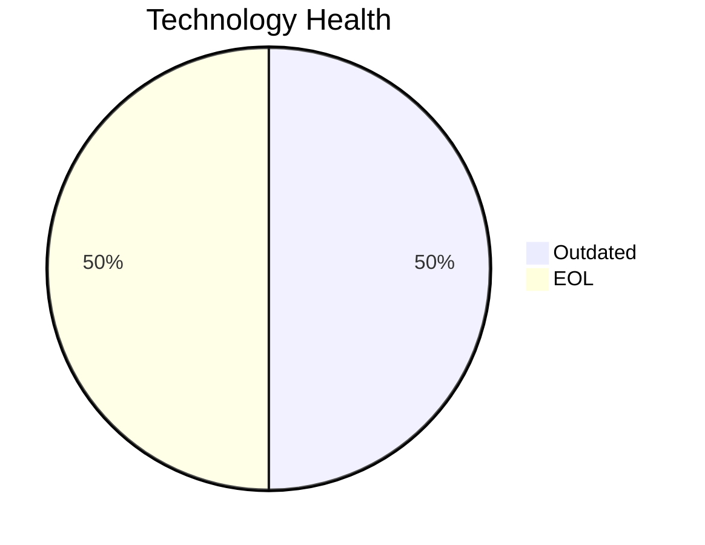

<!-- generated by AI in Github cloud -->
# TrainingApp-020 (app020)

## Application Overview

| Attribute | Value |
|-----------|-------|
| **App ID** | app020 |
| **Name** | TrainingApp-020 |
| **Status** | Production |
| **Criticality** | Low |
| **Solution Type** | 3rd party software |
| **Deployment** | AWS |
| **Containerized** | No |
| **Architecture** | 2-Tier |
| **Business Unit** | HR |
| **External Interfaces** | 7 |
| **Servers** | 1 |
| **Environments** | 3 |

## Technology Stack

| Component | Type | Version | Status | EOL Date |
|-----------|------|---------|--------|----------|
| Windows | os | Server 2012 | 🔴 EOL | 2023-10-10 |
| Angular 15 | programming_language | 15 | 🟡 OUTDATED | 2023-05-18 |
| Microsoft IIS 8.5 | application_server | 8.5 | 🔴 EOL | 2023-10-10 |
| SQL Server 2016 | database | 2016 | 🟡 OUTDATED | 2026-07-14 |

## Complexity Assessment

**Score: 6/10 (MEDIUM)**

Technology age score 8 (2 EOL, 2 outdated components). Integration score 6 (7 external interfaces). Infrastructure score 6 (1 servers, 3 environments). Criticality score 3 (Low). Architecture score 5. Data score 5. Weighted final: 5.8 → 6 (MEDIUM).

| Factor | Value |
|--------|-------|
| Number Of Servers | 1 |
| Number Of Databases | 1 |
| Number Of Environments | 3 |
| Number Of Interfaces | 7 |
| Business Criticality | Low |
| Number Of Outdated Technologies | 2 |
| Number Of Eol Technologies | 2 |
| Number Of Dependencies | 0 |
| Ci Cd Present | Yes |
| Containerized | No |

## Applicable Modernization Scenarios

### Os Update Security Patch
- **Status**: APPLICABLE
- **Reason**: OS 'Windows Server 2012' is EOL and requires security patching or upgrade.
- **Confidence**: 8/10

### Upgrade Legacy Databases
- **Status**: APPLICABLE
- **Reason**: Database 'SQL Server 2016' is OUTDATED; upgrade is required.
- **Confidence**: 8/10

### Update Outdated Components
- **Status**: APPLICABLE
- **Reason**: Outdated/EOL components found: Windows, Angular 15, Microsoft IIS 8.5, SQL Server 2016. Updates required.
- **Confidence**: 8/10

## Other Scenarios

| Scenario | Status | Reason |
|----------|--------|--------|
| switch_to_standard_linux_os | NOT_APPLICABLE | OS 'Windows Server 2012' is Windows; switching to Linux is not applicable. |
| switch_to_arm_cpu | LACK_OF_DATA | No explicit CPU architecture data (x86 vs ARM) is available in the application m... |
| application_server_replacement | BLOCKED | Application is 3rd party software; app server replacement depends on vendor. |
| app_deployment_to_cloud | FULFILLED | Application is already deployed to cloud (AWS). |
| app_containerization | BLOCKED | 3rd party application; containerization depends on vendor support. |
| app_refactor_decoupling | NOT_APPLICABLE | 3rd party application; refactoring is not applicable. |
| switch_db_engine_open_source | NOT_APPLICABLE | 3rd party application; database engine change depends on vendor. |

## Financial Summary

| Scenario | Cost (USD) | Annual Savings (USD) | ROI 3yr % | Payback (yrs) |
|----------|-----------|---------------------|-----------|---------------|
| os_update_security_patch | $1,157 | $500 | 29.7% | 2.3 |
| upgrade_legacy_databases | $11,565 | $10,000 | 159.4% | 1.2 |
| **TOTAL** | **$12,722** | **$10,500** | | |
