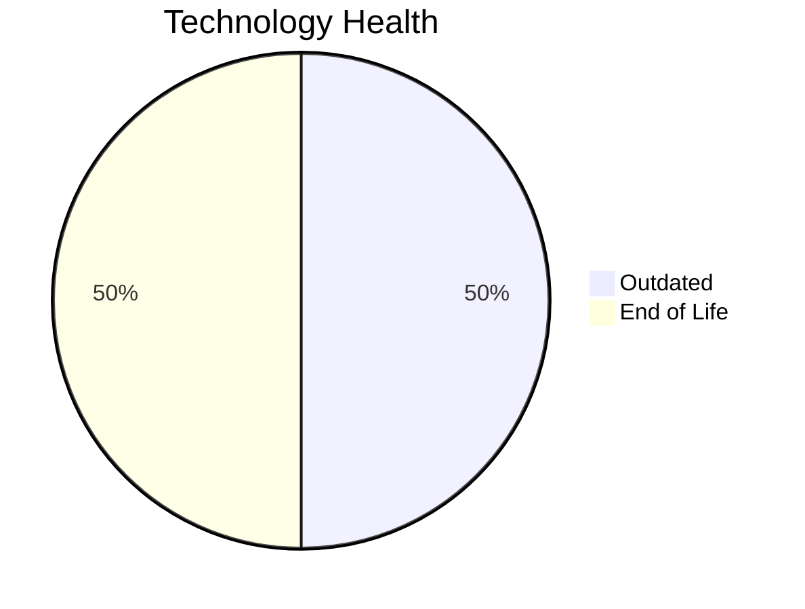

# Application Report: TrainingApp-020

**ID:** app020  
**Generated:** 2026-05-13

## Overview

| Attribute | Value |
|-----------|-------|
| Business Unit | HR |
| Solution Type | 3rd party software |
| Deployment Type | AWS |
| Business Criticality | Low |
| Users | 750 |
| Servers | sv29 |
| Environments | 3 |
| External Interfaces | 7 |
| Containerized | No |
| CI/CD Present | Yes |
| Architecture | 2-Tier |
| Data Classification | Public |

## Technology Stack

| Component | Technology | Version | Status |
|-----------|-----------|---------|--------|
| Operating System | Windows Server 2012 | Windows Server 2012 | 🔴 EOL |
| Database | SQL Server 2016 | SQL Server 2016 | 🟡 Outdated |
| Programming Language | Angular 15 | Angular 15 | 🟡 Outdated |
| Application Server | IIS 8.5 | IIS 8.5 | 🔴 EOL |

## Complexity Assessment

**Score:** 6/10 — **MEDIUM**  
**Confidence:** 8/10

> Technology age score 9/10: Multiple EOL components detected. Integration score 6/10: 7 external interfaces. Infrastructure score 4/10: 1 server(s), 3 environment(s). Business criticality score 3/10: Low criticality application. Architecture score 5/10: 2-Tier architecture, not containerized, CI/CD present. Data score 6/10: Outdated database components present.

| Factor | Value |
|--------|-------|
| Servers | 1 |
| Environments | 3 |
| External Interfaces | 7 |
| EOL Technologies | 2 |
| Outdated Technologies | 2 |
| Business Criticality | Low |
| CI/CD Present | Yes |
| Containerized | No |

## Modernization Scenarios

### ✅ Applicable Scenarios

#### Operating System Update

- **Priority:** High
- **Effort:** Low
- **Effects:** security
- **One-Time Cost:** €1,157
- **Annual Savings:** €500/year
- **Reasoning:** OS (Windows Server 2012) is EOL and requires urgent update/replacement.

#### Application Server Replacement

- **Priority:** Medium
- **Effort:** Medium
- **Effects:** agility, cost
- **One-Time Cost:** €11,565
- **Annual Savings:** €10,800/year
- **Reasoning:** Application server (Microsoft IIS 8.5) is EOL and requires replacement.

#### Upgrade Legacy Databases

- **Priority:** High
- **Effort:** Medium
- **Effects:** security, agility
- **One-Time Cost:** €11,565
- **Annual Savings:** €10,000/year
- **Reasoning:** Database (SQL Server 2016) is OUTDATED and approaching EOL.

### Other Scenarios

| Scenario | Status | Reason |
|----------|--------|--------|
| Switch to Standard Linux OS | ❌ N/A | Application runs on Windows-based OS. Exclusion criterion applies. |
| Switch to ARM-based CPU | 🚫 Blocked | 3rd party application with potential x86-specific dependencies. |
| Application Migration to Cloud (Lift & Shift) | ✔️ Fulfilled | Application is already hosted on cloud infrastructure (AWS). |
| Application Containerization | 🚫 Blocked | 3rd party / SaaS application: runtime packaging cannot be modified by the customer. |
| Application Refactoring and De-coupling | 🚫 Blocked | 3rd party or SaaS application. Internal architecture cannot be refactored by the customer. |
| Switch DB Engine to Open-Source | 🚫 Blocked | 3rd party application. Database migration cannot be performed without vendor involvement. |
| Update Outdated Components | 🚫 Blocked | 3rd party or SaaS application. Component versions are vendor-managed and not upgradeable by the cust... |
| Switch to Managed Database Service | ❌ N/A | Database is already cloud-hosted or scenario not applicable. |
| Managed ARM Database | ❌ N/A | Database is not on a managed cloud service; ARM database migration not applicable. |
| Serverless Database Migration | ❌ N/A | Application deployment pattern does not support serverless database migration at this time. |
| Switch DB Engine to PostgreSQL | 🚫 Blocked | 3rd party application. Database migration to PostgreSQL requires vendor involvement. |

## Financial Summary

| Metric | Value |
|--------|-------|
| Total One-Time Investment | €24,287 |
| Total Annual Savings | €21,300 |
| Break-Even | 1.1 years |
