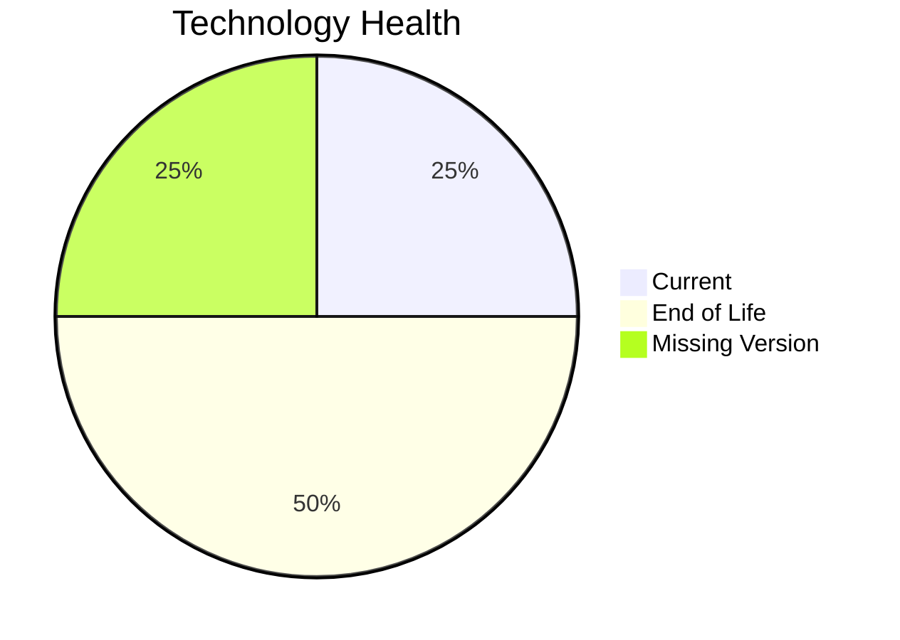

# Application Report: TrainingApp-020

**ID:** app020  
**Generated:** 2026-05-11

## Overview

| Attribute | Value |
|-----------|-------|
| Business Unit | HR |
| Solution Type | 3rd party software |
| Deployment Type | AWS |
| Business Criticality | Low |
| Users | 750 |
| Servers | 1 |
| Architecture | 2-Tier |
| Containerized | No |
| CI/CD | Yes |
| Data Classification | Public |

## Technology Stack

| Component | Technology | Status |
|-----------|-----------|--------|
| Os | Windows Server 2012 | 🔴 EOL |
| Database | SQL Server 2016 | 🔴 EOL |
| Language | Angular 15 | ⚪ NO_KNOWLEDGE |
| Application Server | Microsoft IIS 8.5 | 🟢 CURRENT_VERSION |

## Complexity Assessment

**Score:** 7/10 — **HIGH**  
**Confidence:** 7

> Score 7/10 (HIGH): 2 EOL component(s), 0 outdated, 7 external interfaces, 1 server(s), criticality=Low, architecture=2-Tier.

| Factor | Value |
|--------|-------|
| Servers | 1 |
| Interfaces | 7 |
| Environments | 3 |
| EOL Technologies | 2 |
| Outdated Technologies | 0 |
| CI/CD Present | Yes |
| Containerized | No |

## Modernization Scenarios

### Applicable Scenarios

#### ✅ Operating System Update

- **Priority:** High
- **Effort:** Low
- **Effects:** security
- **Cost:** €1,330 (one-time)
- **Annual Savings:** €500/year
- **Reasoning:** OS (windows server 2012) is EOL and requires update.

#### ✅ Switch to ARM-based CPU

- **Priority:** Medium
- **Effort:** Medium
- **Effects:** cost, sustainability
- **Cost:** €6,650 (one-time)
- **Annual Savings:** €1,000/year
- **Reasoning:** Application runs on cloud and could benefit from ARM-based instances (e.g., AWS Graviton).

#### ✅ Upgrade Legacy Databases

- **Priority:** High
- **Effort:** Medium
- **Effects:** security, agility
- **Cost:** €13,300 (one-time)
- **Annual Savings:** €10,000/year
- **Reasoning:** Database (SQL Server 2016) is EOL and requires upgrade.

#### ✅ Switch DB Engine to open-source database solution

- **Priority:** High
- **Effort:** Medium
- **Effects:** cost
- **Reasoning:** Application uses commercial database (SQL Server 2016) with license cost; migration to open-source is recommended.

#### ✅ Update outdated components

- **Priority:** High
- **Effort:** High
- **Effects:** security, agility, cost
- **Reasoning:** EOL components found: Windows Server 2012, SQL Server 2016. Update required.

### Other Scenarios

| Scenario | Status | Reason |
|----------|--------|--------|
| Switch to standard Linux Operating System | ❌ NOT_APPLICABLE | Application runs on Windows or is SaaS; switching to standard Linux OS is not applicable. |
| Applications Server replacement | ✔️ FULFILLED | Application server appears to be on a supported version. |
| Application Migration to Cloud Infrastructure (Lift & Shift) | ✔️ FULFILLED | Application is already deployed on cloud (AWS). |
| Application Containerization | ❌ NOT_APPLICABLE | 3rd party/SaaS application - containerization managed by vendor. |
| Application Refactoring and De-coupling | ❌ NOT_APPLICABLE | 3rd party/SaaS application - refactoring not applicable. |

## Financial Summary

| Metric | Value |
|--------|-------|
| Total One-Time Cost | €21,280 |
| Total Yearly Savings | €11,500 |
| Break-Even | 1.9 years |
