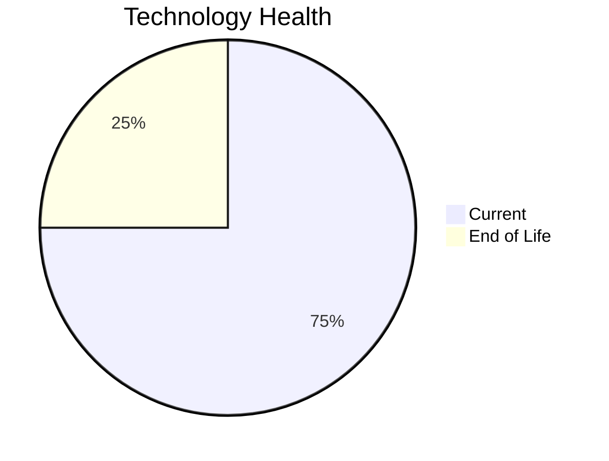

# Application Report: FleetApp-021

**ID:** app021  
**Generated:** 2026-05-13

## Overview

| Attribute | Value |
|-----------|-------|
| Business Unit | Operations |
| Solution Type | Custom made |
| Deployment Type | On-Premise |
| Business Criticality | High |
| Users | 420 |
| Servers | sv30, sv31 |
| Environments | 3 |
| External Interfaces | 4 |
| Containerized | No |
| CI/CD Present | No |
| Architecture | 2-Tier |
| Data Classification | Internal |

## Technology Stack

| Component | Technology | Version | Status |
|-----------|-----------|---------|--------|
| Operating System | Windows Server 2022 | Windows Server 2022 | 🟢 Current |
| Database | Oracle 11g | Oracle 11g | 🔴 EOL |
| Programming Language | C++ 17 | C++ 17 | 🟢 Current |
| Application Server | IIS 10.0 | IIS 10.0 | 🟢 Current |

## Complexity Assessment

**Score:** 6/10 — **MEDIUM**  
**Confidence:** 8/10

> Technology age score 8/10: Multiple EOL components detected. Integration score 4/10: 4 external interfaces. Infrastructure score 4/10: 2 server(s), 3 environment(s). Business criticality score 7/10: High criticality application. Architecture score 6/10: 2-Tier architecture, not containerized, no CI/CD. Data score 7/10: EOL database components present.

| Factor | Value |
|--------|-------|
| Servers | 2 |
| Environments | 3 |
| External Interfaces | 4 |
| EOL Technologies | 1 |
| Outdated Technologies | 0 |
| Business Criticality | High |
| CI/CD Present | No |
| Containerized | No |

## Modernization Scenarios

### ✅ Applicable Scenarios

#### Application Migration to Cloud (Lift & Shift)

- **Priority:** High
- **Effort:** Low
- **Effects:** security, agility
- **One-Time Cost:** €5,783
- **Annual Savings:** €2,700/year
- **Reasoning:** Application is deployed on-premise (On-Premise). Cloud migration would improve scalability and reduce infrastructure costs.

#### Upgrade Legacy Databases

- **Priority:** High
- **Effort:** Medium
- **Effects:** security, agility
- **One-Time Cost:** €11,565
- **Annual Savings:** €10,000/year
- **Reasoning:** Database (Oracle 11g) is EOL and requires urgent upgrade.

#### Switch DB Engine to Open-Source

- **Priority:** High
- **Effort:** Medium
- **Effects:** cost
- **One-Time Cost:** €28,913
- **Annual Savings:** €15,000/year
- **Reasoning:** Commercial database (Oracle 11g) detected. Migrating to PostgreSQL or MySQL would eliminate licensing costs.

#### Update Outdated Components

- **Priority:** High
- **Effort:** High
- **Effects:** security, agility, cost
- **Cost:** No financial data available
- **Reasoning:** Outdated or EOL components detected: Oracle 11g. Updates required to maintain security and supportability.

#### Switch to Managed Database Service

- **Priority:** Medium
- **Effort:** Low
- **Effects:** agility, cost
- **One-Time Cost:** €5,783
- **Annual Savings:** €10,000/year
- **Reasoning:** On-premise database (Oracle 11g) could benefit from migration to a managed cloud database service.

#### Switch DB Engine to PostgreSQL

- **Priority:** High
- **Effort:** Medium
- **Effects:** cost
- **One-Time Cost:** €28,913
- **Annual Savings:** €15,000/year
- **Reasoning:** Commercial database (Oracle 11g) is a candidate for migration to PostgreSQL to eliminate licensing costs.

### Other Scenarios

| Scenario | Status | Reason |
|----------|--------|--------|
| Operating System Update | ✔️ Fulfilled | OS (Windows Server 2022) is on a current supported version. |
| Switch to Standard Linux OS | ❌ N/A | Application runs on Windows-based OS. Exclusion criterion applies. |
| Switch to ARM-based CPU | ❓ Unknown | Insufficient data to determine ARM compatibility (architecture type not documented). |
| Application Server Replacement | ✔️ Fulfilled | Application server (Microsoft IIS 10.0) is on a current supported version. |
| Application Containerization | 🚫 Blocked | Windows application not running .NET 6+. Containerization blocked due to pre-.NET 6 Windows runtime. |
| Application Refactoring and De-coupling | 🔶 Partial | Application architecture (2-Tier) suggests some coupling. Partial refactoring may benefit the applic... |
| Managed ARM Database | ❌ N/A | Database is not on a managed cloud service; ARM database migration not applicable. |
| Serverless Database Migration | ❌ N/A | On-premise deployment: serverless DB migration requires cloud infrastructure first. |

## Financial Summary

| Metric | Value |
|--------|-------|
| Total One-Time Investment | €80,957 |
| Total Annual Savings | €52,700 |
| Break-Even | 1.5 years |
