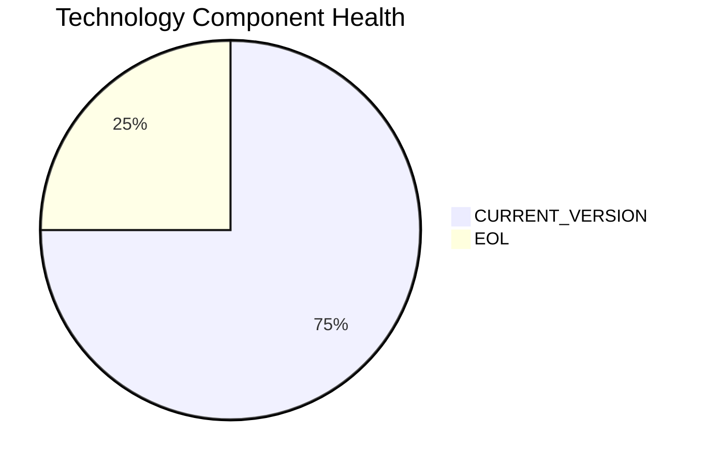

# FleetApp-021 — Application Modernization Report

> **Application ID:** app021  
> **Business Unit:** Operations  
> **Criticality:** High

## Application Overview

| Attribute | Value |
|-----------|-------|
| Application ID | app021 |
| Name | FleetApp-021 |
| Business Unit | Operations |
| Criticality | High |
| Status | Production |
| Deployment Type | On-Premise |
| Architecture | 2-Tier |
| Containerized | No |
| CI/CD | No |
| Users | 420 |
| Environments | 3 |
| External Interfaces | 4 |
| Servers | sv30, sv31 |
| DB Storage (GB) | 400 |
| DB License Required | Yes |

## Technology Stack Assessment

| Component | Name | Status |
|-----------|------|--------|
| Operating System | Windows Server 2022 | 🟢 CURRENT_VERSION |
| Database | Oracle 11g | 🔴 EOL |
| Programming Language | C++ 17 | 🟢 CURRENT_VERSION |
| Application Server | Microsoft IIS 10.0 | 🟢 CURRENT_VERSION |

### Technology Health Distribution

## Complexity Assessment

**Overall Complexity:** 🟡 **MEDIUM** (Score: 6/10)

| Factor | Score | Weight |
|--------|-------|--------|
| Technology Age | 7 | 25% |
| Integration Complexity | 5 | 20% |
| Infrastructure | 5 | 15% |
| Business Criticality | 7 | 15% |
| Architecture | 7 | 15% |
| Data Complexity | 8 | 10% |

## Modernization Scenarios

### Applicable Scenarios

| Scenario | Reasoning |
|----------|-----------|
| Switch to ARM CPU | On-premise deployment can be evaluated for ARM-based hardware to reduce energy costs. |
| Cloud Deployment | Application is deployed on-premise. Cloud migration would improve scalability and reduce infrastructure costs. |
| Containerization | Application is not containerized. Containerization would improve deployment consistency and portability. |
| Refactor & Decouple | Application has a 2-Tier monolithic architecture with limited CI/CD. Refactoring to microservices would improve maintainability. |
| Upgrade Legacy DB | Database Oracle 11g is EOL and must be upgraded. |
| Switch to OSS DB | Oracle 11g is a commercial database. Switching to an open-source alternative would reduce licensing costs. |
| Update Outdated Components | Outdated/EOL components detected: Oracle 11g. Updates required. |
| Switch to Managed DB | On-premise database could be migrated to a managed cloud database service. |
| Managed ARM DB | Migrating database to ARM-based managed cloud service would reduce costs. |
| Serverless DB Migration | Database can be migrated to a serverless database solution to reduce operational overhead. |
| Switch to PostgreSQL | Oracle 11g is a commercial database. Migrating to PostgreSQL would eliminate licensing costs. |

### All Scenario Statuses

| Scenario | Status |
|----------|--------|
| OS Security Patch | 🔵 FULFILLED |
| Switch to Standard Linux | ⬜ NOT_APPLICABLE |
| Switch to ARM CPU | ✅ APPLICABLE |
| App Server Replacement | 🔵 FULFILLED |
| Cloud Deployment | ✅ APPLICABLE |
| Containerization | ✅ APPLICABLE |
| Refactor & Decouple | ✅ APPLICABLE |
| Upgrade Legacy DB | ✅ APPLICABLE |
| Switch to OSS DB | ✅ APPLICABLE |
| Update Outdated Components | ✅ APPLICABLE |
| Switch to Managed DB | ✅ APPLICABLE |
| Managed ARM DB | ✅ APPLICABLE |
| Serverless DB Migration | ✅ APPLICABLE |
| Switch to PostgreSQL | ✅ APPLICABLE |

## Financial Summary

| Metric | Value |
|--------|-------|
| Total Estimated Implementation Cost | $503,090.71 |
| Total Estimated Annual Savings | $298,700.00 |
| Estimated ROI Payback Period | 1.7 years |

### Cost/Savings Breakdown by Scenario

| Scenario | Est. Cost | Est. Annual Savings | ROI (years) |
|----------|-----------|---------------------|-------------|
| Switch to ARM CPU | $5,782.65 | $1,000.00 | 5.78 |
| Cloud Deployment | $5,782.65 | $2,700.00 | 2.14 |
| Containerization | $115,653.04 | $90,000.00 | 1.29 |
| Refactor & Decouple | $289,132.60 | $135,000.00 | 2.14 |
| Upgrade Legacy DB | $11,565.30 | $10,000.00 | 1.16 |
| Switch to OSS DB | $28,913.26 | $15,000.00 | 1.93 |
| Update Outdated Components | N/A | N/A | N/A |
| Switch to Managed DB | $5,782.65 | $10,000.00 | 0.58 |
| Managed ARM DB | $5,782.65 | $5,000.00 | 1.16 |
| Serverless DB Migration | $5,782.65 | $15,000.00 | 0.39 |
| Switch to PostgreSQL | $28,913.26 | $15,000.00 | 1.93 |
