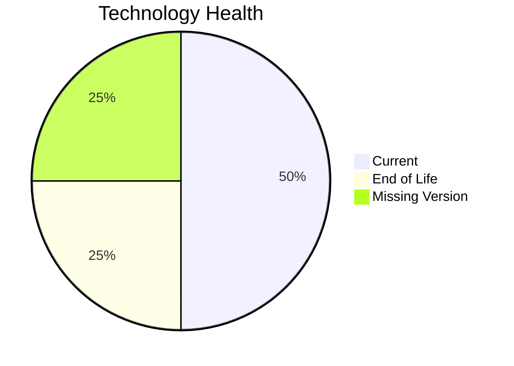

# Application Report: FleetApp-021

**ID:** app021  
**Generated:** 2026-05-11

## Overview

| Attribute | Value |
|-----------|-------|
| Business Unit | Operations |
| Solution Type | Custom made |
| Deployment Type | On-Premise |
| Business Criticality | High |
| Users | 420 |
| Servers | 2 |
| Architecture | 2-Tier |
| Containerized | No |
| CI/CD | No |
| Data Classification | Internal |

## Technology Stack

| Component | Technology | Status |
|-----------|-----------|--------|
| Os | Windows Server 2022 | 🟢 CURRENT_VERSION |
| Database | Oracle 11g | 🔴 EOL |
| Language | C++ 17 | ⚪ NO_KNOWLEDGE |
| Application Server | Microsoft IIS 10.0 | 🟢 CURRENT_VERSION |

## Complexity Assessment

**Score:** 7/10 — **HIGH**  
**Confidence:** 7

> Score 7/10 (HIGH): 1 EOL component(s), 0 outdated, 4 external interfaces, 2 server(s), criticality=High, architecture=2-Tier.

| Factor | Value |
|--------|-------|
| Servers | 2 |
| Interfaces | 4 |
| Environments | 3 |
| EOL Technologies | 1 |
| Outdated Technologies | 0 |
| CI/CD Present | No |
| Containerized | No |

## Modernization Scenarios

### Applicable Scenarios

#### ✅ Switch to ARM-based CPU

- **Priority:** Medium
- **Effort:** Medium
- **Effects:** cost, sustainability
- **Cost:** €6,650 (one-time)
- **Annual Savings:** €1,000/year
- **Reasoning:** Application on on-premise x86 infrastructure could benefit from ARM migration for cost savings.

#### ✅ Application Migration to Cloud Infrastructure (Lift & Shift)

- **Priority:** High
- **Effort:** Low
- **Effects:** security, agility
- **Cost:** €6,650 (one-time)
- **Annual Savings:** €2,400/year
- **Reasoning:** Application runs on-premise and is a candidate for cloud migration.

#### ✅ Application Containerization

- **Priority:** High
- **Effort:** High
- **Effects:** agility, cost, sustainability
- **Cost:** €133,001 (one-time)
- **Annual Savings:** €80,000/year
- **Reasoning:** Application is not containerized; containerization is applicable for improved portability and scalability.

#### ✅ Application Refactoring and De-coupling

- **Priority:** High
- **Effort:** High
- **Effects:** agility, cost, sustainability
- **Cost:** €332,502 (one-time)
- **Annual Savings:** €120,000/year
- **Reasoning:** Application has 2-Tier architecture - refactoring to microservices would improve scalability.

#### ✅ Upgrade Legacy Databases

- **Priority:** High
- **Effort:** Medium
- **Effects:** security, agility
- **Cost:** €13,300 (one-time)
- **Annual Savings:** €10,000/year
- **Reasoning:** Database (Oracle 11g) is EOL and requires upgrade.

#### ✅ Switch DB Engine to open-source database solution

- **Priority:** High
- **Effort:** Medium
- **Effects:** cost
- **Reasoning:** Application uses commercial database (Oracle 11g) with license cost; migration to open-source is recommended.

#### ✅ Update outdated components

- **Priority:** High
- **Effort:** High
- **Effects:** security, agility, cost
- **Reasoning:** EOL components found: Oracle 11g. Update required.

### Other Scenarios

| Scenario | Status | Reason |
|----------|--------|--------|
| Operating System Update | ✔️ FULFILLED | Operating system is on a current, supported version. |
| Switch to standard Linux Operating System | ❌ NOT_APPLICABLE | Application runs on Windows or is SaaS; switching to standard Linux OS is not applicable. |
| Applications Server replacement | ✔️ FULFILLED | Application server appears to be on a supported version. |

## Financial Summary

| Metric | Value |
|--------|-------|
| Total One-Time Cost | €492,103 |
| Total Yearly Savings | €213,400 |
| Break-Even | 2.3 years |
