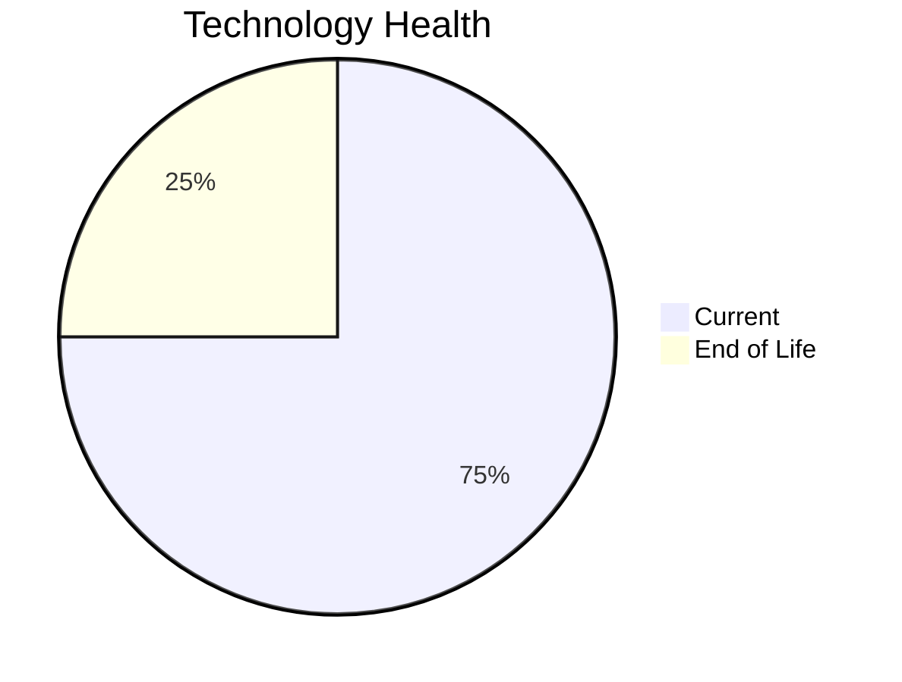

# Application Report: ComplianceApp-022

**ID:** app022  
**Generated:** 2026-05-13

## Overview

| Attribute | Value |
|-----------|-------|
| Business Unit | Compliance |
| Solution Type | Custom made |
| Deployment Type | AWS, On-premise |
| Business Criticality | Critical |
| Users | 310 |
| Servers | sv32, sv33 |
| Environments | 3 |
| External Interfaces | 12 |
| Containerized | Yes |
| CI/CD Present | Yes |
| Architecture | 3-Tier |
| Data Classification | Confidential |

## Technology Stack

| Component | Technology | Version | Status |
|-----------|-----------|---------|--------|
| Operating System | RHEL 7 | RHEL 7 | 🔴 EOL |
| Database | PostgreSQL 14 | PostgreSQL 14 | 🟢 Current |
| Programming Language | Scala 2.13 | Scala 2.13 | 🟢 Current |
| Application Server | Payara 6.x | Payara 6.x | 🟢 Current |

## Complexity Assessment

**Score:** 6/10 — **MEDIUM**  
**Confidence:** 8/10

> Technology age score 8/10: Multiple EOL components detected. Integration score 8/10: 12 external interfaces. Infrastructure score 4/10: 2 server(s), 3 environment(s). Business criticality score 9/10: Critical criticality application. Architecture score 3/10: 3-Tier architecture, containerized, CI/CD present. Data score 2/10: Database in good standing.

| Factor | Value |
|--------|-------|
| Servers | 2 |
| Environments | 3 |
| External Interfaces | 12 |
| EOL Technologies | 1 |
| Outdated Technologies | 0 |
| Business Criticality | Critical |
| CI/CD Present | Yes |
| Containerized | Yes |

## Modernization Scenarios

### ✅ Applicable Scenarios

#### Operating System Update

- **Priority:** High
- **Effort:** Low
- **Effects:** security
- **One-Time Cost:** €1,157
- **Annual Savings:** €500/year
- **Reasoning:** OS (RHEL 7) is EOL and requires urgent update/replacement.

#### Switch to ARM-based CPU

- **Priority:** Medium
- **Effort:** Medium
- **Effects:** cost, sustainability
- **One-Time Cost:** €5,783
- **Annual Savings:** €900/year
- **Reasoning:** Application is containerized and runs on standard OS, making ARM migration feasible.

#### Application Migration to Cloud (Lift & Shift)

- **Priority:** High
- **Effort:** Low
- **Effects:** security, agility
- **One-Time Cost:** €5,783
- **Annual Savings:** €2,700/year
- **Reasoning:** Application is deployed on-premise (AWS, On-premise). Cloud migration would improve scalability and reduce infrastructure costs.

#### Update Outdated Components

- **Priority:** High
- **Effort:** High
- **Effects:** security, agility, cost
- **Cost:** No financial data available
- **Reasoning:** Outdated or EOL components detected: RHEL 7. Updates required to maintain security and supportability.

#### Switch to Managed Database Service

- **Priority:** Medium
- **Effort:** Low
- **Effects:** agility, cost
- **One-Time Cost:** €5,783
- **Annual Savings:** €10,000/year
- **Reasoning:** Hybrid deployment with on-premise database (PostgreSQL 14) could migrate to managed service.

### Other Scenarios

| Scenario | Status | Reason |
|----------|--------|--------|
| Switch to Standard Linux OS | ✔️ Fulfilled | Application already runs on standard Linux OS (RHEL 7). |
| Application Server Replacement | ✔️ Fulfilled | Application server (Payara 6.0) is on a current supported version. |
| Application Containerization | ✔️ Fulfilled | Application is already containerized. |
| Application Refactoring and De-coupling | 🔶 Partial | Application architecture (3-Tier) suggests some coupling. Partial refactoring may benefit the applic... |
| Upgrade Legacy Databases | ✔️ Fulfilled | Database (PostgreSQL 14) is on a current supported version. |
| Switch DB Engine to Open-Source | ✔️ Fulfilled | Database (PostgreSQL 14) is already an open-source database engine. |
| Managed ARM Database | ❌ N/A | Database is not on a managed cloud service; ARM database migration not applicable. |
| Serverless Database Migration | ❌ N/A | Application deployment pattern does not support serverless database migration at this time. |
| Switch DB Engine to PostgreSQL | ✔️ Fulfilled | Database (PostgreSQL 14) is already PostgreSQL or PostgreSQL-compatible. |

## Financial Summary

| Metric | Value |
|--------|-------|
| Total One-Time Investment | €18,506 |
| Total Annual Savings | €14,100 |
| Break-Even | 1.3 years |
