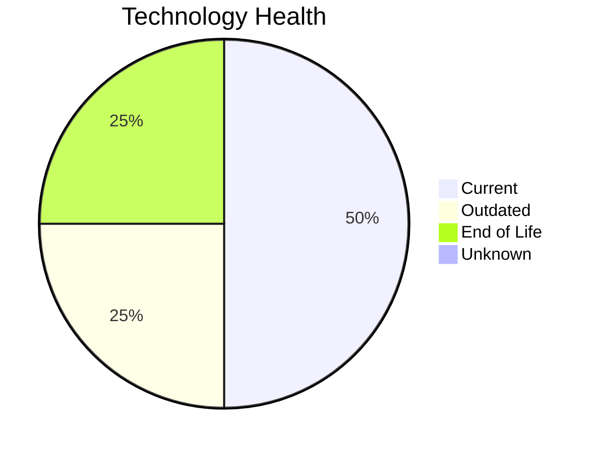

# Application Report: ComplianceApp-022

**ID:** app022
**Generated:** 2026-05-11

## Overview

| Attribute | Value |
|-----------|-------|
| Business Unit | Compliance |
| Solution Type | Custom made |
| Deployment | AWS, On-premise |
| Business Criticality | Critical |
| Users | 310 |
| Servers | 2 (sv32, sv33) |
| Containerized | Yes |
| CI/CD | Yes |
| Architecture | 3-Tier |

## Technology Stack

| Component | Technology | Version | Status |
|-----------|-----------|---------|--------|
| Os | RHEL 7 | RHEL 7 | 🔴 EOL |
| Language | Scala 2.13 | Scala 2.13 | 🟡 OUTDATED |
| Database | PostgreSQL 14 | PostgreSQL 14 | 🟢 CURRENT_VERSION |
| Application Server | Payara 6.0 | Payara 6.0 | 🟢 CURRENT_VERSION |

## Complexity Assessment

**Score:** 6/10 — **MEDIUM**
**Confidence:** 8/10

| Factor | Value |
|--------|-------|
| Technology Age (EOL/Outdated) | 1 EOL / 1 outdated |
| Integration (External Interfaces) | 12 |
| Infrastructure (Servers) | 2 |
| Business Criticality | Critical |
| Containerized | Yes |
| CI/CD Present | Yes |

> Complexity MEDIUM (6/10). Technology age: 8/10 (1 EOL, 1 outdated components). Integration: 8/10 (12 external interfaces). Infrastructure: 4/10 (2 servers). Business criticality Critical: 9/10. Architecture 3-tier: 2/10. Data complexity: 3/10.

## Modernization Scenarios

### Applicable Scenarios

#### ✅ Operating System Update

- **Reason:** OS RHEL 7 has status EOL. Security patches and OS update recommended.
- **Confidence:** 8/10
- **Cost:** €1,157 (one-time)
- **Savings:** €500/year

#### ✅ Switch to ARM-based CPU

- **Reason:** Custom/open-source application on Linux can be considered for ARM-based infrastructure.
- **Confidence:** 8/10
- **Cost:** €5,783 (one-time)
- **Savings:** €1,000/year

#### ✅ Application Migration to Cloud Infrastructure (Lift & Shift)

- **Reason:** Application has hybrid deployment. Full cloud migration can be considered.
- **Confidence:** 8/10
- **Cost:** €5,783 (one-time)
- **Savings:** €2,700/year

#### ✅ Application Refactoring and De-coupling

- **Reason:** Custom application with 3-tier architecture. Refactoring and de-coupling recommended.
- **Confidence:** 8/10
- **Cost:** €289,133 (one-time)
- **Savings:** €135,000/year

#### ✅ Update outdated components

- **Reason:** Application has EOL components that should be updated.
- **Confidence:** 8/10

### Other Scenarios

| Scenario | Status | Reason |
|----------|--------|--------|
| Switch to standard Linux Operating System | ✔️ FULFILLED | Application already runs on standard Linux (RHEL 7). |
| Applications Server replacement | ✔️ FULFILLED | Application server Payara 6.0 is current version. |
| Application Containerization | ✔️ FULFILLED | Application is already containerized. |
| Upgrade Legacy Databases | ✔️ FULFILLED | Database PostgreSQL 14 is current version, no upgrade needed. |
| Switch DB Engine to open-source database solution | ✔️ FULFILLED | Database PostgreSQL 14 is already open-source. |

## Financial Summary

| Metric | Value |
|--------|-------|
| Total One-Time Investment | €301,854 |
| Total Annual Savings | €139,200 |
| Break-Even | 2.2 years |

