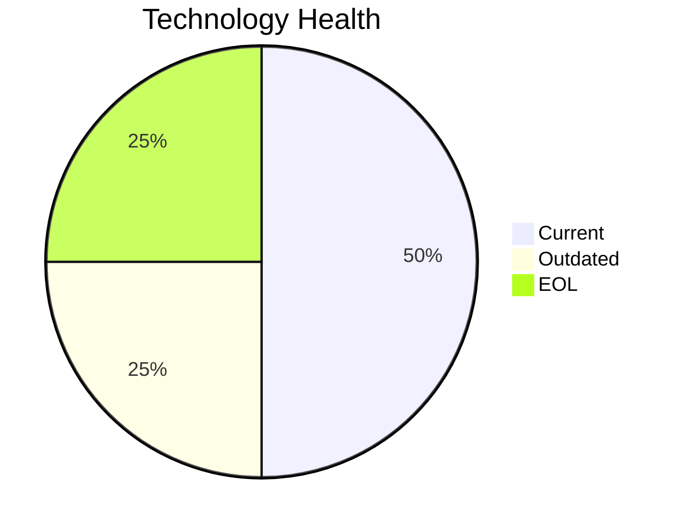

<!-- generated by AI in Github cloud -->
# ComplianceApp-022 (app022)

## Application Overview

| Attribute | Value |
|-----------|-------|
| **App ID** | app022 |
| **Name** | ComplianceApp-022 |
| **Status** | Production |
| **Criticality** | Critical |
| **Solution Type** | Custom made |
| **Deployment** | AWS, On-premise |
| **Containerized** | Yes |
| **Architecture** | 3-Tier |
| **Business Unit** | Compliance |
| **External Interfaces** | 12 |
| **Servers** | 2 |
| **Environments** | 3 |

## Technology Stack

| Component | Type | Version | Status | EOL Date |
|-----------|------|---------|--------|----------|
| RHEL | os | 7 | 🔴 EOL | 2024-06-30 |
| Scala 2.13 | programming_language | 2.13 | 🟡 OUTDATED | N/A |
| Payara 6.0 | application_server | 6.0 | 🟢 CURRENT | N/A |
| PostgreSQL 14 | database | 14 | 🟢 CURRENT | 2026-11-12 |

## Complexity Assessment

**Score: 6/10 (MEDIUM)**

Technology age score 7 (1 EOL, 1 outdated components). Integration score 7 (12 external interfaces). Infrastructure score 6 (2 servers, 3 environments). Criticality score 9 (Critical). Architecture score 3. Data score 4. Weighted final: 6.3 → 6 (MEDIUM).

| Factor | Value |
|--------|-------|
| Number Of Servers | 2 |
| Number Of Databases | 1 |
| Number Of Environments | 3 |
| Number Of Interfaces | 12 |
| Business Criticality | Critical |
| Number Of Outdated Technologies | 1 |
| Number Of Eol Technologies | 1 |
| Number Of Dependencies | 0 |
| Ci Cd Present | Yes |
| Containerized | Yes |

## Applicable Modernization Scenarios

### Os Update Security Patch
- **Status**: APPLICABLE
- **Reason**: OS 'RHEL 7' is EOL and requires security patching or upgrade.
- **Confidence**: 8/10

### App Deployment To Cloud
- **Status**: APPLICABLE
- **Reason**: Application is on-premise (AWS, On-premise); cloud migration (lift & shift) is applicable.
- **Confidence**: 8/10

### App Refactor Decoupling
- **Status**: APPLICABLE
- **Reason**: Custom application with 3-Tier architecture; refactoring to reduce coupling is applicable.
- **Confidence**: 8/10

### Update Outdated Components
- **Status**: APPLICABLE
- **Reason**: Outdated/EOL components found: RHEL, Scala 2.13. Updates required.
- **Confidence**: 8/10

## Other Scenarios

| Scenario | Status | Reason |
|----------|--------|--------|
| switch_to_standard_linux_os | FULFILLED | OS 'RHEL 7' is already a standard Linux distribution. |
| switch_to_arm_cpu | LACK_OF_DATA | No explicit CPU architecture data (x86 vs ARM) is available in the application m... |
| application_server_replacement | FULFILLED | Application server 'Payara 6.0' is current. |
| app_containerization | FULFILLED | Application is already containerized. |
| upgrade_legacy_databases | FULFILLED | Database 'PostgreSQL 14' is current. |
| switch_db_engine_open_source | FULFILLED | Database 'PostgreSQL 14' is already open-source or managed open-source. |

## Financial Summary

| Scenario | Cost (USD) | Annual Savings (USD) | ROI 3yr % | Payback (yrs) |
|----------|-----------|---------------------|-----------|---------------|
| os_update_security_patch | $1,157 | $500 | 29.7% | 2.3 |
| app_deployment_to_cloud | $5,783 | $2,700 | 40.1% | 2.1 |
| app_refactor_decoupling | $289,133 | $135,000 | 40.1% | 2.1 |
| **TOTAL** | **$296,072** | **$138,200** | | |
