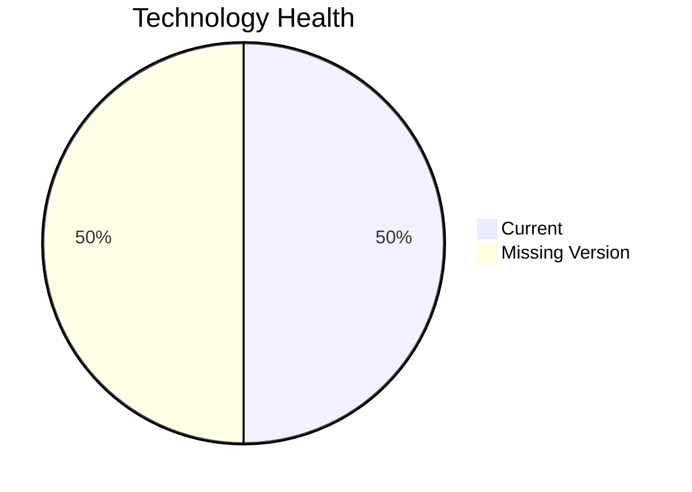

# Application Report: ChatbotApp-023

**ID:** app023  
**Generated:** 2026-05-13

## Overview

| Attribute | Value |
|-----------|-------|
| Business Unit | Customer Service |
| Solution Type | Open Source |
| Deployment Type | AWS |
| Business Criticality | Medium |
| Users | 1100 |
| Servers | sv34 |
| Environments | 2 |
| External Interfaces | 8 |
| Containerized | Yes |
| CI/CD Present | Yes |
| Architecture | 3-Tier |
| Data Classification | Internal |

## Technology Stack

| Component | Technology | Version | Status |
|-----------|-----------|---------|--------|
| Operating System | RHEL 8 | RHEL 8 | 🟢 Current |
| Database | MongoDB (unknown version) | MongoDB (unknown version) | ⚪ Unknown |
| Programming Language | Node.js 18 | Node.js 18 | 🟢 Current |
| Application Server | App Server (unknown) | App Server (unknown) | ⚪ Unknown |

## Complexity Assessment

**Score:** 3/10 — **LOW**  
**Confidence:** 8/10

> Technology age score 2/10: All components current. Integration score 6/10: 8 external interfaces. Infrastructure score 2/10: 1 server(s), 2 environment(s). Business criticality score 5/10: Medium criticality application. Architecture score 3/10: 3-Tier architecture, containerized, CI/CD present. Data score 2/10: Database in good standing.

| Factor | Value |
|--------|-------|
| Servers | 1 |
| Environments | 2 |
| External Interfaces | 8 |
| EOL Technologies | 0 |
| Outdated Technologies | 0 |
| Business Criticality | Medium |
| CI/CD Present | Yes |
| Containerized | Yes |

## Modernization Scenarios

### ✅ Applicable Scenarios

#### Switch to ARM-based CPU

- **Priority:** Medium
- **Effort:** Medium
- **Effects:** cost, sustainability
- **One-Time Cost:** €3,802
- **Annual Savings:** €1,000/year
- **Reasoning:** Application is containerized and runs on standard OS, making ARM migration feasible.

### Other Scenarios

| Scenario | Status | Reason |
|----------|--------|--------|
| Operating System Update | ✔️ Fulfilled | OS (RHEL 8) is on a current supported version. |
| Switch to Standard Linux OS | ✔️ Fulfilled | Application already runs on standard Linux OS (RHEL 8). |
| Application Server Replacement | ✔️ Fulfilled | Application server (Apache Tomcat. 7.4) is on a current supported version. |
| Application Migration to Cloud (Lift & Shift) | ✔️ Fulfilled | Application is already hosted on cloud infrastructure (AWS). |
| Application Containerization | ✔️ Fulfilled | Application is already containerized. |
| Application Refactoring and De-coupling | 🔶 Partial | Application architecture (3-Tier) suggests some coupling. Partial refactoring may benefit the applic... |
| Upgrade Legacy Databases | ✔️ Fulfilled | Database (MongoDB) is on a current supported version. |
| Switch DB Engine to Open-Source | ✔️ Fulfilled | Database (MongoDB) is already an open-source database engine. |
| Update Outdated Components | ✔️ Fulfilled | All application components are on current, supported versions per technology assessment. |
| Switch to Managed Database Service | ❌ N/A | Database is already cloud-hosted or scenario not applicable. |
| Managed ARM Database | ❌ N/A | Database is not on a managed cloud service; ARM database migration not applicable. |
| Serverless Database Migration | ❌ N/A | Application deployment pattern does not support serverless database migration at this time. |
| Switch DB Engine to PostgreSQL | ❌ N/A | No commercial or applicable database detected for PostgreSQL migration. |

## Financial Summary

| Metric | Value |
|--------|-------|
| Total One-Time Investment | €3,802 |
| Total Annual Savings | €1,000 |
| Break-Even | 3.8 years |
