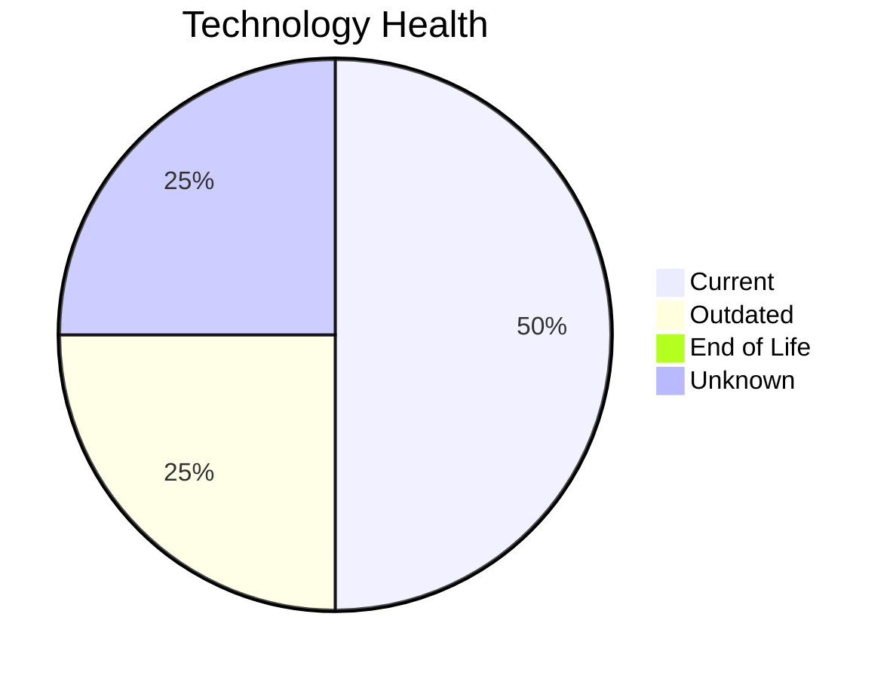

# Application Report: ChatbotApp-023

**ID:** app023
**Generated:** 2026-05-11

## Overview

| Attribute | Value |
|-----------|-------|
| Business Unit | Customer Service |
| Solution Type | Open Source |
| Deployment | AWS |
| Business Criticality | Medium |
| Users | 1100 |
| Servers | 1 (sv34) |
| Containerized | Yes |
| CI/CD | Yes |
| Architecture | 3-Tier |

## Technology Stack

| Component | Technology | Version | Status |
|-----------|-----------|---------|--------|
| Os | RHEL 8 | RHEL 8 | 🟢 CURRENT_VERSION |
| Language | Node.js 18 | Node.js 18 | 🟡 OUTDATED |
| Database | MongoDB | MongoDB | 🟢 CURRENT_VERSION |
| Application Server | Apache Tomcat. 7.4 | Apache Tomcat. 7.4 | ⚪ NO_KNOWLEDGE |

## Complexity Assessment

**Score:** 4/10 — **MEDIUM**
**Confidence:** 8/10

| Factor | Value |
|--------|-------|
| Technology Age (EOL/Outdated) | 0 EOL / 1 outdated |
| Integration (External Interfaces) | 8 |
| Infrastructure (Servers) | 1 |
| Business Criticality | Medium |
| Containerized | Yes |
| CI/CD Present | Yes |

> Complexity MEDIUM (4/10). Technology age: 5/10 (0 EOL, 1 outdated components). Integration: 6/10 (8 external interfaces). Infrastructure: 2/10 (1 servers). Business criticality Medium: 4/10. Architecture 3-tier: 2/10. Data complexity: 3/10.

## Modernization Scenarios

### Applicable Scenarios

#### ✅ Switch to ARM-based CPU

- **Reason:** Custom/open-source application on Linux can be considered for ARM-based infrastructure.
- **Confidence:** 8/10
- **Cost:** €4,373 (one-time)
- **Savings:** €1,000/year

#### ✅ Update outdated components

- **Reason:** Application has outdated components that should be updated.
- **Confidence:** 8/10

### Other Scenarios

| Scenario | Status | Reason |
|----------|--------|--------|
| Operating System Update | ✔️ FULFILLED | OS RHEL 8 is current version, no update needed. |
| Switch to standard Linux Operating System | ✔️ FULFILLED | Application already runs on standard Linux (RHEL 8). |
| Application Migration to Cloud Infrastructure (Lift & Shift) | ✔️ FULFILLED | Application is already deployed on AWS cloud infrastructure. |
| Application Containerization | ✔️ FULFILLED | Application is already containerized. |
| Upgrade Legacy Databases | ✔️ FULFILLED | Database MongoDB is current version, no upgrade needed. |
| Switch DB Engine to open-source database solution | ✔️ FULFILLED | Database MongoDB is already open-source. |
| Applications Server replacement | ❌ NOT_APPLICABLE | No application server or N/A. |
| Application Refactoring and De-coupling | ❌ NOT_APPLICABLE | 3rd party or open-source software; refactoring not in scope. |

## Financial Summary

| Metric | Value |
|--------|-------|
| Total One-Time Investment | €4,373 |
| Total Annual Savings | €1,000 |
| Break-Even | 4.4 years |

