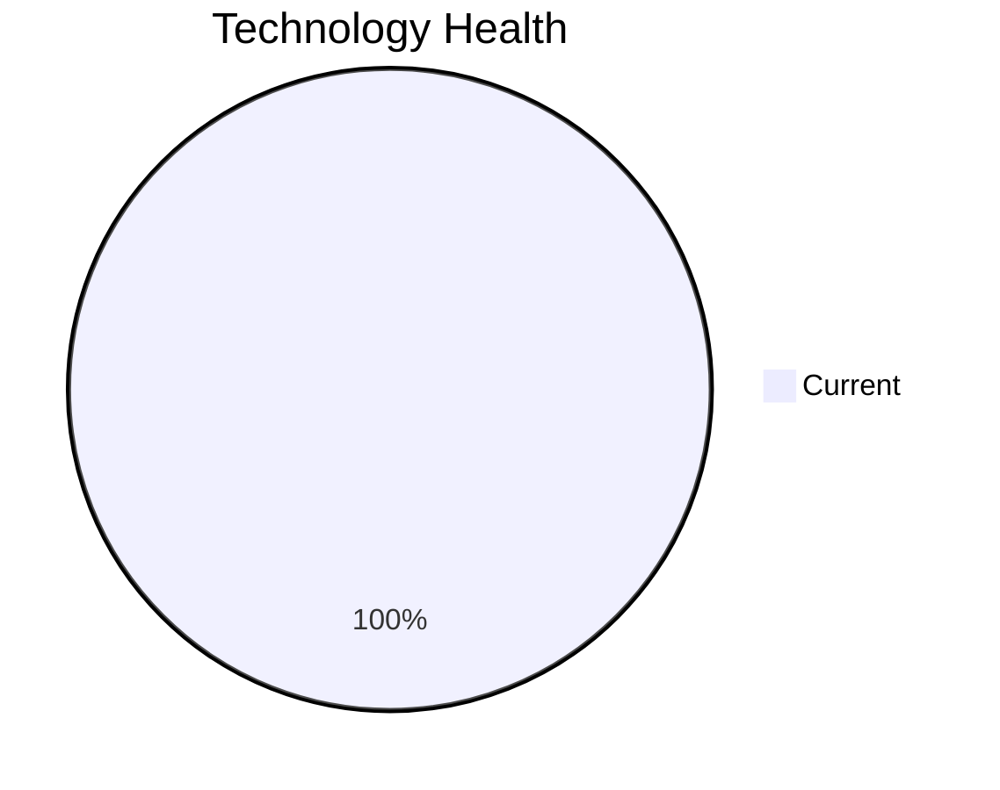

<!-- generated by AI in Github cloud -->
# ChatbotApp-023 (app023)

## Application Overview

| Attribute | Value |
|-----------|-------|
| **App ID** | app023 |
| **Name** | ChatbotApp-023 |
| **Status** | Production |
| **Criticality** | Medium |
| **Solution Type** | Open Source |
| **Deployment** | AWS |
| **Containerized** | Yes |
| **Architecture** | 3-Tier |
| **Business Unit** | Customer Service |
| **External Interfaces** | 8 |
| **Servers** | 1 |
| **Environments** | 2 |

## Technology Stack

| Component | Type | Version | Status | EOL Date |
|-----------|------|---------|--------|----------|
| RHEL | os | 8 | 🟢 CURRENT | 2029-05-31 |
| Node.js 18 | programming_language | 18 | 🟢 CURRENT | 2025-04-30 |
| MongoDB | database |  | 🟢 CURRENT | N/A |

## Complexity Assessment

**Score: 4/10 (MEDIUM)**

Technology age score 2 (0 EOL, 0 outdated components). Integration score 6 (8 external interfaces). Infrastructure score 4 (1 servers, 2 environments). Criticality score 5 (Medium). Architecture score 3. Data score 4. Weighted final: 3.9 → 4 (MEDIUM).

| Factor | Value |
|--------|-------|
| Number Of Servers | 1 |
| Number Of Databases | 1 |
| Number Of Environments | 2 |
| Number Of Interfaces | 8 |
| Business Criticality | Medium |
| Number Of Outdated Technologies | 0 |
| Number Of Eol Technologies | 0 |
| Number Of Dependencies | 0 |
| Ci Cd Present | Yes |
| Containerized | Yes |

## Applicable Modernization Scenarios

### App Refactor Decoupling
- **Status**: APPLICABLE
- **Reason**: Application may benefit from refactoring and de-coupling.
- **Confidence**: 8/10

## Other Scenarios

| Scenario | Status | Reason |
|----------|--------|--------|
| os_update_security_patch | FULFILLED | OS 'RHEL 8' is current and receiving security patches. |
| switch_to_standard_linux_os | FULFILLED | OS 'RHEL 8' is already a standard Linux distribution. |
| switch_to_arm_cpu | LACK_OF_DATA | No explicit CPU architecture data (x86 vs ARM) is available in the application m... |
| application_server_replacement | LACK_OF_DATA | Cannot assess application server 'Apache Tomcat. 7.4' status. |
| app_deployment_to_cloud | FULFILLED | Application is already deployed to cloud (AWS). |
| app_containerization | FULFILLED | Application is already containerized. |
| upgrade_legacy_databases | FULFILLED | Database 'MongoDB' is current. |
| switch_db_engine_open_source | FULFILLED | Database 'MongoDB' is already open-source or managed open-source. |
| update_outdated_components | FULFILLED | All components are current. |

## Financial Summary

| Scenario | Cost (USD) | Annual Savings (USD) | ROI 3yr % | Payback (yrs) |
|----------|-----------|---------------------|-----------|---------------|
| app_refactor_decoupling | $218,626 | $135,000 | 85.2% | 1.6 |
| **TOTAL** | **$218,626** | **$135,000** | | |
