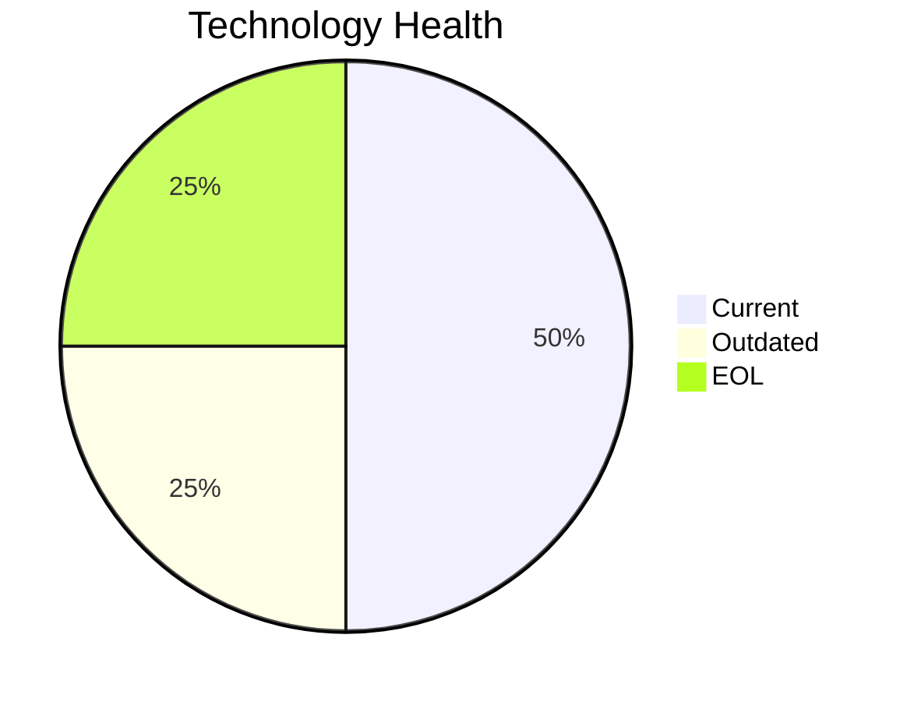

<!-- generated by AI in Github cloud -->
# AuditApp-024 (app024)

## Application Overview

| Attribute | Value |
|-----------|-------|
| **App ID** | app024 |
| **Name** | AuditApp-024 |
| **Status** | Production |
| **Criticality** | High |
| **Solution Type** | Custom made |
| **Deployment** | On-Premise |
| **Containerized** | No |
| **Architecture** | 2-Tier |
| **Business Unit** | Finance |
| **External Interfaces** | 3 |
| **Servers** | 1 |
| **Environments** | 2 |

## Technology Stack

| Component | Type | Version | Status | EOL Date |
|-----------|------|---------|--------|----------|
| Windows | os | Server 2019 | 🟢 CURRENT | 2029-01-09 |
| VB.NET | programming_language |  | 🟡 OUTDATED | N/A |
| Microsoft IIS 10.0 | application_server | 10.0 | 🟢 CURRENT | N/A |
| SQL Server 2014 | database | 2014 | 🔴 EOL | 2024-07-09 |

## Complexity Assessment

**Score: 5/10 (MEDIUM)**

Technology age score 7 (1 EOL, 1 outdated components). Integration score 4 (3 external interfaces). Infrastructure score 4 (1 servers, 2 environments). Criticality score 7 (High). Architecture score 5. Data score 5. Weighted final: 5.5 → 5 (MEDIUM).

| Factor | Value |
|--------|-------|
| Number Of Servers | 1 |
| Number Of Databases | 1 |
| Number Of Environments | 2 |
| Number Of Interfaces | 3 |
| Business Criticality | High |
| Number Of Outdated Technologies | 1 |
| Number Of Eol Technologies | 1 |
| Number Of Dependencies | 0 |
| Ci Cd Present | No |
| Containerized | No |

## Applicable Modernization Scenarios

### App Deployment To Cloud
- **Status**: APPLICABLE
- **Reason**: Application is on-premise (On-Premise); cloud migration (lift & shift) is applicable.
- **Confidence**: 8/10

### App Containerization
- **Status**: APPLICABLE
- **Reason**: Application runs on Windows (Windows Server 2019) and is not containerized; containerization possible with Windows containers.
- **Confidence**: 8/10

### App Refactor Decoupling
- **Status**: APPLICABLE
- **Reason**: Custom application with 2-Tier architecture; refactoring to reduce coupling is applicable.
- **Confidence**: 8/10

### Upgrade Legacy Databases
- **Status**: APPLICABLE
- **Reason**: Database 'SQL Server 2014' is EOL; upgrade is required.
- **Confidence**: 8/10

### Switch Db Engine Open Source
- **Status**: APPLICABLE
- **Reason**: Proprietary database 'SQL Server 2014' with custom app; switching to open-source DB is applicable.
- **Confidence**: 8/10

### Update Outdated Components
- **Status**: APPLICABLE
- **Reason**: Outdated/EOL components found: VB.NET, SQL Server 2014. Updates required.
- **Confidence**: 8/10

## Other Scenarios

| Scenario | Status | Reason |
|----------|--------|--------|
| os_update_security_patch | FULFILLED | OS 'Windows Server 2019' is current and receiving security patches. |
| switch_to_standard_linux_os | NOT_APPLICABLE | OS 'Windows Server 2019' is Windows; switching to Linux is not applicable. |
| switch_to_arm_cpu | LACK_OF_DATA | No explicit CPU architecture data (x86 vs ARM) is available in the application m... |
| application_server_replacement | FULFILLED | Application server 'Microsoft IIS 10.0' is current. |

## Financial Summary

| Scenario | Cost (USD) | Annual Savings (USD) | ROI 3yr % | Payback (yrs) |
|----------|-----------|---------------------|-----------|---------------|
| app_deployment_to_cloud | $5,028 | $2,700 | 61.1% | 1.9 |
| app_containerization | $100,568 | $90,000 | 168.5% | 1.1 |
| app_refactor_decoupling | $251,420 | $135,000 | 61.1% | 1.9 |
| upgrade_legacy_databases | $10,057 | $10,000 | 198.3% | 1.0 |
| switch_db_engine_open_source | $25,142 | $15,000 | 79.0% | 1.7 |
| **TOTAL** | **$392,215** | **$252,700** | | |
