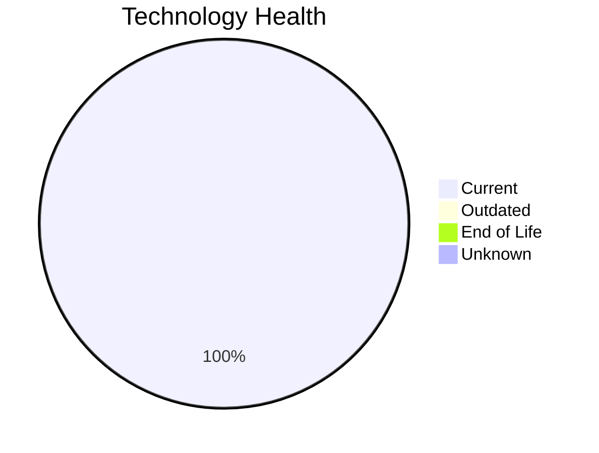

# Application Report: PortalApp-025

**ID:** app025
**Generated:** 2026-05-11

## Overview

| Attribute | Value |
|-----------|-------|
| Business Unit | Operations |
| Solution Type | Custom made |
| Deployment | AWS |
| Business Criticality | Medium |
| Users | 2200 |
| Servers | 2 (sv36, sv37) |
| Containerized | Yes |
| CI/CD | Yes |
| Architecture | 2-Tier |

## Technology Stack

| Component | Technology | Version | Status |
|-----------|-----------|---------|--------|
| Os | Windows Server 2019 | Windows Server 2019 | 🟢 CURRENT_VERSION |
| Language | ASP.NET Core | ASP.NET Core | 🟢 CURRENT_VERSION |
| Database | PostgreSQL 15 | PostgreSQL 15 | 🟢 CURRENT_VERSION |
| Application Server | Microsoft IIS 10.0 | Microsoft IIS 10.0 | 🟢 CURRENT_VERSION |

## Complexity Assessment

**Score:** 4/10 — **MEDIUM**
**Confidence:** 8/10

| Factor | Value |
|--------|-------|
| Technology Age (EOL/Outdated) | 0 EOL / 0 outdated |
| Integration (External Interfaces) | 15 |
| Infrastructure (Servers) | 2 |
| Business Criticality | Medium |
| Containerized | Yes |
| CI/CD Present | Yes |

> Complexity MEDIUM (4/10). Technology age: 2/10 (0 EOL, 0 outdated components). Integration: 8/10 (15 external interfaces). Infrastructure: 4/10 (2 servers). Business criticality Medium: 4/10. Architecture 2-tier: 5/10. Data complexity: 3/10.

## Modernization Scenarios

### Applicable Scenarios

#### ✅ Application Refactoring and De-coupling

- **Reason:** Custom application with 2-tier architecture. Refactoring and de-coupling recommended.
- **Confidence:** 8/10
- **Cost:** €218,626 (one-time)
- **Savings:** €135,000/year

### Other Scenarios

| Scenario | Status | Reason |
|----------|--------|--------|
| Operating System Update | ✔️ FULFILLED | OS Windows Server 2019 is current version, no update needed. |
| Applications Server replacement | ✔️ FULFILLED | Application server Microsoft IIS 10.0 is current version. |
| Application Migration to Cloud Infrastructure (Lift & Shift) | ✔️ FULFILLED | Application is already deployed on AWS cloud infrastructure. |
| Application Containerization | ✔️ FULFILLED | Application is already containerized. |
| Upgrade Legacy Databases | ✔️ FULFILLED | Database PostgreSQL 15 is current version, no upgrade needed. |
| Switch DB Engine to open-source database solution | ✔️ FULFILLED | Database PostgreSQL 15 is already open-source. |
| Update outdated components | ✔️ FULFILLED | All components are current version. |
| Switch to standard Linux Operating System | ❌ NOT_APPLICABLE | Application runs on Windows Server. Switch to Linux may not be suitable for Windows-native stack. |
| Switch to ARM-based CPU | 🚫 BLOCKED | Windows-based OS limits ARM migration options. |

## Financial Summary

| Metric | Value |
|--------|-------|
| Total One-Time Investment | €218,626 |
| Total Annual Savings | €135,000 |
| Break-Even | 1.6 years |

