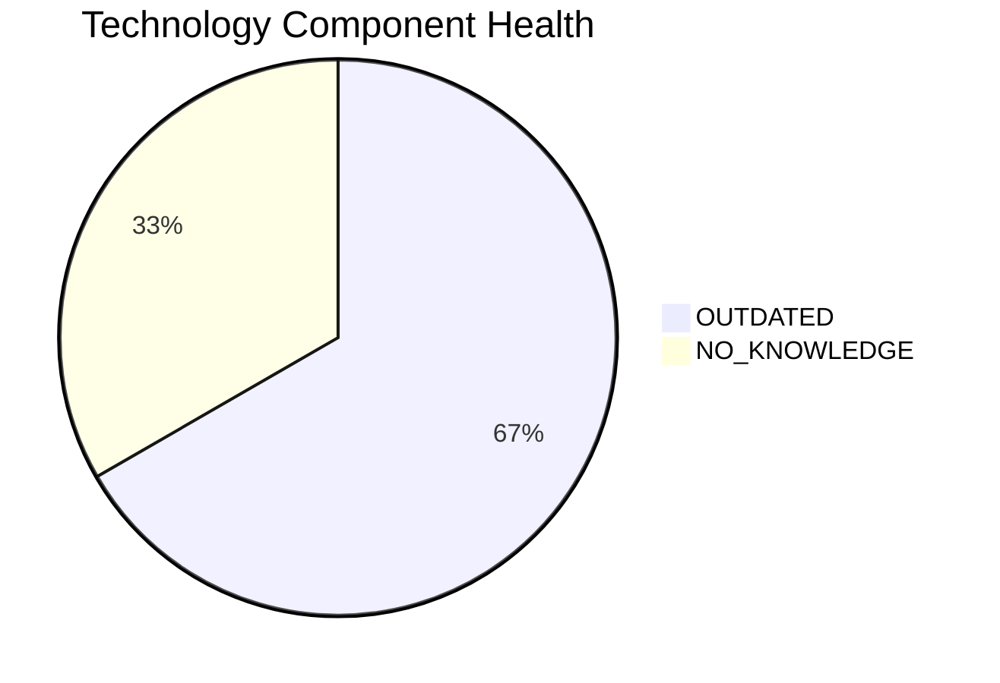

# LegacyFinApp-026 — Application Modernization Report

> **Application ID:** app026  
> **Business Unit:** Finance  
> **Criticality:** Critical

## Application Overview

| Attribute | Value |
|-----------|-------|
| Application ID | app026 |
| Name | LegacyFinApp-026 |
| Business Unit | Finance |
| Criticality | Critical |
| Status | Production |
| Deployment Type | On-Premise |
| Architecture | 1-Tier |
| Containerized | No |
| CI/CD | No |
| Users | 150 |
| Environments | 2 |
| External Interfaces | 1 |
| Servers | s, v, 3, 8 |
| DB Storage (GB) | 1500 |
| DB License Required | Yes |

## Technology Stack Assessment

| Component | Name | Status |
|-----------|------|--------|
| Operating System | AIX 7.2 | 🟡 OUTDATED |
| Database | DB2 | ⚪ NO_KNOWLEDGE |
| Programming Language | FORTRAN 2018 | 🟡 OUTDATED |

### Technology Health Distribution

## Complexity Assessment

**Overall Complexity:** 🟡 **MEDIUM** (Score: 6/10)

| Factor | Score | Weight |
|--------|-------|--------|
| Technology Age | 6 | 25% |
| Integration Complexity | 2 | 20% |
| Infrastructure | 7 | 15% |
| Business Criticality | 9 | 15% |
| Architecture | 9 | 15% |
| Data Complexity | 5 | 10% |

## Modernization Scenarios

### Applicable Scenarios

| Scenario | Reasoning |
|----------|-----------|
| OS Security Patch | OS AIX 7.2 is OUTDATED and requires security patching or upgrade. |
| Switch to Standard Linux | AIX 7.2 is a proprietary Unix OS. Migrating to standard Linux would reduce licensing costs and improve supportability. |
| Cloud Deployment | Application is deployed on-premise. Cloud migration would improve scalability and reduce infrastructure costs. |
| Refactor & Decouple | Application has a 1-Tier monolithic architecture with limited CI/CD. Refactoring to microservices would improve maintainability. |
| Switch to OSS DB | DB2 is a commercial database. Switching to an open-source alternative would reduce licensing costs. |
| Update Outdated Components | Outdated/EOL components detected: AIX 7.2, FORTRAN 2018. Updates required. |
| Switch to Managed DB | On-premise database could be migrated to a managed cloud database service. |
| Managed ARM DB | Migrating database to ARM-based managed cloud service would reduce costs. |
| Switch to PostgreSQL | DB2 is a commercial database. Migrating to PostgreSQL would eliminate licensing costs. |

### All Scenario Statuses

| Scenario | Status |
|----------|--------|
| OS Security Patch | ✅ APPLICABLE |
| Switch to Standard Linux | ✅ APPLICABLE |
| Switch to ARM CPU | 🚫 BLOCKED |
| App Server Replacement | ⬜ NOT_APPLICABLE |
| Cloud Deployment | ✅ APPLICABLE |
| Containerization | 🚫 BLOCKED |
| Refactor & Decouple | ✅ APPLICABLE |
| Upgrade Legacy DB | ❓ LACK_OF_DATA |
| Switch to OSS DB | ✅ APPLICABLE |
| Update Outdated Components | ✅ APPLICABLE |
| Switch to Managed DB | ✅ APPLICABLE |
| Managed ARM DB | ✅ APPLICABLE |
| Serverless DB Migration | 🚫 BLOCKED |
| Switch to PostgreSQL | ✅ APPLICABLE |

## Financial Summary

| Metric | Value |
|--------|-------|
| Total Estimated Implementation Cost | $365,810.56 |
| Total Estimated Annual Savings | $183,600.00 |
| Estimated ROI Payback Period | 2.0 years |

### Cost/Savings Breakdown by Scenario

| Scenario | Est. Cost | Est. Annual Savings | ROI (years) |
|----------|-----------|---------------------|-------------|
| OS Security Patch | $1,156.53 | $500.00 | 2.31 |
| Switch to Standard Linux | $346.96 | $400.00 | 0.87 |
| Cloud Deployment | $5,782.65 | $2,700.00 | 2.14 |
| Refactor & Decouple | $289,132.60 | $135,000.00 | 2.14 |
| Switch to OSS DB | $28,913.26 | $15,000.00 | 1.93 |
| Update Outdated Components | N/A | N/A | N/A |
| Switch to Managed DB | $5,782.65 | $10,000.00 | 0.58 |
| Managed ARM DB | $5,782.65 | $5,000.00 | 1.16 |
| Switch to PostgreSQL | $28,913.26 | $15,000.00 | 1.93 |
