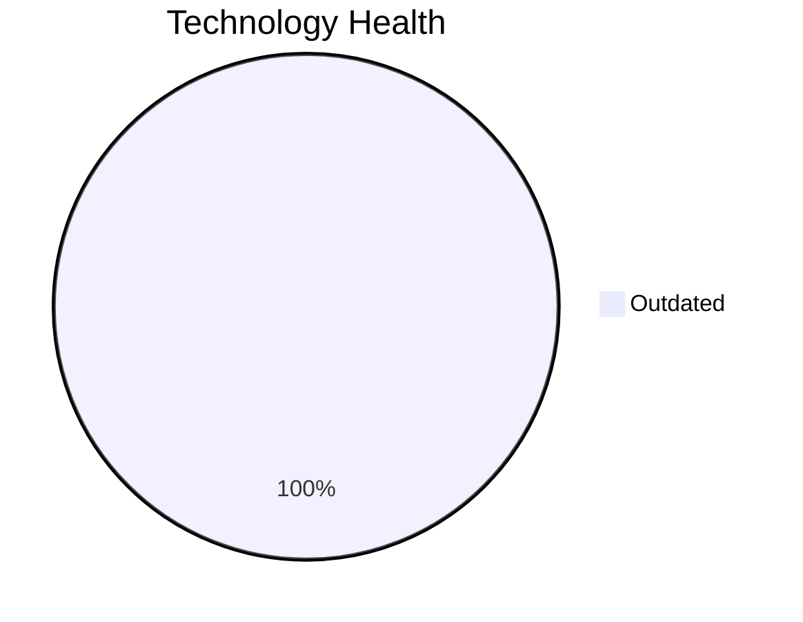

<!-- generated by AI in Github cloud -->
# LegacyFinApp-026 (app026)

## Application Overview

| Attribute | Value |
|-----------|-------|
| **App ID** | app026 |
| **Name** | LegacyFinApp-026 |
| **Status** | Production |
| **Criticality** | Critical |
| **Solution Type** | Custom made |
| **Deployment** | On-Premise |
| **Containerized** | No |
| **Architecture** | 1-Tier |
| **Business Unit** | Finance |
| **External Interfaces** | 1 |
| **Servers** | 1 |
| **Environments** | 2 |

## Technology Stack

| Component | Type | Version | Status | EOL Date |
|-----------|------|---------|--------|----------|
| AIX | os | 7.2 | 🟡 OUTDATED | 2023-11-30 |
| FORTRAN 2018 | programming_language | 2018 | 🟡 OUTDATED | N/A |
| DB2 | database |  | 🟡 OUTDATED | N/A |

## Complexity Assessment

**Score: 6/10 (MEDIUM)**

Technology age score 6 (0 EOL, 3 outdated components). Integration score 3 (1 external interfaces). Infrastructure score 4 (1 servers, 2 environments). Criticality score 9 (Critical). Architecture score 8. Data score 8. Weighted final: 6.0 → 6 (MEDIUM).

| Factor | Value |
|--------|-------|
| Number Of Servers | 1 |
| Number Of Databases | 1 |
| Number Of Environments | 2 |
| Number Of Interfaces | 1 |
| Business Criticality | Critical |
| Number Of Outdated Technologies | 3 |
| Number Of Eol Technologies | 0 |
| Number Of Dependencies | 0 |
| Ci Cd Present | No |
| Containerized | No |

## Applicable Modernization Scenarios

### Os Update Security Patch
- **Status**: APPLICABLE
- **Reason**: OS 'AIX 7.2' is OUTDATED and requires security patching or upgrade.
- **Confidence**: 8/10

### Switch To Standard Linux Os
- **Status**: APPLICABLE
- **Reason**: OS 'AIX 7.2' is proprietary AIX; migrating to standard Linux would improve standardization.
- **Confidence**: 8/10

### App Deployment To Cloud
- **Status**: APPLICABLE
- **Reason**: Application is on-premise (On-Premise); cloud migration (lift & shift) is applicable.
- **Confidence**: 8/10

### App Containerization
- **Status**: APPLICABLE
- **Reason**: Custom/open-source application not yet containerized; containerization is applicable.
- **Confidence**: 8/10

### App Refactor Decoupling
- **Status**: APPLICABLE
- **Reason**: Application has 1-Tier architecture and is custom-built; refactoring and de-coupling is strongly recommended.
- **Confidence**: 8/10

### Upgrade Legacy Databases
- **Status**: APPLICABLE
- **Reason**: Database 'DB2' is OUTDATED; upgrade is required.
- **Confidence**: 8/10

### Switch Db Engine Open Source
- **Status**: APPLICABLE
- **Reason**: Proprietary database 'DB2' with custom app; switching to open-source DB is applicable.
- **Confidence**: 8/10

### Update Outdated Components
- **Status**: APPLICABLE
- **Reason**: Outdated/EOL components found: AIX, FORTRAN 2018, DB2. Updates required.
- **Confidence**: 8/10

## Other Scenarios

| Scenario | Status | Reason |
|----------|--------|--------|
| switch_to_arm_cpu | LACK_OF_DATA | No explicit CPU architecture data (x86 vs ARM) is available in the application m... |
| application_server_replacement | NOT_APPLICABLE | No application server is used by this application. |

## Financial Summary

| Scenario | Cost (USD) | Annual Savings (USD) | ROI 3yr % | Payback (yrs) |
|----------|-----------|---------------------|-----------|---------------|
| os_update_security_patch | $1,157 | $500 | 29.7% | 2.3 |
| switch_to_standard_linux_os | $347 | $400 | 245.9% | 0.9 |
| app_deployment_to_cloud | $5,783 | $2,700 | 40.1% | 2.1 |
| app_containerization | $115,653 | $90,000 | 133.5% | 1.3 |
| app_refactor_decoupling | $289,133 | $135,000 | 40.1% | 2.1 |
| upgrade_legacy_databases | $11,565 | $10,000 | 159.4% | 1.2 |
| switch_db_engine_open_source | $28,913 | $15,000 | 55.6% | 1.9 |
| **TOTAL** | **$452,550** | **$253,600** | | |
