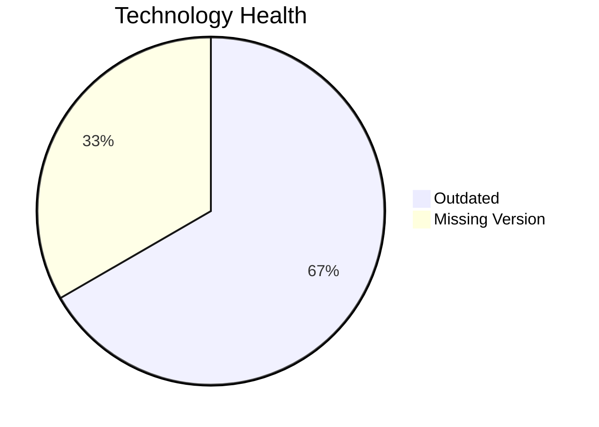

# Application Report: LegacyFinApp-026

**ID:** app026  
**Generated:** 2026-05-13

## Overview

| Attribute | Value |
|-----------|-------|
| Business Unit | Finance |
| Solution Type | Custom made |
| Deployment Type | On-Premise |
| Business Criticality | Critical |
| Users | 150 |
| Servers | sv38 |
| Environments | 2 |
| External Interfaces | 1 |
| Containerized | No |
| CI/CD Present | No |
| Architecture | 1-Tier |
| Data Classification | Confidential |

## Technology Stack

| Component | Technology | Version | Status |
|-----------|-----------|---------|--------|
| Operating System | AIX 7.2 | AIX 7.2 | 🟡 Outdated |
| Database | IBM DB2 (unknown version) | IBM DB2 (unknown version) | ⚪ Unknown |
| Programming Language | FORTRAN 2018 | FORTRAN 2018 | 🟡 Outdated |
| Application Server | N/A | N/A | ⚪ Unknown |

## Complexity Assessment

**Score:** 5/10 — **MEDIUM**  
**Confidence:** 8/10

> Technology age score 6/10: Outdated components present. Integration score 2/10: 1 external interfaces. Infrastructure score 2/10: 1 server(s), 2 environment(s). Business criticality score 9/10: Critical criticality application. Architecture score 9/10: 1-Tier architecture, not containerized, no CI/CD. Data score 4/10: Database in good standing.

| Factor | Value |
|--------|-------|
| Servers | 1 |
| Environments | 2 |
| External Interfaces | 1 |
| EOL Technologies | 0 |
| Outdated Technologies | 2 |
| Business Criticality | Critical |
| CI/CD Present | No |
| Containerized | No |

## Modernization Scenarios

### ✅ Applicable Scenarios

#### Operating System Update

- **Priority:** High
- **Effort:** Low
- **Effects:** security
- **One-Time Cost:** €1,006
- **Annual Savings:** €500/year
- **Reasoning:** OS (AIX 7.2) is OUTDATED and requires security patching or upgrade.

#### Switch to Standard Linux OS

- **Priority:** Medium
- **Effort:** Medium
- **Effects:** agility, security, cost
- **One-Time Cost:** €302
- **Annual Savings:** €400/year
- **Reasoning:** OS (AIX 7.2) is a proprietary Unix system. Migrating to standard Linux would reduce costs and improve supportability.

#### Application Migration to Cloud (Lift & Shift)

- **Priority:** High
- **Effort:** Low
- **Effects:** security, agility
- **One-Time Cost:** €5,028
- **Annual Savings:** €2,700/year
- **Reasoning:** Application is deployed on-premise (On-Premise). Cloud migration would improve scalability and reduce infrastructure costs.

#### Application Refactoring and De-coupling

- **Priority:** High
- **Effort:** High
- **Effects:** agility, cost, sustainability
- **One-Time Cost:** €251,420
- **Annual Savings:** €135,000/year
- **Reasoning:** Application has monolithic 1-Tier architecture. Refactoring to a decoupled architecture would improve maintainability and scalability.

#### Switch DB Engine to Open-Source

- **Priority:** High
- **Effort:** Medium
- **Effects:** cost
- **One-Time Cost:** €25,142
- **Annual Savings:** €15,000/year
- **Reasoning:** Commercial database (DB2) detected. Migrating to PostgreSQL or MySQL would eliminate licensing costs.

#### Update Outdated Components

- **Priority:** High
- **Effort:** High
- **Effects:** security, agility, cost
- **Cost:** No financial data available
- **Reasoning:** Outdated or EOL components detected: AIX 7.2, FORTRAN 2018. Updates required to maintain security and supportability.

#### Switch to Managed Database Service

- **Priority:** Medium
- **Effort:** Low
- **Effects:** agility, cost
- **One-Time Cost:** €5,028
- **Annual Savings:** €10,000/year
- **Reasoning:** On-premise database (DB2) could benefit from migration to a managed cloud database service.

#### Switch DB Engine to PostgreSQL

- **Priority:** High
- **Effort:** Medium
- **Effects:** cost
- **One-Time Cost:** €25,142
- **Annual Savings:** €15,000/year
- **Reasoning:** Commercial database (DB2) is a candidate for migration to PostgreSQL to eliminate licensing costs.

### Other Scenarios

| Scenario | Status | Reason |
|----------|--------|--------|
| Switch to ARM-based CPU | 🚫 Blocked | Legacy proprietary Unix OS prevents ARM migration without OS change first. |
| Application Server Replacement | ❌ N/A | No application server is used by this application. |
| Application Containerization | 🚫 Blocked | Legacy Unix OS (AIX 7.2) is not compatible with standard container technologies. OS migration requir... |
| Upgrade Legacy Databases | ✔️ Fulfilled | Database (DB2) is on a current supported version. |
| Managed ARM Database | 🚫 Blocked | Legacy Unix OS constrains ARM adoption for database as well. |
| Serverless Database Migration | ❌ N/A | On-premise deployment: serverless DB migration requires cloud infrastructure first. |

## Financial Summary

| Metric | Value |
|--------|-------|
| Total One-Time Investment | €313,068 |
| Total Annual Savings | €178,600 |
| Break-Even | 1.8 years |
