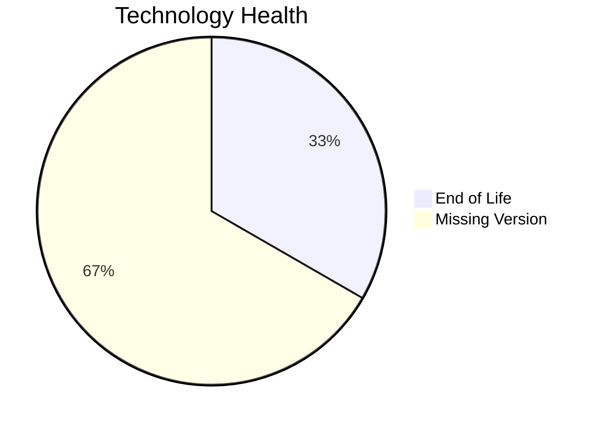

# Application Report: LegacyFinApp-026

**ID:** app026  
**Generated:** 2026-05-11

## Overview

| Attribute | Value |
|-----------|-------|
| Business Unit | Finance |
| Solution Type | Custom made |
| Deployment Type | On-Premise |
| Business Criticality | Critical |
| Users | 150 |
| Servers | 1 |
| Architecture | 1-Tier |
| Containerized | No |
| CI/CD | No |
| Data Classification | Confidential |

## Technology Stack

| Component | Technology | Status |
|-----------|-----------|--------|
| Os | AIX 7.2 | 🔴 EOL |
| Database | DB2 | ⚪ NO_KNOWLEDGE |
| Language | FORTRAN 2018 | ⚪ NO_KNOWLEDGE |

## Complexity Assessment

**Score:** 6/10 — **MEDIUM**  
**Confidence:** 7

> Score 6/10 (MEDIUM): 1 EOL component(s), 0 outdated, 1 external interfaces, 1 server(s), criticality=Critical, architecture=1-Tier.

| Factor | Value |
|--------|-------|
| Servers | 1 |
| Interfaces | 1 |
| Environments | 2 |
| EOL Technologies | 1 |
| Outdated Technologies | 0 |
| CI/CD Present | No |
| Containerized | No |

## Modernization Scenarios

### Applicable Scenarios

#### ✅ Operating System Update

- **Priority:** High
- **Effort:** Low
- **Effects:** security
- **Cost:** €1,157 (one-time)
- **Annual Savings:** €500/year
- **Reasoning:** OS (aix 7.2) is EOL and requires update.

#### ✅ Switch to standard Linux Operating System

- **Priority:** Medium
- **Effort:** Medium
- **Effects:** agility, security, cost
- **Cost:** €347 (one-time)
- **Annual Savings:** €400/year
- **Reasoning:** Application runs on proprietary OS (AIX 7.2) which should be migrated to standard Linux.

#### ✅ Switch to ARM-based CPU

- **Priority:** Medium
- **Effort:** Medium
- **Effects:** cost, sustainability
- **Cost:** €5,783 (one-time)
- **Annual Savings:** €1,000/year
- **Reasoning:** Application on on-premise x86 infrastructure could benefit from ARM migration for cost savings.

#### ✅ Application Migration to Cloud Infrastructure (Lift & Shift)

- **Priority:** High
- **Effort:** Low
- **Effects:** security, agility
- **Cost:** €5,783 (one-time)
- **Annual Savings:** €2,700/year
- **Reasoning:** Application runs on-premise and is a candidate for cloud migration.

#### ✅ Application Refactoring and De-coupling

- **Priority:** High
- **Effort:** High
- **Effects:** agility, cost, sustainability
- **Cost:** €289,133 (one-time)
- **Annual Savings:** €135,000/year
- **Reasoning:** Application has 1-Tier architecture - refactoring to microservices would improve scalability.

#### ✅ Switch DB Engine to open-source database solution

- **Priority:** High
- **Effort:** Medium
- **Effects:** cost
- **Reasoning:** Application uses commercial database (DB2) with license cost; migration to open-source is recommended.

#### ✅ Update outdated components

- **Priority:** High
- **Effort:** High
- **Effects:** security, agility, cost
- **Reasoning:** EOL components found: AIX 7.2. Update required.

### Other Scenarios

| Scenario | Status | Reason |
|----------|--------|--------|
| Applications Server replacement | ❌ NOT_APPLICABLE | No application server component identified. |
| Application Containerization | 🚫 BLOCKED | Legacy architecture (COBOL/1-Tier) makes containerization impractical without major refactoring. |
| Upgrade Legacy Databases | ❓ LACK_OF_DATA | Database lifecycle status could not be determined. |

## Financial Summary

| Metric | Value |
|--------|-------|
| Total One-Time Cost | €302,203 |
| Total Yearly Savings | €139,600 |
| Break-Even | 2.2 years |
