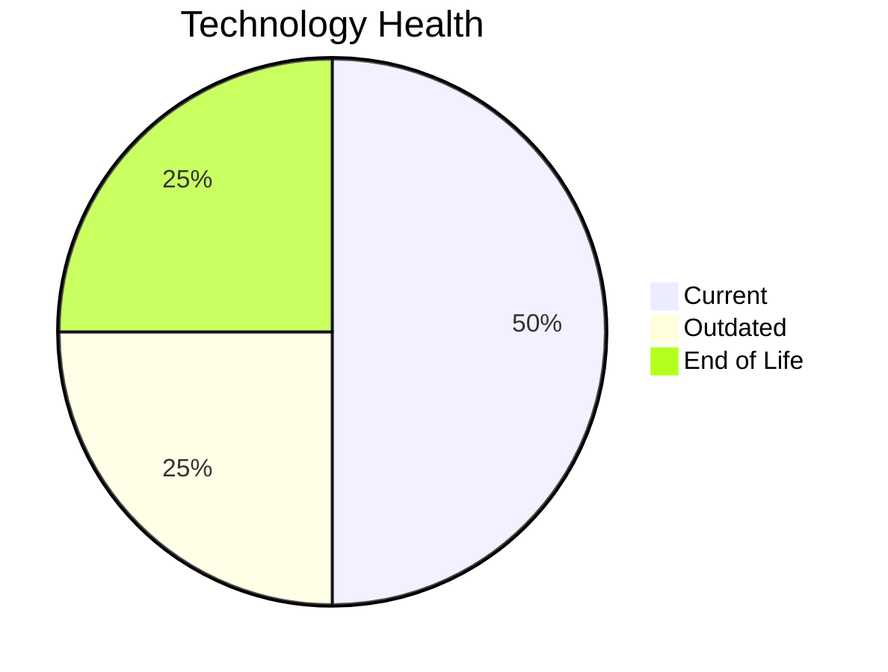

# Application Report: DataWarehouseApp-027

**ID:** app027  
**Generated:** 2026-05-13

## Overview

| Attribute | Value |
|-----------|-------|
| Business Unit | BI |
| Solution Type | Custom made |
| Deployment Type | AWS, On-premise |
| Business Criticality | High |
| Users | 320 |
| Servers | sv39, sv40 |
| Environments | 3 |
| External Interfaces | 20 |
| Containerized | No |
| CI/CD Present | Yes |
| Architecture | 3-Tier |
| Data Classification | Internal |

## Technology Stack

| Component | Technology | Version | Status |
|-----------|-----------|---------|--------|
| Operating System | RHEL 7 | RHEL 7 | 🔴 EOL |
| Database | SQL Server 2022 | SQL Server 2022 | 🟢 Current |
| Programming Language | Java 11 | Java 11 | 🟢 Current |
| Application Server | WebSphere 8.5 | WebSphere 8.5 | 🟡 Outdated |

## Complexity Assessment

**Score:** 6/10 — **MEDIUM**  
**Confidence:** 8/10

> Technology age score 8/10: Multiple EOL components detected. Integration score 8/10: 20 external interfaces. Infrastructure score 4/10: 2 server(s), 3 environment(s). Business criticality score 7/10: High criticality application. Architecture score 4/10: 3-Tier architecture, not containerized, CI/CD present. Data score 4/10: Database in good standing.

| Factor | Value |
|--------|-------|
| Servers | 2 |
| Environments | 3 |
| External Interfaces | 20 |
| EOL Technologies | 1 |
| Outdated Technologies | 1 |
| Business Criticality | High |
| CI/CD Present | Yes |
| Containerized | No |

## Modernization Scenarios

### ✅ Applicable Scenarios

#### Operating System Update

- **Priority:** High
- **Effort:** Low
- **Effects:** security
- **One-Time Cost:** €1,157
- **Annual Savings:** €500/year
- **Reasoning:** OS (RHEL 7) is EOL and requires urgent update/replacement.

#### Switch to ARM-based CPU

- **Priority:** Medium
- **Effort:** Medium
- **Effects:** cost, sustainability
- **One-Time Cost:** €5,783
- **Annual Savings:** €900/year
- **Reasoning:** Custom application on standard Linux is a candidate for ARM CPU migration with cost and sustainability benefits.

#### Application Server Replacement

- **Priority:** Medium
- **Effort:** Medium
- **Effects:** agility, cost
- **One-Time Cost:** €11,565
- **Annual Savings:** €10,800/year
- **Reasoning:** Application server (Websphere 8.5) is OUTDATED and approaching EOL.

#### Application Migration to Cloud (Lift & Shift)

- **Priority:** High
- **Effort:** Low
- **Effects:** security, agility
- **One-Time Cost:** €5,783
- **Annual Savings:** €2,700/year
- **Reasoning:** Application is deployed on-premise (AWS, On-premise). Cloud migration would improve scalability and reduce infrastructure costs.

#### Application Containerization

- **Priority:** High
- **Effort:** High
- **Effects:** agility, cost, sustainability
- **One-Time Cost:** €115,653
- **Annual Savings:** €90,000/year
- **Reasoning:** Application runs on Linux or modern .NET stack and is not yet containerized. Containerization would improve portability and resource efficiency.

#### Switch DB Engine to Open-Source

- **Priority:** High
- **Effort:** Medium
- **Effects:** cost
- **One-Time Cost:** €28,913
- **Annual Savings:** €15,000/year
- **Reasoning:** Commercial database (SQL Server 2022) detected. Migrating to PostgreSQL or MySQL would eliminate licensing costs.

#### Update Outdated Components

- **Priority:** High
- **Effort:** High
- **Effects:** security, agility, cost
- **Cost:** No financial data available
- **Reasoning:** Outdated or EOL components detected: RHEL 7, WebSphere 8.5. Updates required to maintain security and supportability.

#### Switch to Managed Database Service

- **Priority:** Medium
- **Effort:** Low
- **Effects:** agility, cost
- **One-Time Cost:** €5,783
- **Annual Savings:** €10,000/year
- **Reasoning:** Hybrid deployment with on-premise database (SQL Server 2022) could migrate to managed service.

#### Switch DB Engine to PostgreSQL

- **Priority:** High
- **Effort:** Medium
- **Effects:** cost
- **One-Time Cost:** €28,913
- **Annual Savings:** €15,000/year
- **Reasoning:** Commercial database (SQL Server 2022) is a candidate for migration to PostgreSQL to eliminate licensing costs.

### Other Scenarios

| Scenario | Status | Reason |
|----------|--------|--------|
| Switch to Standard Linux OS | ✔️ Fulfilled | Application already runs on standard Linux OS (RHEL 7). |
| Application Refactoring and De-coupling | 🔶 Partial | Application architecture (3-Tier) suggests some coupling. Partial refactoring may benefit the applic... |
| Upgrade Legacy Databases | ✔️ Fulfilled | Database (SQL Server 2022) is on a current supported version. |
| Managed ARM Database | ❌ N/A | Database is not on a managed cloud service; ARM database migration not applicable. |
| Serverless Database Migration | ❌ N/A | Application deployment pattern does not support serverless database migration at this time. |

## Financial Summary

| Metric | Value |
|--------|-------|
| Total One-Time Investment | €203,550 |
| Total Annual Savings | €144,900 |
| Break-Even | 1.4 years |
