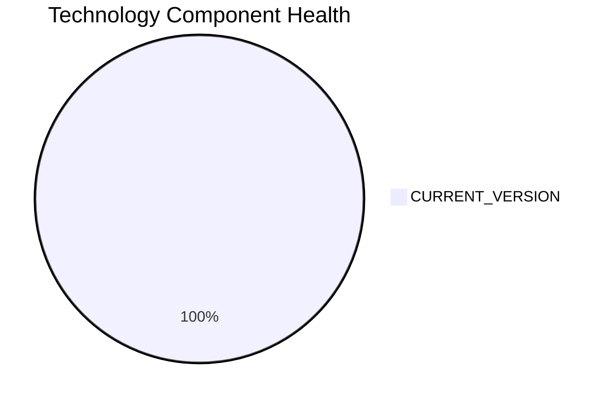

# NotificationApp-028 — Application Modernization Report

> **Application ID:** app028  
> **Business Unit:** IT  
> **Criticality:** Medium

## Application Overview

| Attribute | Value |
|-----------|-------|
| Application ID | app028 |
| Name | NotificationApp-028 |
| Business Unit | IT |
| Criticality | Medium |
| Status | Production |
| Deployment Type | AWS |
| Architecture | unknown |
| Containerized | Yes |
| CI/CD | Yes |
| Users | 850 |
| Environments | 3 |
| External Interfaces | 25 |
| Servers | sv41, sv42 |
| DB Storage (GB) | 3000 |
| DB License Required | Yes |

## Technology Stack Assessment

| Component | Name | Status |
|-----------|------|--------|
| Operating System | Windows Server 2019 | 🟢 CURRENT_VERSION |
| Database | Oracle 19c | 🟢 CURRENT_VERSION |
| Programming Language | Java 17 | 🟢 CURRENT_VERSION |
| Application Server | Microsoft IIS 10.0 | 🟢 CURRENT_VERSION |

### Technology Health Distribution

## Complexity Assessment

**Overall Complexity:** 🟡 **MEDIUM** (Score: 5/10)

| Factor | Score | Weight |
|--------|-------|--------|
| Technology Age | 2 | 25% |
| Integration Complexity | 9 | 20% |
| Infrastructure | 5 | 15% |
| Business Criticality | 5 | 15% |
| Architecture | 4 | 15% |
| Data Complexity | 5 | 10% |

## Modernization Scenarios

### Applicable Scenarios

| Scenario | Reasoning |
|----------|-----------|
| Switch to ARM CPU | Cloud deployment can leverage ARM-based instances (e.g., AWS Graviton) for cost savings. |
| Refactor & Decouple | Application with unknown architecture could benefit from decoupling and modernization. |
| Switch to OSS DB | Oracle 19c is a commercial database. Switching to an open-source alternative would reduce licensing costs. |
| Switch to Managed DB | Database could be migrated to a fully managed cloud database service for reduced operational overhead. |
| Managed ARM DB | Database can be evaluated for ARM-based managed service deployment. |
| Serverless DB Migration | Database can be migrated to a serverless database solution to reduce operational overhead. |
| Switch to PostgreSQL | Oracle 19c is a commercial database. Migrating to PostgreSQL would eliminate licensing costs. |

### All Scenario Statuses

| Scenario | Status |
|----------|--------|
| OS Security Patch | 🔵 FULFILLED |
| Switch to Standard Linux | ⬜ NOT_APPLICABLE |
| Switch to ARM CPU | ✅ APPLICABLE |
| App Server Replacement | 🔵 FULFILLED |
| Cloud Deployment | 🔵 FULFILLED |
| Containerization | 🔵 FULFILLED |
| Refactor & Decouple | ✅ APPLICABLE |
| Upgrade Legacy DB | 🔵 FULFILLED |
| Switch to OSS DB | ✅ APPLICABLE |
| Update Outdated Components | 🔵 FULFILLED |
| Switch to Managed DB | ✅ APPLICABLE |
| Managed ARM DB | ✅ APPLICABLE |
| Serverless DB Migration | ✅ APPLICABLE |
| Switch to PostgreSQL | ✅ APPLICABLE |

## Financial Summary

| Metric | Value |
|--------|-------|
| Total Estimated Implementation Cost | $321,817.13 |
| Total Estimated Annual Savings | $196,000.00 |
| Estimated ROI Payback Period | 1.6 years |

### Cost/Savings Breakdown by Scenario

| Scenario | Est. Cost | Est. Annual Savings | ROI (years) |
|----------|-----------|---------------------|-------------|
| Switch to ARM CPU | $5,028.39 | $1,000.00 | 5.03 |
| Refactor & Decouple | $251,419.65 | $135,000.00 | 1.86 |
| Switch to OSS DB | $25,141.96 | $15,000.00 | 1.68 |
| Switch to Managed DB | $5,028.39 | $10,000.00 | 0.5 |
| Managed ARM DB | $5,028.39 | $5,000.00 | 1.01 |
| Serverless DB Migration | $5,028.39 | $15,000.00 | 0.34 |
| Switch to PostgreSQL | $25,141.96 | $15,000.00 | 1.68 |
