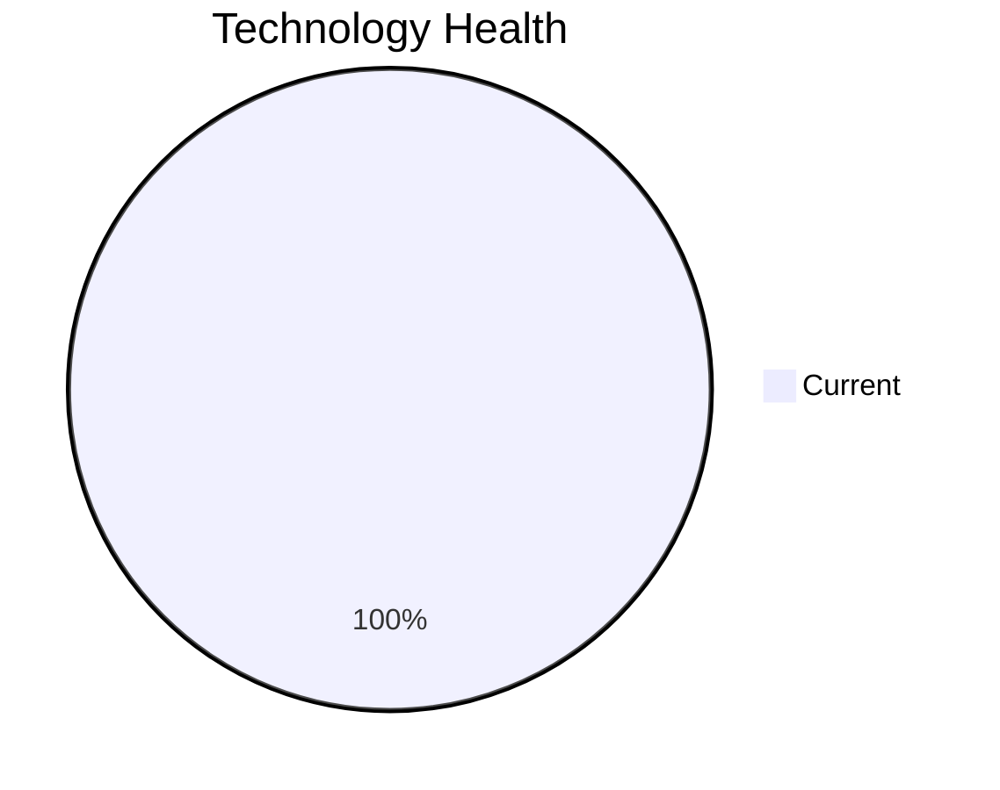

# Application Report: NotificationApp-028

**ID:** app028  
**Generated:** 2026-05-13

## Overview

| Attribute | Value |
|-----------|-------|
| Business Unit | IT |
| Solution Type | 3rd party software |
| Deployment Type | AWS |
| Business Criticality | Medium |
| Users | 850 |
| Servers | sv41, sv42 |
| Environments | 3 |
| External Interfaces | 25 |
| Containerized | Yes |
| CI/CD Present | Yes |
| Architecture | unknown |
| Data Classification | Internal |

## Technology Stack

| Component | Technology | Version | Status |
|-----------|-----------|---------|--------|
| Operating System | Windows Server 2019 | Windows Server 2019 | 🟢 Current |
| Database | Oracle 19c | Oracle 19c | 🟢 Current |
| Programming Language | Java 17 | Java 17 | 🟢 Current |
| Application Server | IIS 10.0 | IIS 10.0 | 🟢 Current |

## Complexity Assessment

**Score:** 5/10 — **MEDIUM**  
**Confidence:** 8/10

> Technology age score 2/10: All components current. Integration score 9/10: 25 external interfaces. Infrastructure score 4/10: 2 server(s), 3 environment(s). Business criticality score 5/10: Medium criticality application. Architecture score 4/10: unknown architecture, containerized, CI/CD present. Data score 4/10: Database in good standing.

| Factor | Value |
|--------|-------|
| Servers | 2 |
| Environments | 3 |
| External Interfaces | 25 |
| EOL Technologies | 0 |
| Outdated Technologies | 0 |
| Business Criticality | Medium |
| CI/CD Present | Yes |
| Containerized | Yes |

## Modernization Scenarios

*No directly applicable scenarios identified.*

### Other Scenarios

| Scenario | Status | Reason |
|----------|--------|--------|
| Operating System Update | ✔️ Fulfilled | OS (Windows Server 2019) is on a current supported version. |
| Switch to Standard Linux OS | ❌ N/A | Application runs on Windows-based OS. Exclusion criterion applies. |
| Switch to ARM-based CPU | 🚫 Blocked | 3rd party application with potential x86-specific dependencies. |
| Application Server Replacement | ✔️ Fulfilled | Application server (Microsoft IIS 10.0) is on a current supported version. |
| Application Migration to Cloud (Lift & Shift) | ✔️ Fulfilled | Application is already hosted on cloud infrastructure (AWS). |
| Application Containerization | ✔️ Fulfilled | Application is already containerized. |
| Application Refactoring and De-coupling | 🚫 Blocked | 3rd party or SaaS application. Internal architecture cannot be refactored by the customer. |
| Upgrade Legacy Databases | ✔️ Fulfilled | Database (Oracle 19c) is on a current supported version. |
| Switch DB Engine to Open-Source | 🚫 Blocked | 3rd party application. Database migration cannot be performed without vendor involvement. |
| Update Outdated Components | 🚫 Blocked | 3rd party or SaaS application. Component versions are vendor-managed and not upgradeable by the cust... |
| Switch to Managed Database Service | ❌ N/A | Database is already cloud-hosted or scenario not applicable. |
| Managed ARM Database | ❌ N/A | Database is not on a managed cloud service; ARM database migration not applicable. |
| Serverless Database Migration | ❌ N/A | Application deployment pattern does not support serverless database migration at this time. |
| Switch DB Engine to PostgreSQL | 🚫 Blocked | 3rd party application. Database migration to PostgreSQL requires vendor involvement. |

## Financial Summary

| Metric | Value |
|--------|-------|
| Total One-Time Investment | €0 |
| Total Annual Savings | €0 |
| Break-Even | N/A |
